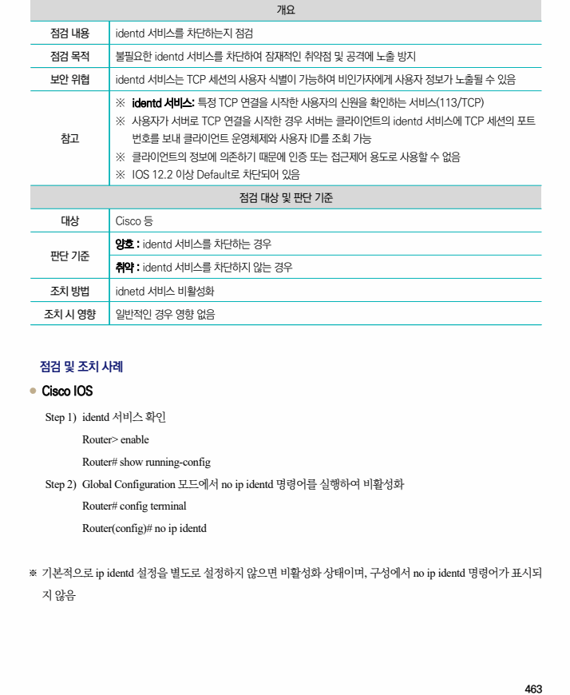

## 원문 전사

### PDF 페이지 463

~~~text transcription
개요
점검 내용 identd 서비스를 차단하는지 점검
점검 목적 불필요한 identd 서비스를 차단하여 잠재적인 취약점 및 공격에 노출 방지
보안 위협 identd 서비스는 TCP 세션의 사용자 식별이 가능하여 비인가자에게 사용자 정보가 노출될 수 있음
※ identd 서비스: 특정 TCP 연결을 시작한 사용자의 신원을 확인하는 서비스(113/TCP)
※ 사용자가 서버로 TCP 연결을 시작한 경우 서버는 클라이언트의 identd 서비스에 TCP 세션의 포트
참고 번호를 보내 클라이언트 운영체제와 사용자 ID를 조회 가능
※ 클라이언트의 정보에 의존하기 때문에 인증 또는 접근제어 용도로 사용할 수 없음
※ IOS 12.2 이상 Default로 차단되어 있음
점검 대상 및 판단 기준
대상 Cisco 등
양호 : identd 서비스를 차단하는 경우
판단 기준
취약 : identd 서비스를 차단하지 않는 경우
조치 방법 idnetd 서비스 비활성화
조치 시 영향 일반적인 경우 영향 없음
점검 및 조치 사례
l Cisco IOS
Step 1) identd 서비스 확인
Router> enable
Router# show running-config
Step 2) Global Configuration 모드에서 no ip identd 명령어를 실행하여 비활성화
Router# config terminal
Router(config)# no ip identd
※ 기본적으로 ip identd 설정을 별도로 설정하지 않으면 비활성화 상태이며, 구성에서 no ip identd 명령어가 표시되
지 않음
~~~

