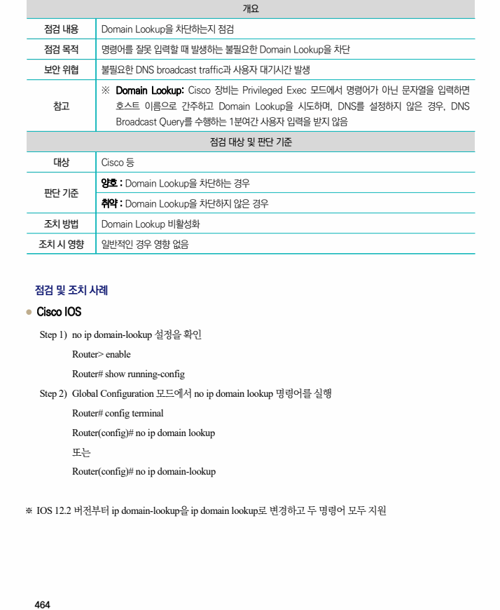

## 원문 전사

### PDF 페이지 464

~~~text transcription
개요
점검 내용 Domain Lookup을 차단하는지 점검
점검 목적 명령어를 잘못 입력할 때 발생하는 불필요한 Domain Lookup을 차단
보안 위협 불필요한 DNS broadcast traffic과 사용자 대기시간 발생
※ Domain Lookup: Cisco 장비는 Privileged Exec 모드에서 명령어가 아닌 문자열을 입력하면
참고 호스트 이름으로 간주하고 Domain Lookup을 시도하며, DNS를 설정하지 않은 경우, DNS
Broadcast Query를 수행하는 1분여간 사용자 입력을 받지 않음
점검 대상 및 판단 기준
대상 Cisco 등
양호 : Domain Lookup을 차단하는 경우
판단 기준
취약 : Domain Lookup을 차단하지 않은 경우
조치 방법 Domain Lookup 비활성화
조치 시 영향 일반적인 경우 영향 없음
점검 및 조치 사례
l Cisco IOS
Step 1) no ip domain-lookup 설정을 확인
Router> enable
Router# show running-config
Step 2) Global Configuration 모드에서 no ip domain lookup 명령어를 실행
Router# config terminal
Router(config)# no ip domain lookup
또는
Router(config)# no ip domain-lookup
※ IOS 12.2 버전부터 ip domain-lookup을 ip domain lookup로 변경하고 두 명령어 모두 지원
~~~

