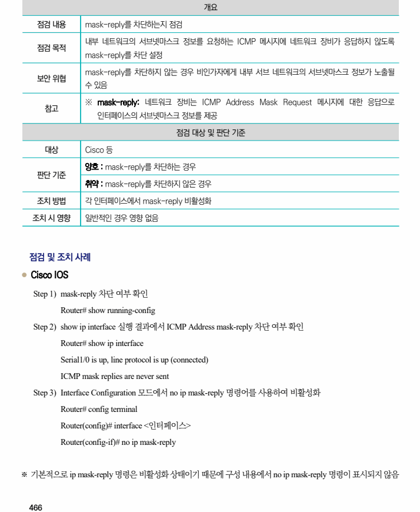

## 원문 전사

### PDF 페이지 466

~~~text transcription
개요
점검 내용 mask-reply를 차단하는지 점검
내부 네트워크의 서브넷마스크 정보를 요청하는 ICMP 메시지에 네트워크 장비가 응답하지 않도록
점검 목적
mask-reply를 차단 설정
mask-reply를 차단하지 않는 경우 비인가자에게 내부 서브 네트워크의 서브넷마스크 정보가 노출될
보안 위협
수 있음
※ mask-reply: 네트워크 장비는 ICMP Address Mask Request 메시지에 대한 응답으로
참고
인터페이스의 서브넷마스크 정보를 제공
점검 대상 및 판단 기준
대상 Cisco 등
양호 : mask-reply를 차단하는 경우
판단 기준
취약 : mask-reply를 차단하지 않은 경우
조치 방법 각 인터페이스에서 mask-reply 비활성화
조치 시 영향 일반적인 경우 영향 없음
점검 및 조치 사례
l Cisco IOS
Step 1) mask-reply 차단 여부 확인
Router# show running-config
Step 2) show ip interface 실행 결과에서 ICMP Address mask-reply 차단 여부 확인
Router# show ip interface
Serial1/0 is up, line protocol is up (connected)
ICMP mask replies are never sent
Step 3) Interface Configuration 모드에서 no ip mask-reply 명령어를 사용하여 비활성화
Router# config terminal
Router(config)# interface <인터페이스>
Router(config-if)# no ip mask-reply
※ 기본적으로 ip mask-reply 명령은 비활성화 상태이기 때문에 구성 내용에서 no ip mask-reply 명령이 표시되지 않음
~~~

