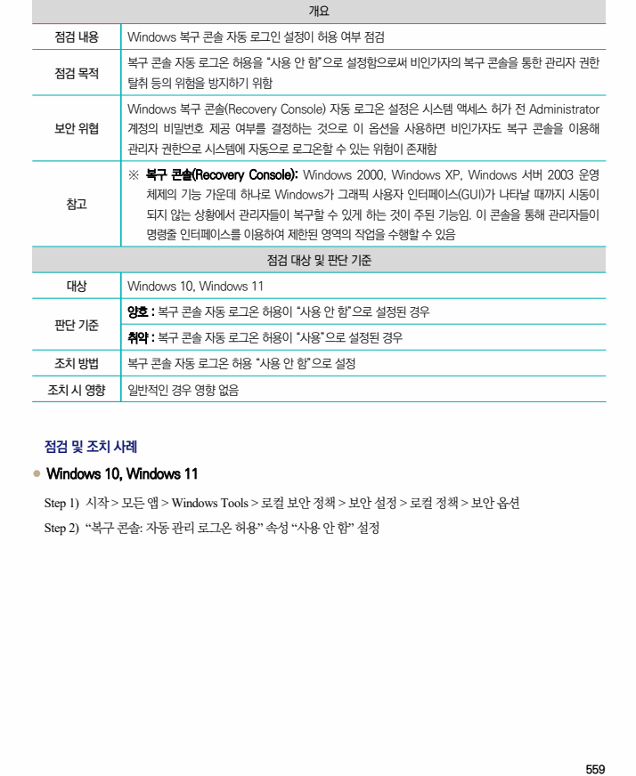
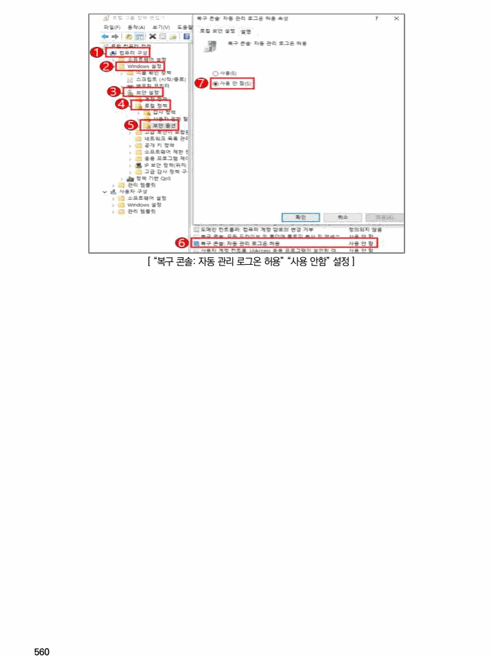

## 원문 전사

### PDF 페이지 559

~~~text transcription
개요
점검 내용 Windows 복구 콘솔 자동 로그인 설정이 허용 여부 점검
복구 콘솔 자동 로그온 허용을 “사용 안 함”으로 설정함으로써 비인가자의 복구 콘솔을 통한 관리자 권한
점검 목적
탈취 등의 위험을 방지하기 위함
Windows 복구 콘솔(Recovery Console) 자동 로그온 설정은 시스템 액세스 허가 전 Administrator
보안 위협 계정의 비밀번호 제공 여부를 결정하는 것으로 이 옵션을 사용하면 비인가자도 복구 콘솔을 이용해
관리자 권한으로 시스템에 자동으로 로그온할 수 있는 위험이 존재함
※ 복구 콘솔(Recovery Console): Windows 2000, Windows XP, Windows 서버 2003 운영
체제의 기능 가운데 하나로 Windows가 그래픽 사용자 인터페이스(GUI)가 나타날 때까지 시동이
참고
되지 않는 상황에서 관리자들이 복구할 수 있게 하는 것이 주된 기능임. 이 콘솔을 통해 관리자들이
명령줄 인터페이스를 이용하여 제한된 영역의 작업을 수행할 수 있음
점검 대상 및 판단 기준
대상 Windows 10, Windows 11
양호 : 복구 콘솔 자동 로그온 허용이 “사용 안 함”으로 설정된 경우
판단 기준
취약 : 복구 콘솔 자동 로그온 허용이 “사용”으로 설정된 경우
조치 방법 복구 콘솔 자동 로그온 허용 “사용 안 함”으로 설정
조치 시 영향 일반적인 경우 영향 없음
점검 및 조치 사례
l Windows 10, Windows 11
Step 1) 시작 > 모든 앱 > Windows Tools > 로컬 보안 정책 > 보안 설정 > 로컬 정책 > 보안 옵션
Step 2) “복구 콘솔: 자동 관리 로그온 허용” 속성 “사용 안 함” 설정
~~~

### PDF 페이지 560

~~~text transcription
[ “복구 콘솔: 자동 관리 로그온 허용” “사용 안함” 설정 ]
~~~

