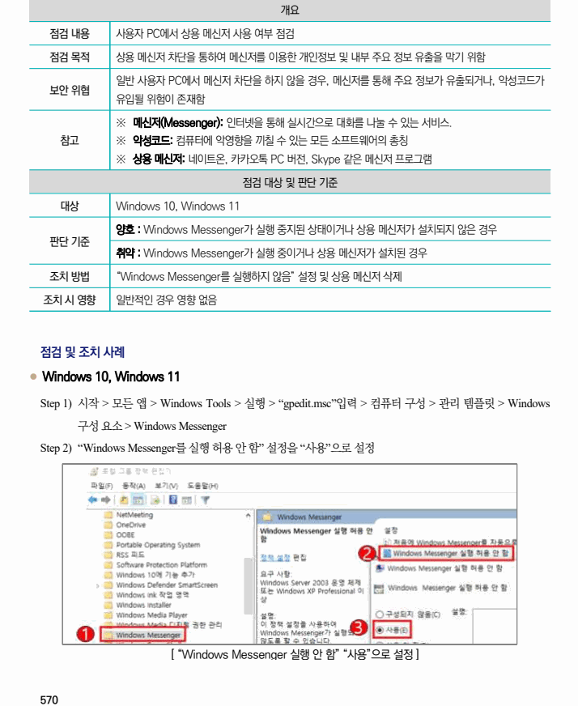

## 원문 전사

### PDF 페이지 570

~~~text transcription
개요
점검 내용 사용자 PC에서 상용 메신저 사용 여부 점검
점검 목적 상용 메신저 차단을 통하여 메신저를 이용한 개인정보 및 내부 주요 정보 유출을 막기 위함
일반 사용자 PC에서 메신저 차단을 하지 않을 경우, 메신저를 통해 주요 정보가 유출되거나, 악성코드가
보안 위협
유입될 위험이 존재함
※ 메신저(Messenger): 인터넷을 통해 실시간으로 대화를 나눌 수 있는 서비스.
참고 ※ 악성코드: 컴퓨터에 악영향을 끼칠 수 있는 모든 소프트웨어의 총칭
※ 상용 메신저: 네이트온, 카카오톡 PC 버전, Skype 같은 메신저 프로그램
점검 대상 및 판단 기준
대상 Windows 10, Windows 11
양호 : Windows Messenger가 실행 중지된 상태이거나 상용 메신저가 설치되지 않은 경우
판단 기준
취약 : Windows Messenger가 실행 중이거나 상용 메신저가 설치된 경우
조치 방법 “Windows Messenger를 실행하지 않음” 설정 및 상용 메신저 삭제
조치 시 영향 일반적인 경우 영향 없음
점검 및 조치 사례
l Windows 10, Windows 11
Step 1) 시작 > 모든 앱 > Windows Tools > 실행 > “gpedit.msc”입력 > 컴퓨터 구성 > 관리 템플릿 > Windows
구성 요소 > Windows Messenger
Step 2) “Windows Messenger를 실행 허용 안 함” 설정을 “사용”으로 설정
[ “Windows Messenger 실행 안 함” “사용”으로 설정 ]
~~~

