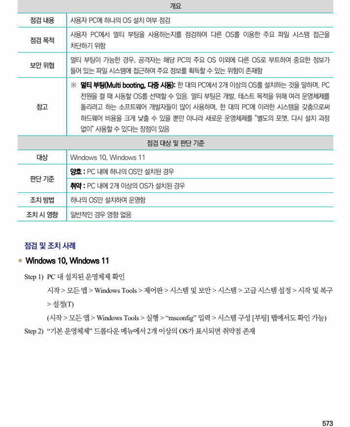
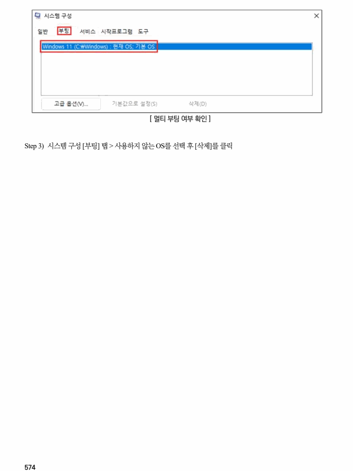

## 원문 전사

### PDF 페이지 573

~~~text transcription
개요
점검 내용 사용자 PC에 하나의 OS 설치 여부 점검
사용자 PC에서 멀티 부팅을 사용하는지를 점검하여 다른 OS를 이용한 주요 파일 시스템 접근을
점검 목적
차단하기 위함
멀티 부팅이 가능한 경우, 공격자는 해당 PC의 주요 OS 이외에 다른 OS로 부트하여 중요한 정보가
보안 위협
들어 있는 파일 시스템에 접근하여 주요 정보를 획득할 수 있는 위험이 존재함
※ 멀티 부팅(Multi booting, 다중 시동): 한 대의 PC에서 2개 이상의 OS를 설치하는 것을 말하며, PC
전원을 켤 때 시동할 OS를 선택할 수 있음. 멀티 부팅은 개발, 테스트 목적을 위해 여러 운영체제를
참고 돌리려고 하는 소프트웨어 개발자들이 많이 사용하며, 한 대의 PC에 이러한 시스템을 갖춤으로써
하드웨어 비용을 크게 낮출 수 있을 뿐만 아니라 새로운 운영체제를 "별도의 포맷, 다시 설치 과정
없이" 사용할 수 있다는 장점이 있음
점검 대상 및 판단 기준
대상 Windows 10, Windows 11
양호 : PC 내에 하나의 OS만 설치된 경우
판단 기준
취약 : PC 내에 2개 이상의 OS가 설치된 경우
조치 방법 하나의 OS만 설치하여 운영함
조치 시 영향 일반적인 경우 영향 없음
점검 및 조치 사례
l Windows 10, Windows 11
Step 1) PC 내 설치된 운영체제 확인
시작 > 모든 앱 > Windows Tools > 제어판 > 시스템 및 보안 > 시스템 > 고급 시스템 설정 > 시작 및 복구
> 설정(T)
(시작 > 모든 앱 > Windows Tools > 실행 > “msconfig” 입력 > 시스템 구성 [부팅] 탭에서도 확인 가능)
Step 2) “기본 운영체제” 드롭다운 메뉴에서 2개 이상의 OS가 표시되면 취약점 존재
~~~

### PDF 페이지 574

~~~text transcription
[ 멀티 부팅 여부 확인 ]
Step 3) 시스템 구성 [부팅] 탭 > 사용하지 않는 OS를 선택 후 [삭제]를 클릭
~~~

