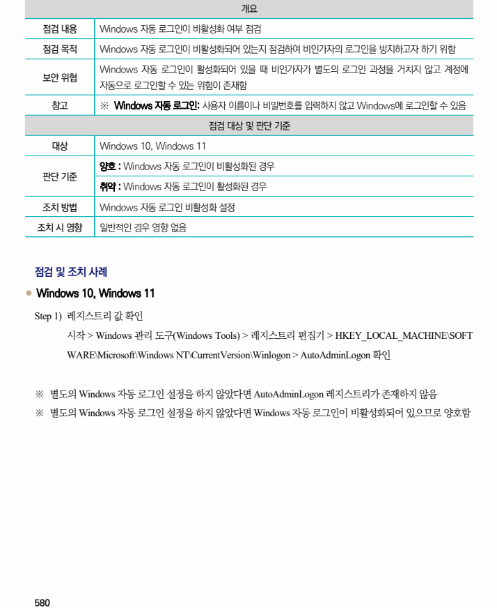
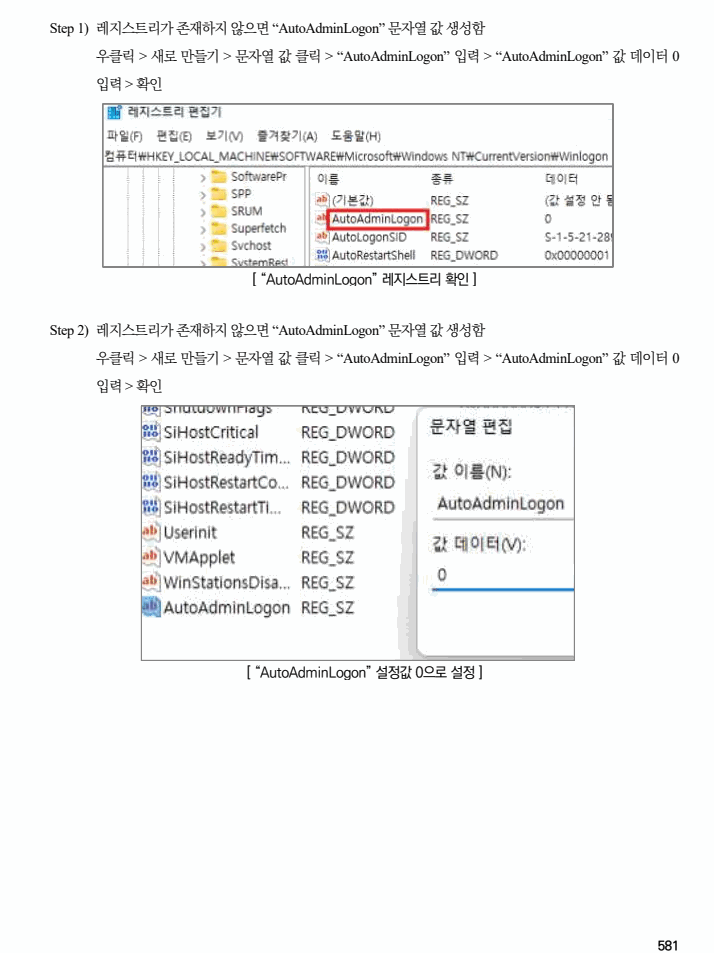

## 원문 전사

### PDF 페이지 580

~~~text transcription
개요
점검 내용 Windows 자동 로그인이 비활성화 여부 점검
점검 목적 Windows 자동 로그인이 비활성화되어 있는지 점검하여 비인가자의 로그인을 방지하고자 하기 위함
Windows 자동 로그인이 활성화되어 있을 때 비인가자가 별도의 로그인 과정을 거치지 않고 계정에
보안 위협
자동으로 로그인할 수 있는 위험이 존재함
참고 ※ Windows 자동 로그인: 사용자 이름이나 비밀번호를 입력하지 않고 Windows에 로그인할 수 있음
점검 대상 및 판단 기준
대상 Windows 10, Windows 11
양호 : Windows 자동 로그인이 비활성화된 경우
판단 기준
취약 : Windows 자동 로그인이 활성화된 경우
조치 방법 Windows 자동 로그인 비활성화 설정
조치 시 영향 일반적인 경우 영향 없음
점검 및 조치 사례
l Windows 10, Windows 11
Step 1) 레지스트리 값 확인
시작 > Windows 관리 도구(Windows Tools) > 레지스트리 편집기 > HKEY_LOCAL_MACHINE\SOFT
WARE\Microsoft\Windows NT\CurrentVersion\Winlogon > AutoAdminLogon 확인
※ 별도의 Windows 자동 로그인 설정을 하지 않았다면 AutoAdminLogon 레지스트리가 존재하지 않음
※ 별도의 Windows 자동 로그인 설정을 하지 않았다면 Windows 자동 로그인이 비활성화되어 있으므로 양호함
~~~

### PDF 페이지 581

~~~text transcription
Step 1) 레지스트리가 존재하지 않으면 “AutoAdminLogon” 문자열 값 생성함
우클릭 > 새로 만들기 > 문자열 값 클릭 > “AutoAdminLogon” 입력 > “AutoAdminLogon” 값 데이터 0
입력 > 확인
[ “AutoAdminLogon” 레지스트리 확인 ]
Step 2) 레지스트리가 존재하지 않으면 “AutoAdminLogon” 문자열 값 생성함
우클릭 > 새로 만들기 > 문자열 값 클릭 > “AutoAdminLogon” 입력 > “AutoAdminLogon” 값 데이터 0
입력 > 확인
[ “AutoAdminLogon” 설정값 0으로 설정 ]
~~~

