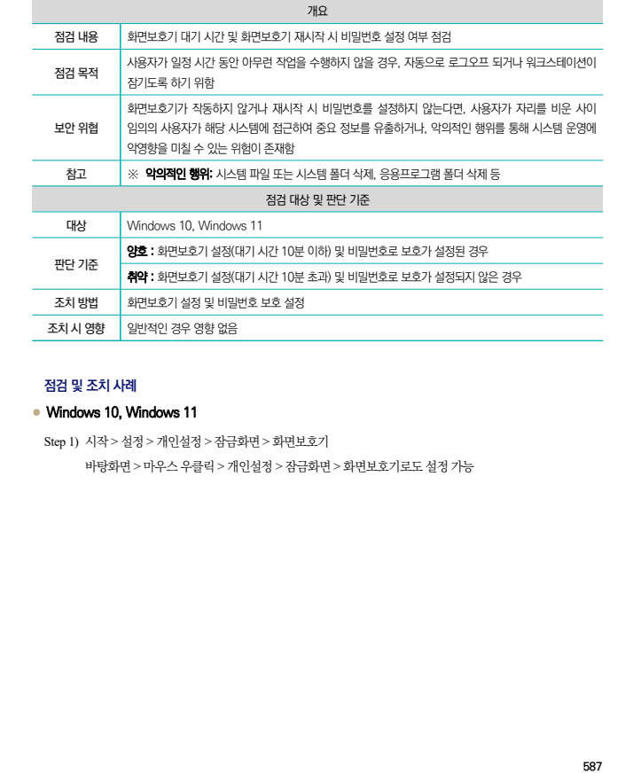
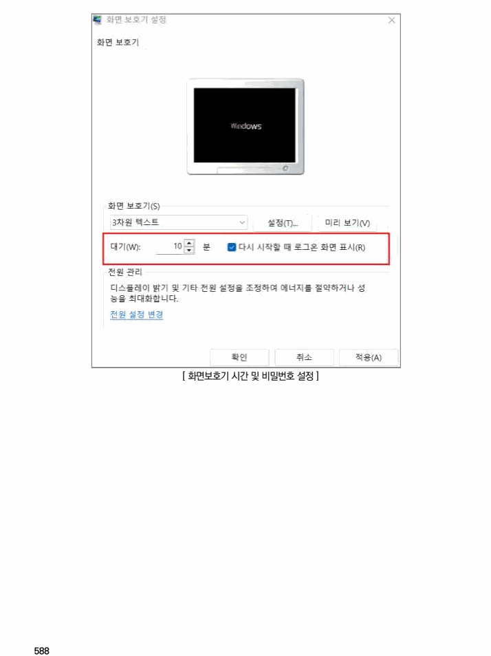

## 원문 전사

### PDF 페이지 587

~~~text transcription
개요
점검 내용 화면보호기 대기 시간 및 화면보호기 재시작 시 비밀번호 설정 여부 점검
사용자가 일정 시간 동안 아무런 작업을 수행하지 않을 경우, 자동으로 로그오프 되거나 워크스테이션이
점검 목적
잠기도록 하기 위함
화면보호기가 작동하지 않거나 재시작 시 비밀번호를 설정하지 않는다면, 사용자가 자리를 비운 사이
보안 위협 임의의 사용자가 해당 시스템에 접근하여 중요 정보를 유출하거나, 악의적인 행위를 통해 시스템 운영에
악영향을 미칠 수 있는 위험이 존재함
참고 ※ 악의적인 행위: 시스템 파일 또는 시스템 폴더 삭제, 응용프로그램 폴더 삭제 등
점검 대상 및 판단 기준
대상 Windows 10, Windows 11
양호 : 화면보호기 설정(대기 시간 10분 이하) 및 비밀번호로 보호가 설정된 경우
판단 기준
취약 : 화면보호기 설정(대기 시간 10분 초과) 및 비밀번호로 보호가 설정되지 않은 경우
조치 방법 화면보호기 설정 및 비밀번호 보호 설정
조치 시 영향 일반적인 경우 영향 없음
점검 및 조치 사례
l Windows 10, Windows 11
Step 1) 시작 > 설정 > 개인설정 > 잠금화면 > 화면보호기
바탕화면 > 마우스 우클릭 > 개인설정 > 잠금화면 > 화면보호기로도 설정 가능
~~~

### PDF 페이지 588

~~~text transcription
[ 화면보호기 시간 및 비밀번호 설정 ]
~~~

