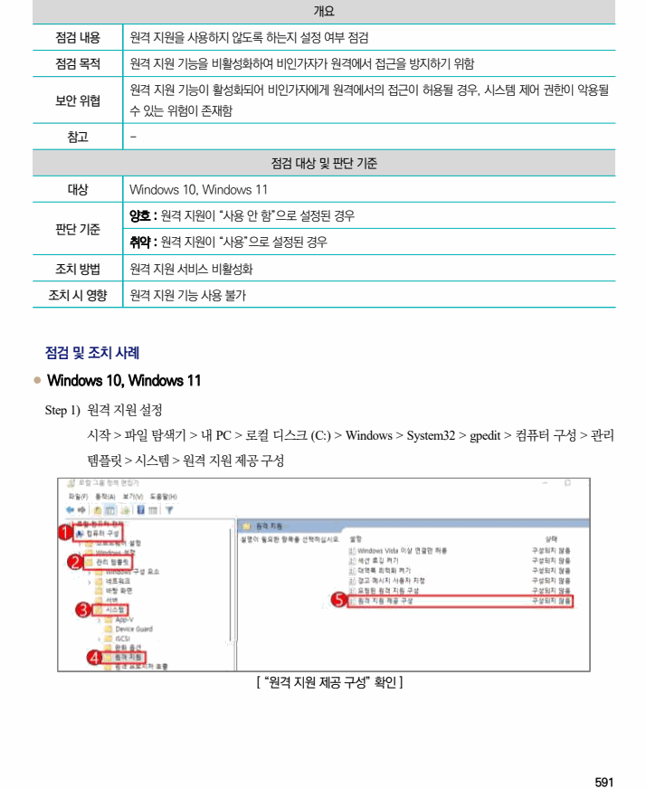
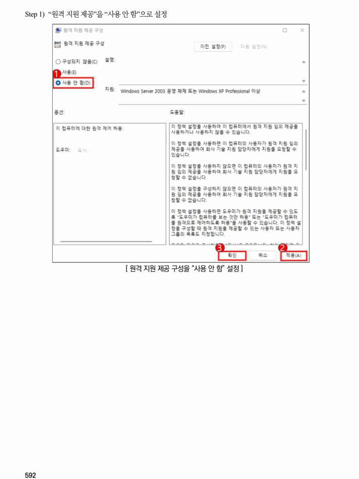

## 원문 전사

### PDF 페이지 591

~~~text transcription
개요
점검 내용 원격 지원을 사용하지 않도록 하는지 설정 여부 점검
점검 목적 원격 지원 기능을 비활성화하여 비인가자가 원격에서 접근을 방지하기 위함
원격 지원 기능이 활성화되어 비인가자에게 원격에서의 접근이 허용될 경우, 시스템 제어 권한이 악용될
보안 위협
수 있는 위험이 존재함
참고 -
점검 대상 및 판단 기준
대상 Windows 10, Windows 11
양호 : 원격 지원이 “사용 안 함”으로 설정된 경우
판단 기준
취약 : 원격 지원이 “사용”으로 설정된 경우
조치 방법 원격 지원 서비스 비활성화
조치 시 영향 원격 지원 기능 사용 불가
점검 및 조치 사례
l Windows 10, Windows 11
Step 1) 원격 지원 설정
시작 > 파일 탐색기 > 내 PC > 로컬 디스크 (C:) > Windows > System32 > gpedit > 컴퓨터 구성 > 관리
템플릿 > 시스템 > 원격 지원 제공 구성
[ “원격 지원 제공 구성” 확인 ]
~~~

### PDF 페이지 592

~~~text transcription
Step 1) “원격 지원 제공”을 “사용 안 함”으로 설정
[ 원격 지원 제공 구성을 “사용 안 함” 설정 ]
~~~

