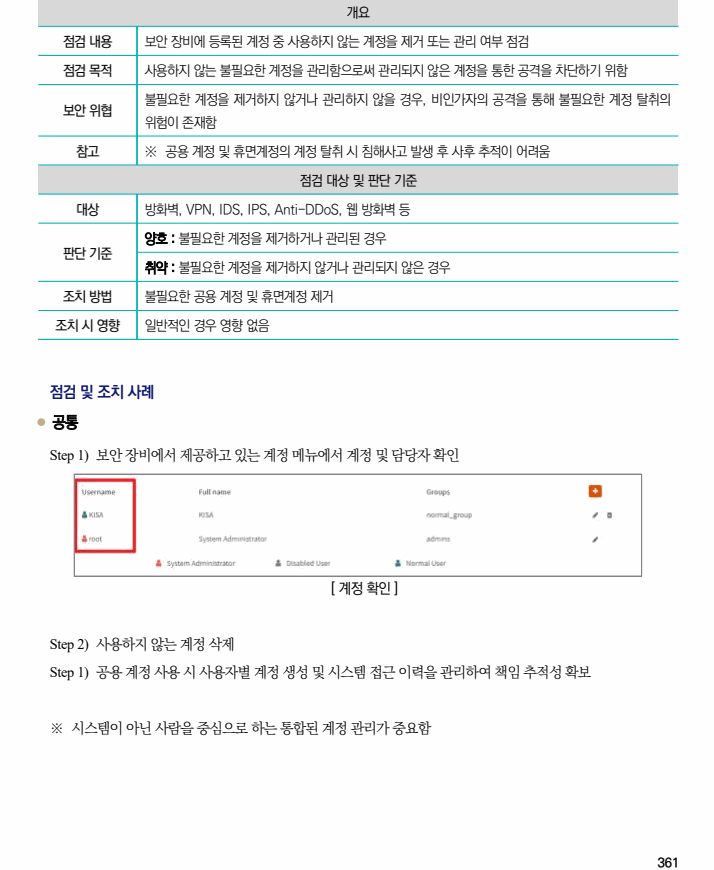

## 원문 전사

### PDF 페이지 361

~~~text transcription
개요
점검 내용 보안 장비에 등록된 계정 중 사용하지 않는 계정을 제거 또는 관리 여부 점검
점검 목적 사용하지 않는 불필요한 계정을 관리함으로써 관리되지 않은 계정을 통한 공격을 차단하기 위함
불필요한 계정을 제거하지 않거나 관리하지 않을 경우, 비인가자의 공격을 통해 불필요한 계정 탈취의
보안 위협
위험이 존재함
참고 ※ 공용 계정 및 휴면계정의 계정 탈취 시 침해사고 발생 후 사후 추적이 어려움
점검 대상 및 판단 기준
대상 방화벽, VPN, IDS, IPS, Anti-DDoS, 웹 방화벽 등
양호 : 불필요한 계정을 제거하거나 관리된 경우
판단 기준
취약 : 불필요한 계정을 제거하지 않거나 관리되지 않은 경우
조치 방법 불필요한 공용 계정 및 휴면계정 제거
조치 시 영향 일반적인 경우 영향 없음
점검 및 조치 사례
l 공통
Step 1) 보안 장비에서 제공하고 있는 계정 메뉴에서 계정 및 담당자 확인
[ 계정 확인 ]
Step 2) 사용하지 않는 계정 삭제
Step 1) 공용 계정 사용 시 사용자별 계정 생성 및 시스템 접근 이력을 관리하여 책임 추적성 확보
※ 시스템이 아닌 사람을 중심으로 하는 통합된 계정 관리가 중요함
~~~

