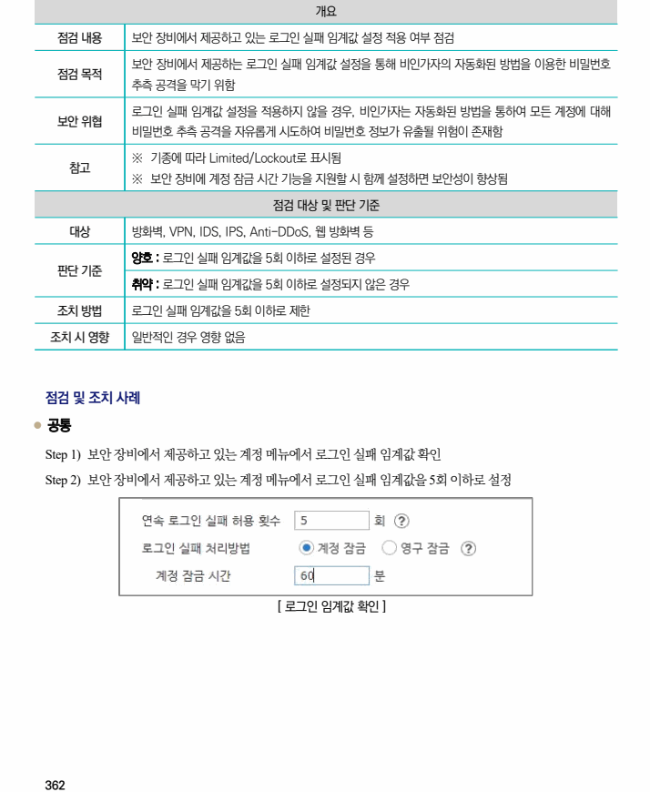

## 원문 전사

### PDF 페이지 362

~~~text transcription
개요
점검 내용 보안 장비에서 제공하고 있는 로그인 실패 임계값 설정 적용 여부 점검
보안 장비에서 제공하는 로그인 실패 임계값 설정을 통해 비인가자의 자동화된 방법을 이용한 비밀번호
점검 목적
추측 공격을 막기 위함
로그인 실패 임계값 설정을 적용하지 않을 경우, 비인가자는 자동화된 방법을 통하여 모든 계정에 대해
보안 위협
비밀번호 추측 공격을 자유롭게 시도하여 비밀번호 정보가 유출될 위험이 존재함
※ 기종에 따라 Limited/Lockout로 표시됨
참고
※ 보안 장비에 계정 잠금 시간 기능을 지원할 시 함께 설정하면 보안성이 향상됨
점검 대상 및 판단 기준
대상 방화벽, VPN, IDS, IPS, Anti-DDoS, 웹 방화벽 등
양호 : 로그인 실패 임계값을 5회 이하로 설정된 경우
판단 기준
취약 : 로그인 실패 임계값을 5회 이하로 설정되지 않은 경우
조치 방법 로그인 실패 임계값을 5회 이하로 제한
조치 시 영향 일반적인 경우 영향 없음
점검 및 조치 사례
l 공통
Step 1) 보안 장비에서 제공하고 있는 계정 메뉴에서 로그인 실패 임계값 확인
Step 2) 보안 장비에서 제공하고 있는 계정 메뉴에서 로그인 실패 임계값을 5회 이하로 설정
[ 로그인 임계값 확인 ]
~~~

