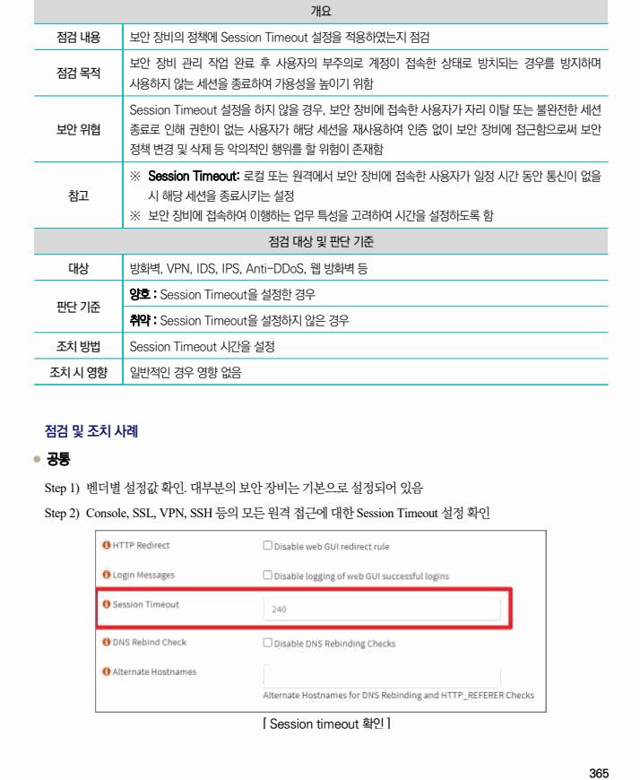
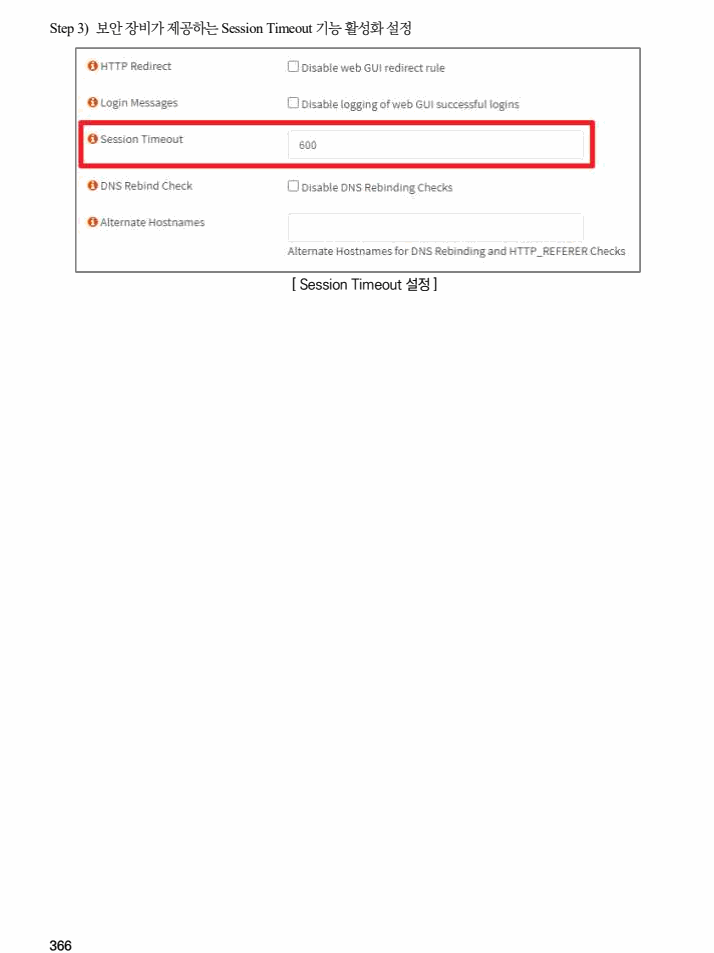

## 원문 전사

### PDF 페이지 365

~~~text transcription
개요
점검 내용 보안 장비의 정책에 Session Timeout 설정을 적용하였는지 점검
보안 장비 관리 작업 완료 후 사용자의 부주의로 계정이 접속한 상태로 방치되는 경우를 방지하며
점검 목적
사용하지 않는 세션을 종료하여 가용성을 높이기 위함
Session Timeout 설정을 하지 않을 경우, 보안 장비에 접속한 사용자가 자리 이탈 또는 불완전한 세션
보안 위협 종료로 인해 권한이 없는 사용자가 해당 세션을 재사용하여 인증 없이 보안 장비에 접근함으로써 보안
정책 변경 및 삭제 등 악의적인 행위를 할 위험이 존재함
※ Session Timeout: 로컬 또는 원격에서 보안 장비에 접속한 사용자가 일정 시간 동안 통신이 없을
참고 시 해당 세션을 종료시키는 설정
※ 보안 장비에 접속하여 이행하는 업무 특성을 고려하여 시간을 설정하도록 함
점검 대상 및 판단 기준
대상 방화벽, VPN, IDS, IPS, Anti-DDoS, 웹 방화벽 등
양호 : Session Timeout을 설정한 경우
판단 기준
취약 : Session Timeout을 설정하지 않은 경우
조치 방법 Session Timeout 시간을 설정
조치 시 영향 일반적인 경우 영향 없음
점검 및 조치 사례
l 공통
Step 1) 벤더별 설정값 확인. 대부분의 보안 장비는 기본으로 설정되어 있음
Step 2) Console, SSL, VPN, SSH 등의 모든 원격 접근에 대한 Session Timeout 설정 확인
[ Session timeout 확인 ]
~~~

### PDF 페이지 366

~~~text transcription
Step 3) 보안 장비가 제공하는 Session Timeout 기능 활성화 설정
[ Session Timeout 설정 ]
~~~

