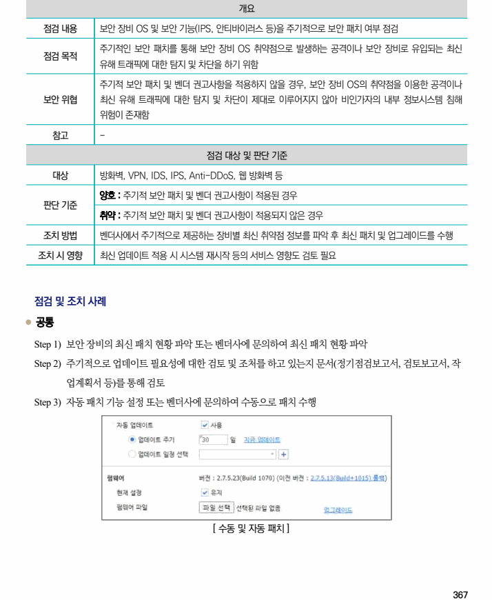

## 원문 전사

### PDF 페이지 367

~~~text transcription
개요
점검 내용 보안 장비 OS 및 보안 기능(IPS, 안티바이러스 등)을 주기적으로 보안 패치 여부 점검
주기적인 보안 패치를 통해 보안 장비 OS 취약점으로 발생하는 공격이나 보안 장비로 유입되는 최신
점검 목적
유해 트래픽에 대한 탐지 및 차단을 하기 위함
주기적 보안 패치 및 벤더 권고사항을 적용하지 않을 경우, 보안 장비 OS의 취약점을 이용한 공격이나
보안 위협 최신 유해 트래픽에 대한 탐지 및 차단이 제대로 이루어지지 않아 비인가자의 내부 정보시스템 침해
위험이 존재함
참고 -
점검 대상 및 판단 기준
대상 방화벽, VPN, IDS, IPS, Anti-DDoS, 웹 방화벽 등
양호 : 주기적 보안 패치 및 벤더 권고사항이 적용된 경우
판단 기준
취약 : 주기적 보안 패치 및 벤더 권고사항이 적용되지 않은 경우
조치 방법 벤더사에서 주기적으로 제공하는 장비별 최신 취약점 정보를 파악 후 최신 패치 및 업그레이드를 수행
조치 시 영향 최신 업데이트 적용 시 시스템 재시작 등의 서비스 영향도 검토 필요
점검 및 조치 사례
l 공통
Step 1) 보안 장비의 최신 패치 현황 파악 또는 벤더사에 문의하여 최신 패치 현황 파악
Step 2) 주기적으로 업데이트 필요성에 대한 검토 및 조처를 하고 있는지 문서(정기점검보고서, 검토보고서, 작
업계획서 등)를 통해 검토
Step 3) 자동 패치 기능 설정 또는 벤더사에 문의하여 수동으로 패치 수행
[ 수동 및 자동 패치 ]
~~~

