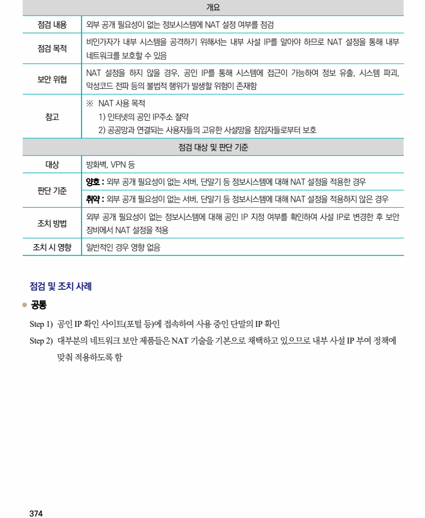
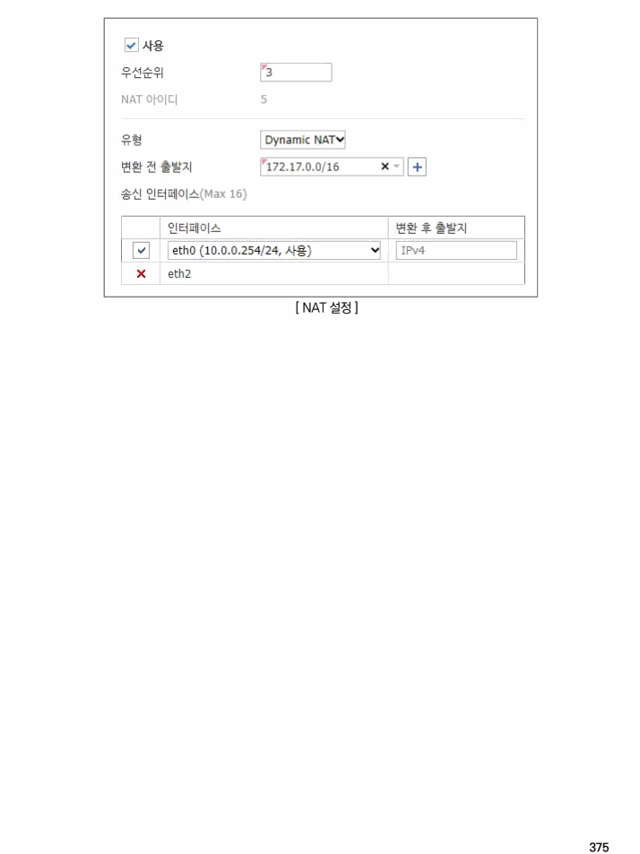

## 원문 전사

### PDF 페이지 374

~~~text transcription
개요
점검 내용 외부 공개 필요성이 없는 정보시스템에 NAT 설정 여부를 점검
비인가자가 내부 시스템을 공격하기 위해서는 내부 사설 IP를 알아야 하므로 NAT 설정을 통해 내부
점검 목적
네트워크를 보호할 수 있음
NAT 설정을 하지 않을 경우, 공인 IP를 통해 시스템에 접근이 가능하여 정보 유출, 시스템 파괴,
보안 위협
악성코드 전파 등의 불법적 행위가 발생할 위험이 존재함
※ NAT 사용 목적
참고 1) 인터넷의 공인 IP주소 절약
2) 공공망과 연결되는 사용자들의 고유한 사설망을 침입자들로부터 보호
점검 대상 및 판단 기준
대상 방화벽, VPN 등
양호 : 외부 공개 필요성이 없는 서버, 단말기 등 정보시스템에 대해 NAT 설정을 적용한 경우
판단 기준
취약 : 외부 공개 필요성이 없는 서버, 단말기 등 정보시스템에 대해 NAT 설정을 적용하지 않은 경우
외부 공개 필요성이 없는 정보시스템에 대해 공인 IP 지정 여부를 확인하여 사설 IP로 변경한 후 보안
조치 방법
장비에서 NAT 설정을 적용
조치 시 영향 일반적인 경우 영향 없음
점검 및 조치 사례
l 공통
Step 1) 공인 IP 확인 사이트(포털 등)에 접속하여 사용 중인 단말의 IP 확인
Step 2) 대부분의 네트워크 보안 제품들은 NAT 기술을 기본으로 채택하고 있으므로 내부 사설 IP 부여 정책에
맞춰 적용하도록 함
~~~

### PDF 페이지 375

~~~text transcription
[ NAT 설정 ]
~~~

