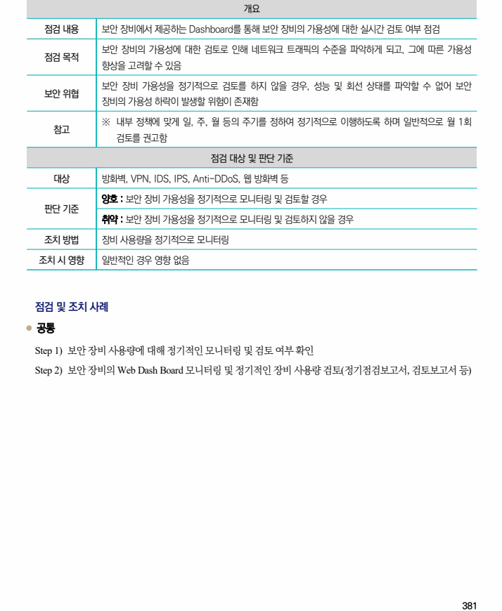
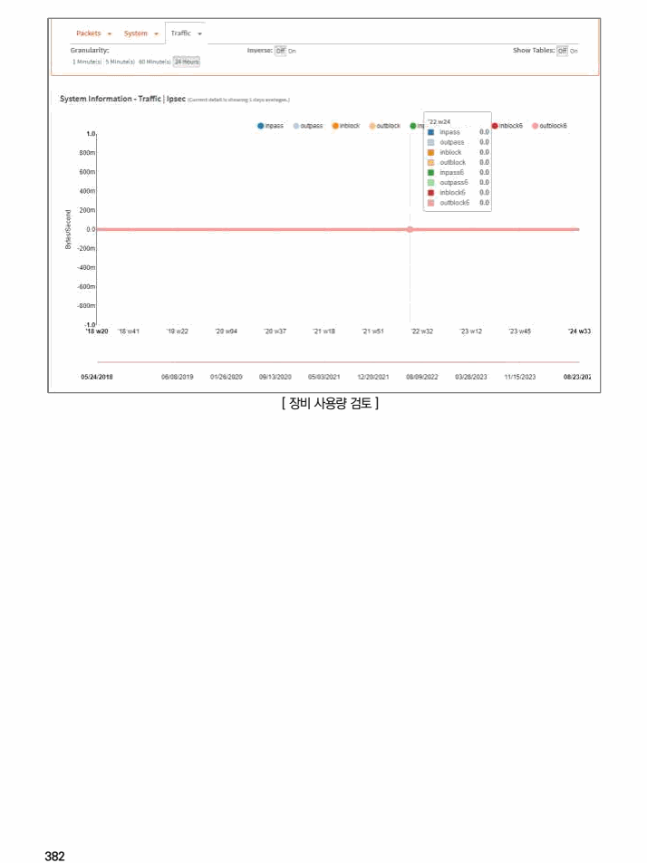

## 원문 전사

### PDF 페이지 381

~~~text transcription
개요
점검 내용 보안 장비에서 제공하는 Dashboard를 통해 보안 장비의 가용성에 대한 실시간 검토 여부 점검
보안 장비의 가용성에 대한 검토로 인해 네트워크 트래픽의 수준을 파악하게 되고, 그에 따른 가용성
점검 목적
향상을 고려할 수 있음
보안 장비 가용성을 정기적으로 검토를 하지 않을 경우, 성능 및 회선 상태를 파악할 수 없어 보안
보안 위협
장비의 가용성 하락이 발생할 위험이 존재함
※ 내부 정책에 맞게 일, 주, 월 등의 주기를 정하여 정기적으로 이행하도록 하며 일반적으로 월 1회
참고
검토를 권고함
점검 대상 및 판단 기준
대상 방화벽, VPN, IDS, IPS, Anti-DDoS, 웹 방화벽 등
양호 : 보안 장비 가용성을 정기적으로 모니터링 및 검토할 경우
판단 기준
취약 : 보안 장비 가용성을 정기적으로 모니터링 및 검토하지 않을 경우
조치 방법 장비 사용량을 정기적으로 모니터링
조치 시 영향 일반적인 경우 영향 없음
점검 및 조치 사례
l 공통
Step 1) 보안 장비 사용량에 대해 정기적인 모니터링 및 검토 여부 확인
Step 2) 보안 장비의 Web Dash Board 모니터링 및 정기적인 장비 사용량 검토(정기점검보고서, 검토보고서 등)
~~~

### PDF 페이지 382

~~~text transcription
[ 장비 사용량 검토 ]
~~~

