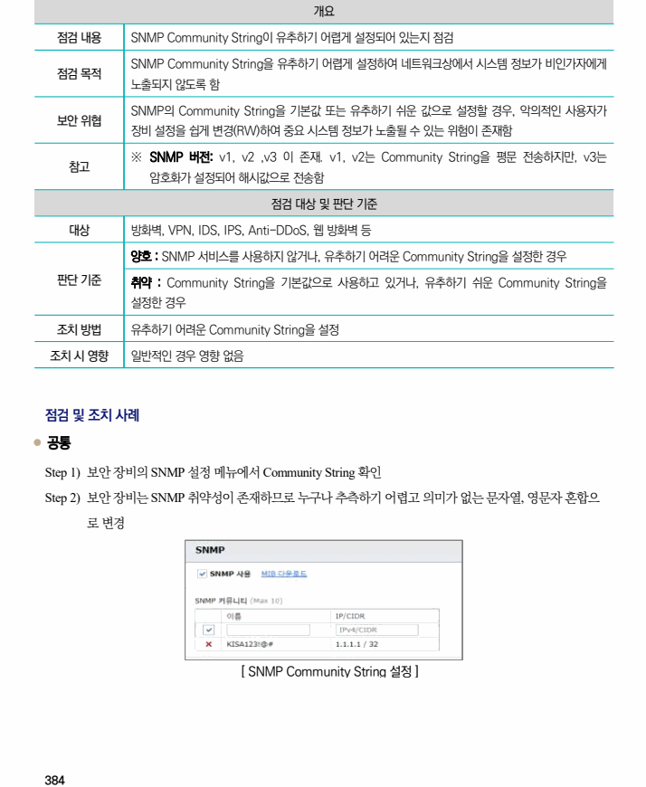

## 원문 전사

### PDF 페이지 384

~~~text transcription
개요
점검 내용 SNMP Community String이 유추하기 어렵게 설정되어 있는지 점검
SNMP Community String을 유추하기 어렵게 설정하여 네트워크상에서 시스템 정보가 비인가자에게
점검 목적
노출되지 않도록 함
SNMP의 Community String을 기본값 또는 유추하기 쉬운 값으로 설정할 경우, 악의적인 사용자가
보안 위협
장비 설정을 쉽게 변경(RW)하여 중요 시스템 정보가 노출될 수 있는 위험이 존재함
※ SNMP 버전: v1, v2 ,v3 이 존재. v1, v2는 Community String을 평문 전송하지만, v3는
참고
암호화가 설정되어 해시값으로 전송함
점검 대상 및 판단 기준
대상 방화벽, VPN, IDS, IPS, Anti-DDoS, 웹 방화벽 등
양호 : SNMP 서비스를 사용하지 않거나, 유추하기 어려운 Community String을 설정한 경우
판단 기준 취약 : Community String을 기본값으로 사용하고 있거나, 유추하기 쉬운 Community String을
설정한 경우
조치 방법 유추하기 어려운 Community String을 설정
조치 시 영향 일반적인 경우 영향 없음
점검 및 조치 사례
l 공통
Step 1) 보안 장비의 SNMP 설정 메뉴에서 Community String 확인
Step 2) 보안 장비는 SNMP 취약성이 존재하므로 누구나 추측하기 어렵고 의미가 없는 문자열, 영문자 혼합으
로 변경
[ SNMP Community String 설정 ]
~~~

