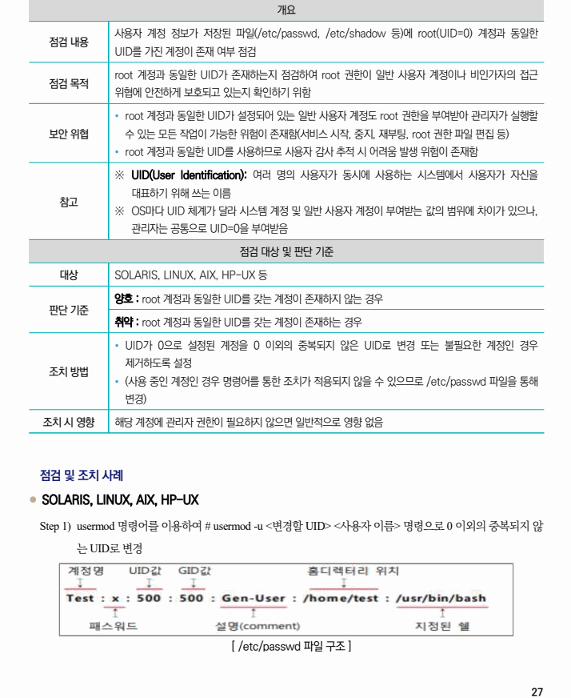
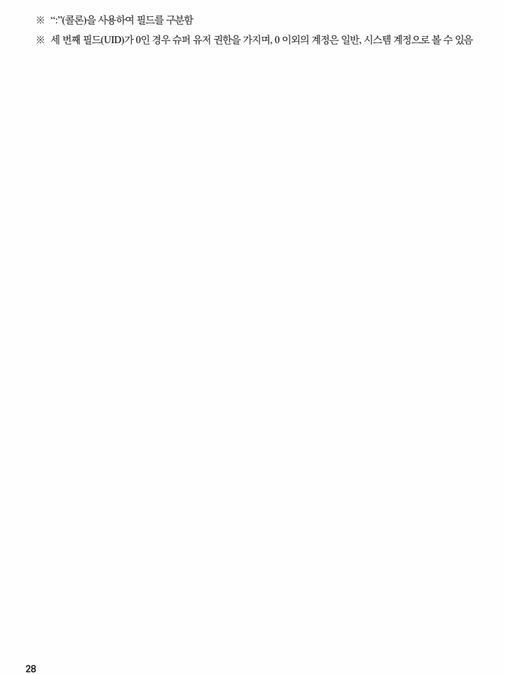

## 원문 전사

### PDF 페이지 27

~~~text transcription
개요
사용자 계정 정보가 저장된 파일(/etc/passwd, /etc/shadow 등)에 root(UID=0) 계정과 동일한
점검 내용
UID를 가진 계정이 존재 여부 점검
root 계정과 동일한 UID가 존재하는지 점검하여 root 권한이 일반 사용자 계정이나 비인가자의 접근
점검 목적
위협에 안전하게 보호되고 있는지 확인하기 위함
Ÿ root 계정과 동일한 UID가 설정되어 있는 일반 사용자 계정도 root 권한을 부여받아 관리자가 실행할
보안 위협 수 있는 모든 작업이 가능한 위험이 존재함(서비스 시작, 중지, 재부팅, root 권한 파일 편집 등)
Ÿ root 계정과 동일한 UID를 사용하므로 사용자 감사 추적 시 어려움 발생 위험이 존재함
※ UID(User Identification): 여러 명의 사용자가 동시에 사용하는 시스템에서 사용자가 자신을
대표하기 위해 쓰는 이름
참고
※ OS마다 UID 체계가 달라 시스템 계정 및 일반 사용자 계정이 부여받는 값의 범위에 차이가 있으나,
관리자는 공통으로 UID=0을 부여받음
점검 대상 및 판단 기준
대상 SOLARIS, LINUX, AIX, HP-UX 등
양호 : root 계정과 동일한 UID를 갖는 계정이 존재하지 않는 경우
판단 기준
취약 : root 계정과 동일한 UID를 갖는 계정이 존재하는 경우
Ÿ UID가 0으로 설정된 계정을 0 이외의 중복되지 않은 UID로 변경 또는 불필요한 계정인 경우
제거하도록 설정
조치 방법
Ÿ (사용 중인 계정인 경우 명령어를 통한 조치가 적용되지 않을 수 있으므로 /etc/passwd 파일을 통해
변경)
조치 시 영향 해당 계정에 관리자 권한이 필요하지 않으면 일반적으로 영향 없음
점검 및 조치 사례
l SOLARIS, LINUX, AIX, HP-UX
Step 1) usermod 명령어를 이용하여 # usermod -u <변경할 UID> <사용자 이름> 명령으로 0 이외의 중복되지 않
는 UID로 변경
[ /etc/passwd 파일 구조 ]
~~~

### PDF 페이지 28

~~~text transcription
※ “:”(콜론)을 사용하여 필드를 구분함
※ 세 번째 필드(UID)가 0인 경우 슈퍼 유저 권한을 가지며, 0 이외의 계정은 일반, 시스템 계정으로 볼 수 있음
~~~

