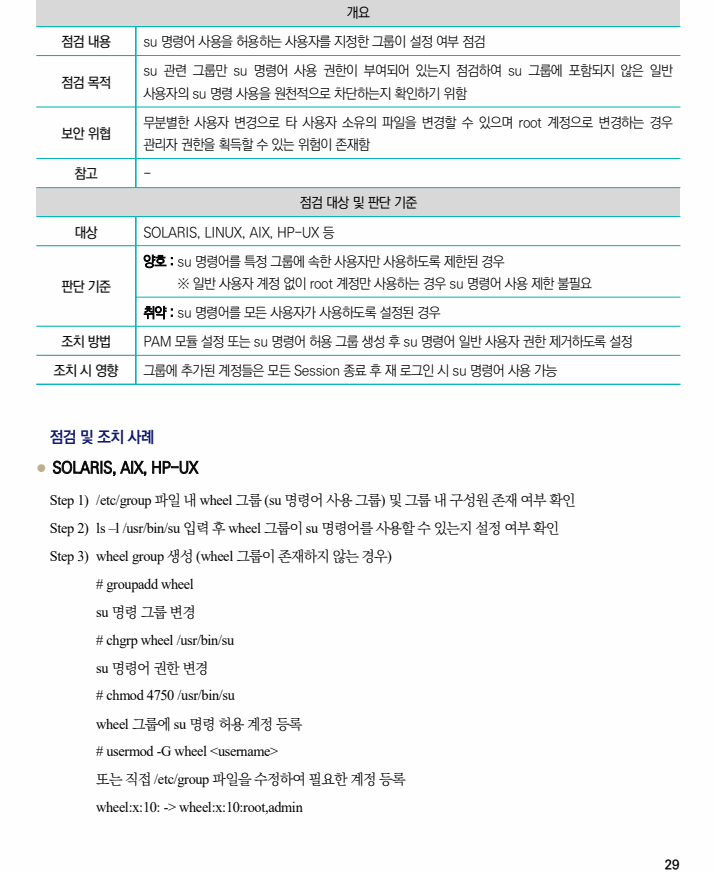
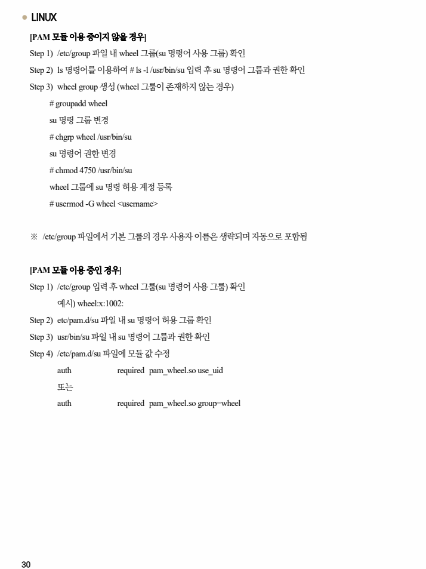

## 원문 전사

### PDF 페이지 29

~~~text transcription
개요
점검 내용 su 명령어 사용을 허용하는 사용자를 지정한 그룹이 설정 여부 점검
su 관련 그룹만 su 명령어 사용 권한이 부여되어 있는지 점검하여 su 그룹에 포함되지 않은 일반
점검 목적
사용자의 su 명령 사용을 원천적으로 차단하는지 확인하기 위함
무분별한 사용자 변경으로 타 사용자 소유의 파일을 변경할 수 있으며 root 계정으로 변경하는 경우
보안 위협
관리자 권한을 획득할 수 있는 위험이 존재함
참고 -
점검 대상 및 판단 기준
대상 SOLARIS, LINUX, AIX, HP-UX 등
양호 : su 명령어를 특정 그룹에 속한 사용자만 사용하도록 제한된 경우
판단 기준 ※ 일반 사용자 계정 없이 root 계정만 사용하는 경우 su 명령어 사용 제한 불필요
취약 : su 명령어를 모든 사용자가 사용하도록 설정된 경우
조치 방법 PAM 모듈 설정 또는 su 명령어 허용 그룹 생성 후 su 명령어 일반 사용자 권한 제거하도록 설정
조치 시 영향 그룹에 추가된 계정들은 모든 Session 종료 후 재 로그인 시 su 명령어 사용 가능
점검 및 조치 사례
l SOLARIS, AIX, HP-UX
Step 1) /etc/group 파일 내 wheel 그룹 (su 명령어 사용 그룹) 및 그룹 내 구성원 존재 여부 확인
Step 2) ls –l /usr/bin/su 입력 후 wheel 그룹이 su 명령어를 사용할 수 있는지 설정 여부 확인
Step 3) wheel group 생성 (wheel 그룹이 존재하지 않는 경우)
# groupadd wheel
su 명령 그룹 변경
# chgrp wheel /usr/bin/su
su 명령어 권한 변경
# chmod 4750 /usr/bin/su
wheel 그룹에 su 명령 허용 계정 등록
# usermod -G wheel <username>
또는 직접 /etc/group 파일을 수정하여 필요한 계정 등록
wheel:x:10: -> wheel:x:10:root,admin
~~~

### PDF 페이지 30

~~~text transcription
l LINUX
[PAM 모듈 이용 중이지 않을 경우]
Step 1) /etc/group 파일 내 wheel 그룹(su 명령어 사용 그룹) 확인
Step 2) ls 명령어를 이용하여 # ls -l /usr/bin/su 입력 후 su 명령어 그룹과 권한 확인
Step 3) wheel group 생성 (wheel 그룹이 존재하지 않는 경우)
# groupadd wheel
su 명령 그룹 변경
# chgrp wheel /usr/bin/su
su 명령어 권한 변경
# chmod 4750 /usr/bin/su
wheel 그룹에 su 명령 허용 계정 등록
# usermod -G wheel <username>
※ /etc/group 파일에서 기본 그룹의 경우 사용자 이름은 생략되며 자동으로 포함됨
[PAM 모듈 이용 중인 경우]
Step 1) /etc/group 입력 후 wheel 그룹(su 명령어 사용 그룹) 확인
예시) wheel:x:1002:
Step 2) etc/pam.d/su 파일 내 su 명령어 허용 그룹 확인
Step 3) usr/bin/su 파일 내 su 명령어 그룹과 권한 확인
Step 4) /etc/pam.d/su 파일에 모듈 값 수정
auth required pam_wheel.so use_uid
또는
auth required pam_wheel.so group=wheel
~~~

