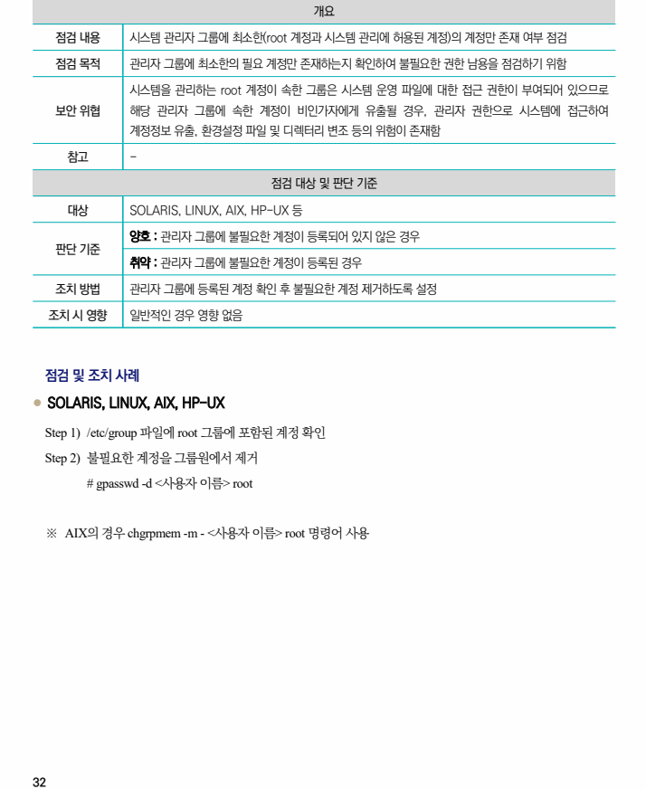

## 원문 전사

### PDF 페이지 32

~~~text transcription
개요
점검 내용 시스템 관리자 그룹에 최소한(root 계정과 시스템 관리에 허용된 계정)의 계정만 존재 여부 점검
점검 목적 관리자 그룹에 최소한의 필요 계정만 존재하는지 확인하여 불필요한 권한 남용을 점검하기 위함
시스템을 관리하는 root 계정이 속한 그룹은 시스템 운영 파일에 대한 접근 권한이 부여되어 있으므로
보안 위협 해당 관리자 그룹에 속한 계정이 비인가자에게 유출될 경우, 관리자 권한으로 시스템에 접근하여
계정정보 유출, 환경설정 파일 및 디렉터리 변조 등의 위험이 존재함
참고 -
점검 대상 및 판단 기준
대상 SOLARIS, LINUX, AIX, HP-UX 등
양호 : 관리자 그룹에 불필요한 계정이 등록되어 있지 않은 경우
판단 기준
취약 : 관리자 그룹에 불필요한 계정이 등록된 경우
조치 방법 관리자 그룹에 등록된 계정 확인 후 불필요한 계정 제거하도록 설정
조치 시 영향 일반적인 경우 영향 없음
점검 및 조치 사례
l SOLARIS, LINUX, AIX, HP-UX
Step 1) /etc/group 파일에 root 그룹에 포함된 계정 확인
Step 2) 불필요한 계정을 그룹원에서 제거
# gpasswd -d <사용자 이름> root
※ AIX의 경우 chgrpmem -m - <사용자 이름> root 명령어 사용
~~~

