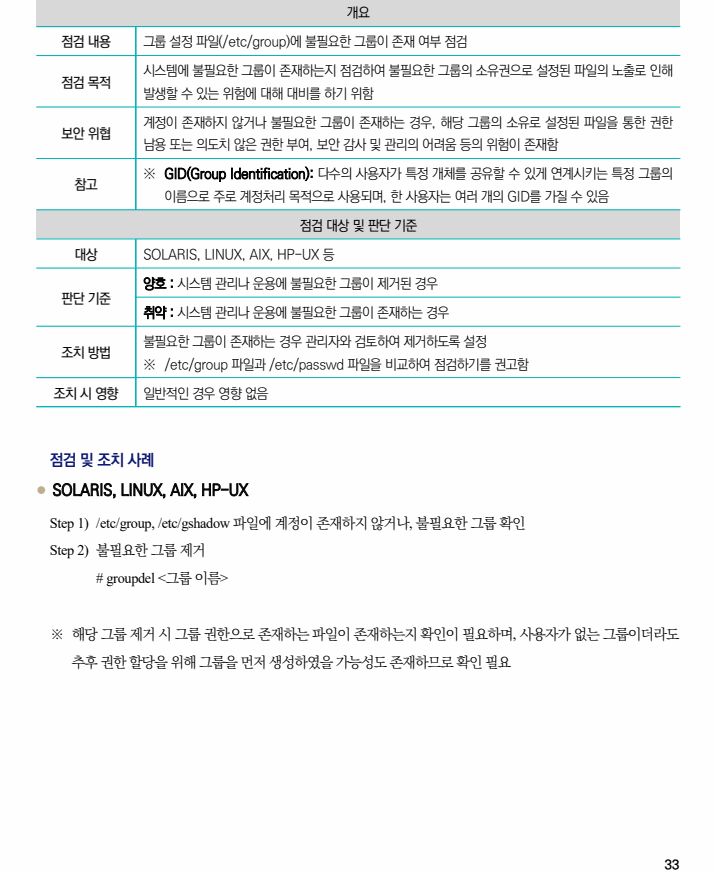

## 원문 전사

### PDF 페이지 33

~~~text transcription
개요
점검 내용 그룹 설정 파일(/etc/group)에 불필요한 그룹이 존재 여부 점검
시스템에 불필요한 그룹이 존재하는지 점검하여 불필요한 그룹의 소유권으로 설정된 파일의 노출로 인해
점검 목적
발생할 수 있는 위험에 대해 대비를 하기 위함
계정이 존재하지 않거나 불필요한 그룹이 존재하는 경우, 해당 그룹의 소유로 설정된 파일을 통한 권한
보안 위협
남용 또는 의도치 않은 권한 부여, 보안 감사 및 관리의 어려움 등의 위험이 존재함
※ GID(Group Identification): 다수의 사용자가 특정 개체를 공유할 수 있게 연계시키는 특정 그룹의
참고
이름으로 주로 계정처리 목적으로 사용되며, 한 사용자는 여러 개의 GID를 가질 수 있음
점검 대상 및 판단 기준
대상 SOLARIS, LINUX, AIX, HP-UX 등
양호 : 시스템 관리나 운용에 불필요한 그룹이 제거된 경우
판단 기준
취약 : 시스템 관리나 운용에 불필요한 그룹이 존재하는 경우
불필요한 그룹이 존재하는 경우 관리자와 검토하여 제거하도록 설정
조치 방법
※ /etc/group 파일과 /etc/passwd 파일을 비교하여 점검하기를 권고함
조치 시 영향 일반적인 경우 영향 없음
점검 및 조치 사례
l SOLARIS, LINUX, AIX, HP-UX
Step 1) /etc/group, /etc/gshadow 파일에 계정이 존재하지 않거나, 불필요한 그룹 확인
Step 2) 불필요한 그룹 제거
# groupdel <그룹 이름>
※ 해당 그룹 제거 시 그룹 권한으로 존재하는 파일이 존재하는지 확인이 필요하며, 사용자가 없는 그룹이더라도
추후 권한 할당을 위해 그룹을 먼저 생성하였을 가능성도 존재하므로 확인 필요
~~~

