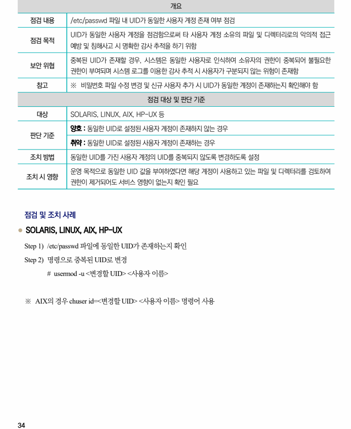

## 원문 전사

### PDF 페이지 34

~~~text transcription
개요
점검 내용 /etc/passwd 파일 내 UID가 동일한 사용자 계정 존재 여부 점검
UID가 동일한 사용자 계정을 점검함으로써 타 사용자 계정 소유의 파일 및 디렉터리로의 악의적 접근
점검 목적
예방 및 침해사고 시 명확한 감사 추적을 하기 위함
중복된 UID가 존재할 경우, 시스템은 동일한 사용자로 인식하여 소유자의 권한이 중복되어 불필요한
보안 위협
권한이 부여되며 시스템 로그를 이용한 감사 추적 시 사용자가 구분되지 않는 위험이 존재함
참고 ※ 비밀번호 파일 수정 변경 및 신규 사용자 추가 시 UID가 동일한 계정이 존재하는지 확인해야 함
점검 대상 및 판단 기준
대상 SOLARIS, LINUX, AIX, HP-UX 등
양호 : 동일한 UID로 설정된 사용자 계정이 존재하지 않는 경우
판단 기준
취약 : 동일한 UID로 설정된 사용자 계정이 존재하는 경우
조치 방법 동일한 UID를 가진 사용자 계정의 UID를 중복되지 않도록 변경하도록 설정
운영 목적으로 동일한 UID 값을 부여하였다면 해당 계정이 사용하고 있는 파일 및 디렉터리를 검토하여
조치 시 영향
권한이 제거되어도 서비스 영향이 없는지 확인 필요
점검 및 조치 사례
l SOLARIS, LINUX, AIX, HP-UX
Step 1) /etc/passwd 파일에 동일한 UID가 존재하는지 확인
Step 2) 명령으로 중복된 UID로 변경
# usermod -u <변경할 UID> <사용자 이름>
※ AIX의 경우 chuser id=<변경할 UID> <사용자 이름> 명령어 사용
~~~

