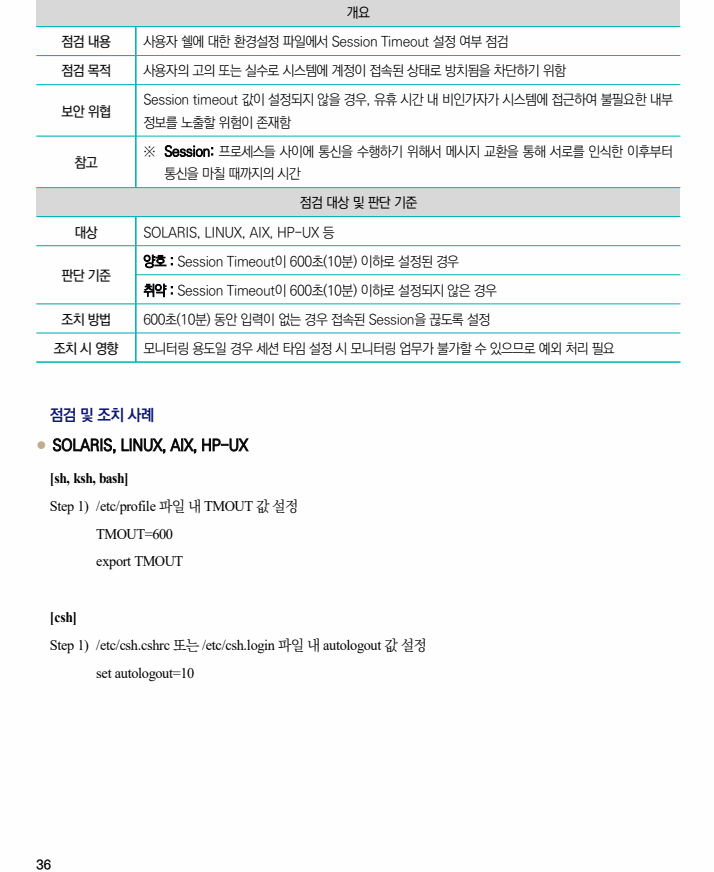

## 원문 전사

### PDF 페이지 36

~~~text transcription
개요
점검 내용 사용자 쉘에 대한 환경설정 파일에서 Session Timeout 설정 여부 점검
점검 목적 사용자의 고의 또는 실수로 시스템에 계정이 접속된 상태로 방치됨을 차단하기 위함
Session timeout 값이 설정되지 않을 경우, 유휴 시간 내 비인가자가 시스템에 접근하여 불필요한 내부
보안 위협
정보를 노출할 위험이 존재함
※ Session: 프로세스들 사이에 통신을 수행하기 위해서 메시지 교환을 통해 서로를 인식한 이후부터
참고
통신을 마칠 때까지의 시간
점검 대상 및 판단 기준
대상 SOLARIS, LINUX, AIX, HP-UX 등
양호 : Session Timeout이 600초(10분) 이하로 설정된 경우
판단 기준
취약 : Session Timeout이 600초(10분) 이하로 설정되지 않은 경우
조치 방법 600초(10분) 동안 입력이 없는 경우 접속된 Session을 끊도록 설정
조치 시 영향 모니터링 용도일 경우 세션 타임 설정 시 모니터링 업무가 불가할 수 있으므로 예외 처리 필요
점검 및 조치 사례
l SOLARIS, LINUX, AIX, HP-UX
[sh, ksh, bash]
Step 1) /etc/profile 파일 내 TMOUT 값 설정
TMOUT=600
export TMOUT
[csh]
Step 1) /etc/csh.cshrc 또는 /etc/csh.login 파일 내 autologout 값 설정
set autologout=10
~~~

