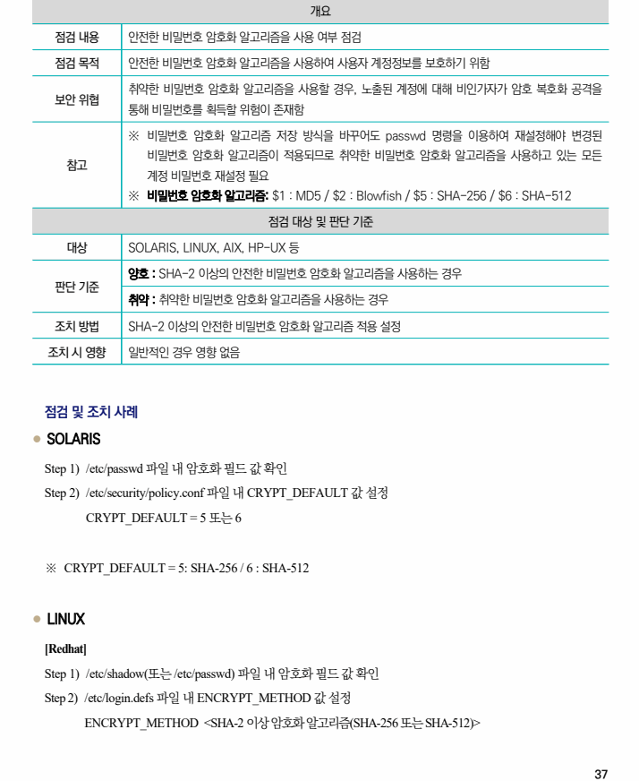
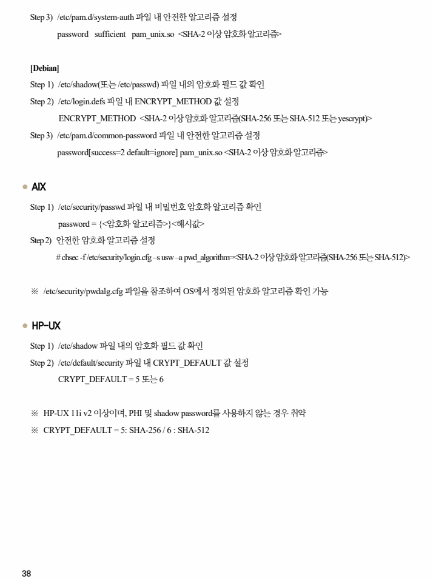

## 원문 전사

### PDF 페이지 37

~~~text transcription
개요
점검 내용 안전한 비밀번호 암호화 알고리즘을 사용 여부 점검
점검 목적 안전한 비밀번호 암호화 알고리즘을 사용하여 사용자 계정정보를 보호하기 위함
취약한 비밀번호 암호화 알고리즘을 사용할 경우, 노출된 계정에 대해 비인가자가 암호 복호화 공격을
보안 위협
통해 비밀번호를 획득할 위험이 존재함
※ 비밀번호 암호화 알고리즘 저장 방식을 바꾸어도 passwd 명령을 이용하여 재설정해야 변경된
비밀번호 암호화 알고리즘이 적용되므로 취약한 비밀번호 암호화 알고리즘을 사용하고 있는 모든
참고
계정 비밀번호 재설정 필요
※ 비밀번호 암호화 알고리즘: $1 : MD5 / $2 : Blowfish / $5 : SHA-256 / $6 : SHA-512
점검 대상 및 판단 기준
대상 SOLARIS, LINUX, AIX, HP-UX 등
양호 : SHA-2 이상의 안전한 비밀번호 암호화 알고리즘을 사용하는 경우
판단 기준
취약 : 취약한 비밀번호 암호화 알고리즘을 사용하는 경우
조치 방법 SHA-2 이상의 안전한 비밀번호 암호화 알고리즘 적용 설정
조치 시 영향 일반적인 경우 영향 없음
점검 및 조치 사례
l SOLARIS
Step 1) /etc/passwd 파일 내 암호화 필드 값 확인
Step 2) /etc/security/policy.conf 파일 내 CRYPT_DEFAULT 값 설정
CRYPT_DEFAULT = 5 또는 6
※ CRYPT_DEFAULT = 5: SHA-256 / 6 : SHA-512
l LINUX
[Redhat]
Step 1) /etc/shadow(또는 /etc/passwd) 파일 내 암호화 필드 값 확인
Step 2) /etc/login.defs 파일 내 ENCRYPT_METHOD 값 설정
ENCRYPT_METHOD <SHA-2 이상 암호화 알고리즘(SHA-256 또는 SHA-512)>
~~~

### PDF 페이지 38

~~~text transcription
Step 3) /etc/pam.d/system-auth 파일 내 안전한 알고리즘 설정
password sufficient pam_unix.so <SHA-2 이상 암호화 알고리즘>
[Debian]
Step 1) /etc/shadow(또는 /etc/passwd) 파일 내의 암호화 필드 값 확인
Step 2) /etc/login.defs 파일 내 ENCRYPT_METHOD 값 설정
ENCRYPT_METHOD <SHA-2 이상 암호화 알고리즘(SHA-256 또는 SHA-512 또는 yescrypt)>
Step 3) /etc/pam.d/common-password 파일 내 안전한 알고리즘 설정
password[success=2 default=ignore] pam_unix.so <SHA-2 이상 암호화 알고리즘>
l AIX
Step 1) /etc/security/passwd 파일 내 비밀번호 암호화 알고리즘 확인
password = {<암호화 알고리즘>}<해시값>
Step 2) 안전한 암호화 알고리즘 설정
# chsec -f /etc/security/login.cfg –s usw –a pwd_algorithm=<SHA-2 이상 암호화 알고리즘(SHA-256 또는 SHA-512)>
※ /etc/security/pwdalg.cfg 파일을 참조하여 OS에서 정의된 암호화 알고리즘 확인 가능
l HP-UX
Step 1) /etc/shadow 파일 내의 암호화 필드 값 확인
Step 2) /etc/default/security 파일 내 CRYPT_DEFAULT 값 설정
CRYPT_DEFAULT = 5 또는 6
※ HP-UX 11i v2 이상이며, PHI 및 shadow password를 사용하지 않는 경우 취약
※ CRYPT_DEFAULT = 5: SHA-256 / 6 : SHA-512
~~~

