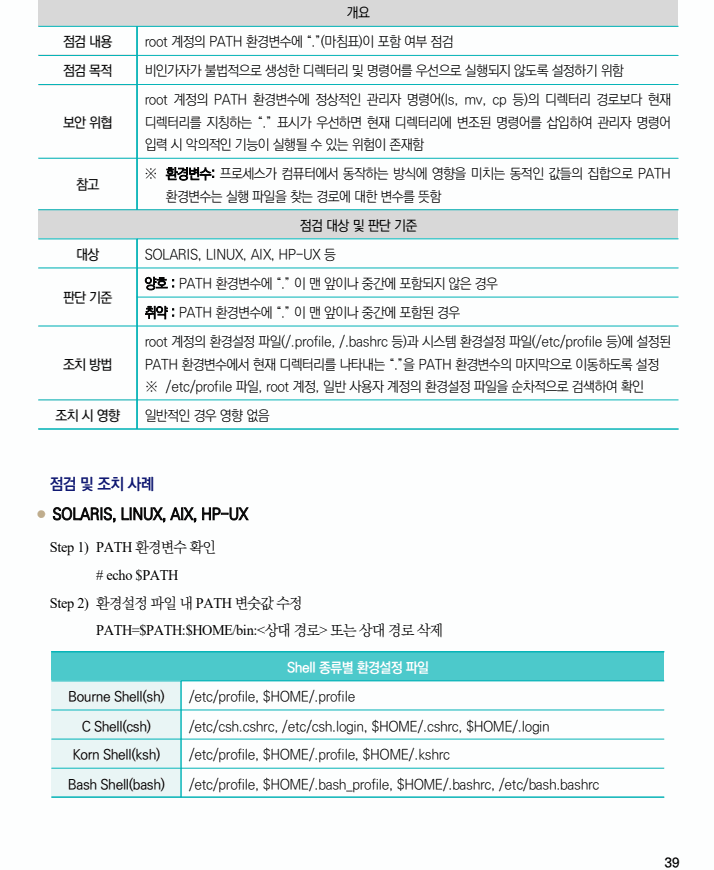

## 원문 전사

### PDF 페이지 39

~~~text transcription
개요
점검 내용 root 계정의 PATH 환경변수에 “.”(마침표)이 포함 여부 점검
점검 목적 비인가자가 불법적으로 생성한 디렉터리 및 명령어를 우선으로 실행되지 않도록 설정하기 위함
root 계정의 PATH 환경변수에 정상적인 관리자 명령어(ls, mv, cp 등)의 디렉터리 경로보다 현재
보안 위협 디렉터리를 지칭하는 “.” 표시가 우선하면 현재 디렉터리에 변조된 명령어를 삽입하여 관리자 명령어
입력 시 악의적인 기능이 실행될 수 있는 위험이 존재함
※ 환경변수: 프로세스가 컴퓨터에서 동작하는 방식에 영향을 미치는 동적인 값들의 집합으로 PATH
참고
환경변수는 실행 파일을 찾는 경로에 대한 변수를 뜻함
점검 대상 및 판단 기준
대상 SOLARIS, LINUX, AIX, HP-UX 등
양호 : PATH 환경변수에 “.” 이 맨 앞이나 중간에 포함되지 않은 경우
판단 기준
취약 : PATH 환경변수에 “.” 이 맨 앞이나 중간에 포함된 경우
root 계정의 환경설정 파일(/.profile, /.bashrc 등)과 시스템 환경설정 파일(/etc/profile 등)에 설정된
조치 방법 PATH 환경변수에서 현재 디렉터리를 나타내는 “.”을 PATH 환경변수의 마지막으로 이동하도록 설정
※ /etc/profile 파일, root 계정, 일반 사용자 계정의 환경설정 파일을 순차적으로 검색하여 확인
조치 시 영향 일반적인 경우 영향 없음
점검 및 조치 사례
l SOLARIS, LINUX, AIX, HP-UX
Step 1) PATH 환경변수 확인
# echo $PATH
Step 2) 환경설정 파일 내 PATH 변숫값 수정
PATH=$PATH:$HOME/bin:<상대 경로> 또는 상대 경로 삭제
Shell 종류별 환경설정 파일
Bourne Shell(sh) /etc/profile, $HOME/.profile
C Shell(csh) /etc/csh.cshrc, /etc/csh.login, $HOME/.cshrc, $HOME/.login
Korn Shell(ksh) /etc/profile, $HOME/.profile, $HOME/.kshrc
Bash Shell(bash) /etc/profile, $HOME/.bash_profile, $HOME/.bashrc, /etc/bash.bashrc
~~~

