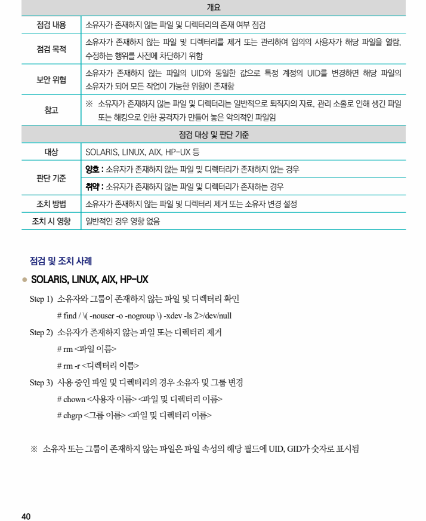

## 원문 전사

### PDF 페이지 40

~~~text transcription
개요
점검 내용 소유자가 존재하지 않는 파일 및 디렉터리의 존재 여부 점검
소유자가 존재하지 않는 파일 및 디렉터리를 제거 또는 관리하여 임의의 사용자가 해당 파일을 열람,
점검 목적
수정하는 행위를 사전에 차단하기 위함
소유자가 존재하지 않는 파일의 UID와 동일한 값으로 특정 계정의 UID를 변경하면 해당 파일의
보안 위협
소유자가 되어 모든 작업이 가능한 위험이 존재함
※ 소유자가 존재하지 않는 파일 및 디렉터리는 일반적으로 퇴직자의 자료, 관리 소홀로 인해 생긴 파일
참고
또는 해킹으로 인한 공격자가 만들어 놓은 악의적인 파일임
점검 대상 및 판단 기준
대상 SOLARIS, LINUX, AIX, HP-UX 등
양호 : 소유자가 존재하지 않는 파일 및 디렉터리가 존재하지 않는 경우
판단 기준
취약 : 소유자가 존재하지 않는 파일 및 디렉터리가 존재하는 경우
조치 방법 소유자가 존재하지 않는 파일 및 디렉터리 제거 또는 소유자 변경 설정
조치 시 영향 일반적인 경우 영향 없음
점검 및 조치 사례
l SOLARIS, LINUX, AIX, HP-UX
Step 1) 소유자와 그룹이 존재하지 않는 파일 및 디렉터리 확인
# find / \( -nouser -o -nogroup \) -xdev -ls 2>/dev/null
Step 2) 소유자가 존재하지 않는 파일 또는 디렉터리 제거
# rm <파일 이름>
# rm -r <디렉터리 이름>
Step 3) 사용 중인 파일 및 디렉터리의 경우 소유자 및 그룹 변경
# chown <사용자 이름> <파일 및 디렉터리 이름>
# chgrp <그룹 이름> <파일 및 디렉터리 이름>
※ 소유자 또는 그룹이 존재하지 않는 파일은 파일 속성의 해당 필드에 UID, GID가 숫자로 표시됨
~~~

