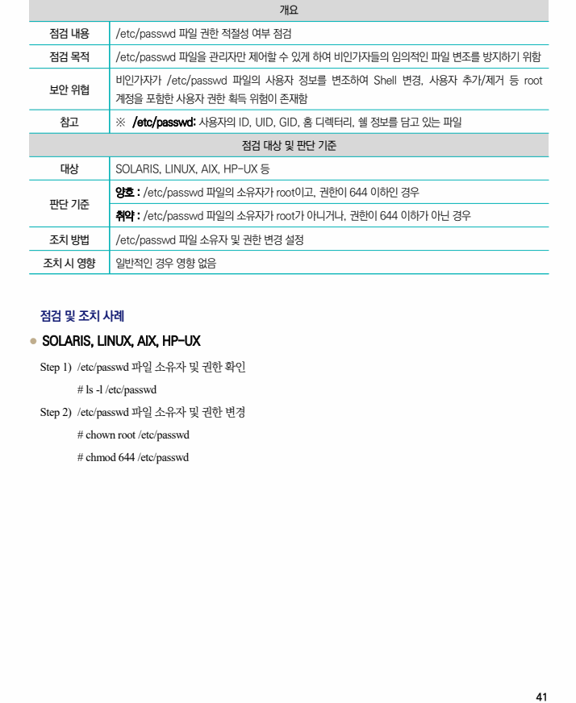

## 원문 전사

### PDF 페이지 41

~~~text transcription
개요
점검 내용 /etc/passwd 파일 권한 적절성 여부 점검
점검 목적 /etc/passwd 파일을 관리자만 제어할 수 있게 하여 비인가자들의 임의적인 파일 변조를 방지하기 위함
비인가자가 /etc/passwd 파일의 사용자 정보를 변조하여 Shell 변경, 사용자 추가/제거 등 root
보안 위협
계정을 포함한 사용자 권한 획득 위험이 존재함
참고 ※ /etc/passwd: 사용자의 ID, UID, GID, 홈 디렉터리, 쉘 정보를 담고 있는 파일
점검 대상 및 판단 기준
대상 SOLARIS, LINUX, AIX, HP-UX 등
양호 : /etc/passwd 파일의 소유자가 root이고, 권한이 644 이하인 경우
판단 기준
취약 : /etc/passwd 파일의 소유자가 root가 아니거나, 권한이 644 이하가 아닌 경우
조치 방법 /etc/passwd 파일 소유자 및 권한 변경 설정
조치 시 영향 일반적인 경우 영향 없음
점검 및 조치 사례
l SOLARIS, LINUX, AIX, HP-UX
Step 1) /etc/passwd 파일 소유자 및 권한 확인
# ls -l /etc/passwd
Step 2) /etc/passwd 파일 소유자 및 권한 변경
# chown root /etc/passwd
# chmod 644 /etc/passwd
~~~

