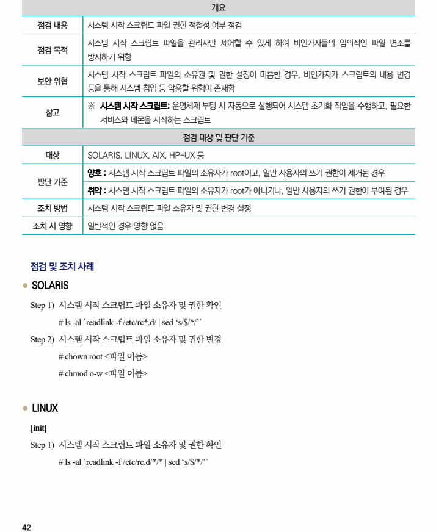
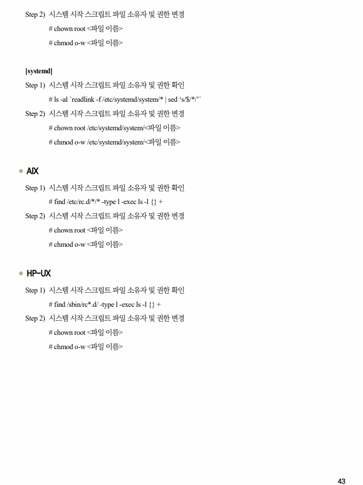

## 원문 전사

### PDF 페이지 42

~~~text transcription
개요
점검 내용 시스템 시작 스크립트 파일 권한 적절성 여부 점검
시스템 시작 스크립트 파일을 관리자만 제어할 수 있게 하여 비인가자들의 임의적인 파일 변조를
점검 목적
방지하기 위함
시스템 시작 스크립트 파일의 소유권 및 권한 설정이 미흡할 경우, 비인가자가 스크립트의 내용 변경
보안 위협
등을 통해 시스템 침입 등 악용할 위험이 존재함
※ 시스템 시작 스크립트: 운영체제 부팅 시 자동으로 실행되어 시스템 초기화 작업을 수행하고, 필요한
참고
서비스와 데몬을 시작하는 스크립트
점검 대상 및 판단 기준
대상 SOLARIS, LINUX, AIX, HP-UX 등
양호 : 시스템 시작 스크립트 파일의 소유자가 root이고, 일반 사용자의 쓰기 권한이 제거된 경우
판단 기준
취약 : 시스템 시작 스크립트 파일의 소유자가 root가 아니거나, 일반 사용자의 쓰기 권한이 부여된 경우
조치 방법 시스템 시작 스크립트 파일 소유자 및 권한 변경 설정
조치 시 영향 일반적인 경우 영향 없음
점검 및 조치 사례
l SOLARIS
Step 1) 시스템 시작 스크립트 파일 소유자 및 권한 확인
# ls -al `readlink -f /etc/rc*.d/ | sed ‘s/$/*/’`
Step 2) 시스템 시작 스크립트 파일 소유자 및 권한 변경
# chown root <파일 이름>
# chmod o-w <파일 이름>
l LINUX
[init]
Step 1) 시스템 시작 스크립트 파일 소유자 및 권한 확인
# ls -al `readlink -f /etc/rc.d/*/* | sed ‘s/$/*/’`
~~~

### PDF 페이지 43

~~~text transcription
Step 2) 시스템 시작 스크립트 파일 소유자 및 권한 변경
# chown root <파일 이름>
# chmod o-w <파일 이름>
[systemd]
Step 1) 시스템 시작 스크립트 파일 소유자 및 권한 확인
# ls -al `readlink -f /etc/systemd/system/* | sed ‘s/$/*/’`
Step 2) 시스템 시작 스크립트 파일 소유자 및 권한 변경
# chown root /etc/systemd/system/<파일 이름>
# chmod o-w /etc/systemd/system/<파일 이름>
l AIX
Step 1) 시스템 시작 스크립트 파일 소유자 및 권한 확인
# find /etc/rc.d/*/* -type l -exec ls -l {} +
Step 2) 시스템 시작 스크립트 파일 소유자 및 권한 변경
# chown root <파일 이름>
# chmod o-w <파일 이름>
l HP-UX
Step 1) 시스템 시작 스크립트 파일 소유자 및 권한 확인
# find /sbin/rc*.d/ -type l -exec ls -l {} +
Step 2) 시스템 시작 스크립트 파일 소유자 및 권한 변경
# chown root <파일 이름>
# chmod o-w <파일 이름>
~~~

