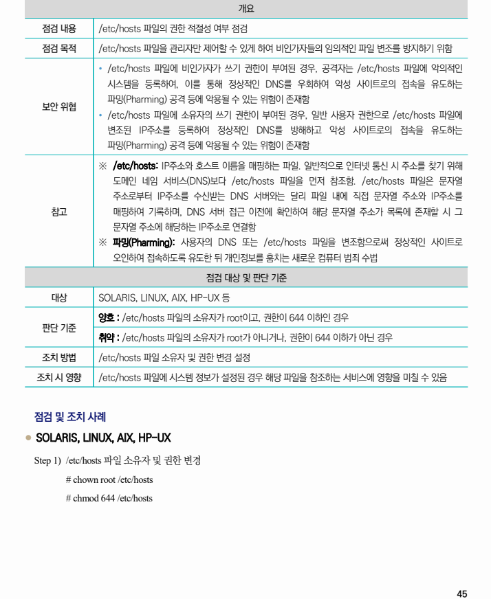

## 원문 전사

### PDF 페이지 45

~~~text transcription
개요
점검 내용 /etc/hosts 파일의 권한 적절성 여부 점검
점검 목적 /etc/hosts 파일을 관리자만 제어할 수 있게 하여 비인가자들의 임의적인 파일 변조를 방지하기 위함
Ÿ /etc/hosts 파일에 비인가자가 쓰기 권한이 부여된 경우, 공격자는 /etc/hosts 파일에 악의적인
시스템을 등록하여, 이를 통해 정상적인 DNS를 우회하여 악성 사이트로의 접속을 유도하는
파밍(Pharming) 공격 등에 악용될 수 있는 위험이 존재함
보안 위협
Ÿ /etc/hosts 파일에 소유자의 쓰기 권한이 부여된 경우, 일반 사용자 권한으로 /etc/hosts 파일에
변조된 IP주소를 등록하여 정상적인 DNS를 방해하고 악성 사이트로의 접속을 유도하는
파밍(Pharming) 공격 등에 악용될 수 있는 위험이 존재함
※ /etc/hosts: IP주소와 호스트 이름을 매핑하는 파일. 일반적으로 인터넷 통신 시 주소를 찾기 위해
도메인 네임 서비스(DNS)보다 /etc/hosts 파일을 먼저 참조함. /etc/hosts 파일은 문자열
주소로부터 IP주소를 수신받는 DNS 서버와는 달리 파일 내에 직접 문자열 주소와 IP주소를
참고 매핑하여 기록하며, DNS 서버 접근 이전에 확인하여 해당 문자열 주소가 목록에 존재할 시 그
문자열 주소에 해당하는 IP주소로 연결함
※ 파밍(Pharming): 사용자의 DNS 또는 /etc/hosts 파일을 변조함으로써 정상적인 사이트로
오인하여 접속하도록 유도한 뒤 개인정보를 훔치는 새로운 컴퓨터 범죄 수법
점검 대상 및 판단 기준
대상 SOLARIS, LINUX, AIX, HP-UX 등
양호 : /etc/hosts 파일의 소유자가 root이고, 권한이 644 이하인 경우
판단 기준
취약 : /etc/hosts 파일의 소유자가 root가 아니거나, 권한이 644 이하가 아닌 경우
조치 방법 /etc/hosts 파일 소유자 및 권한 변경 설정
조치 시 영향 /etc/hosts 파일에 시스템 정보가 설정된 경우 해당 파일을 참조하는 서비스에 영향을 미칠 수 있음
점검 및 조치 사례
l SOLARIS, LINUX, AIX, HP-UX
Step 1) /etc/hosts 파일 소유자 및 권한 변경
# chown root /etc/hosts
# chmod 644 /etc/hosts
~~~

