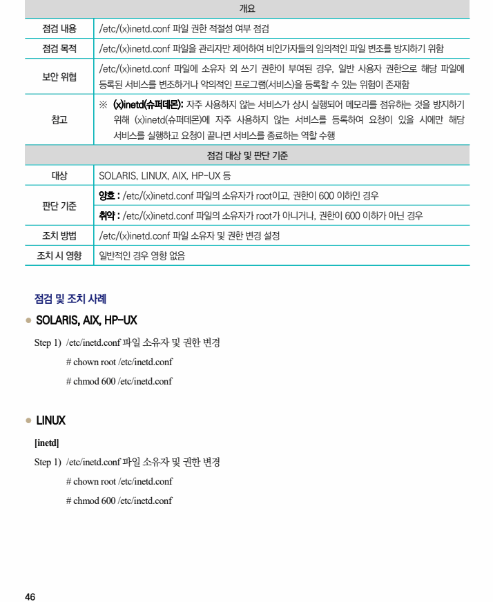
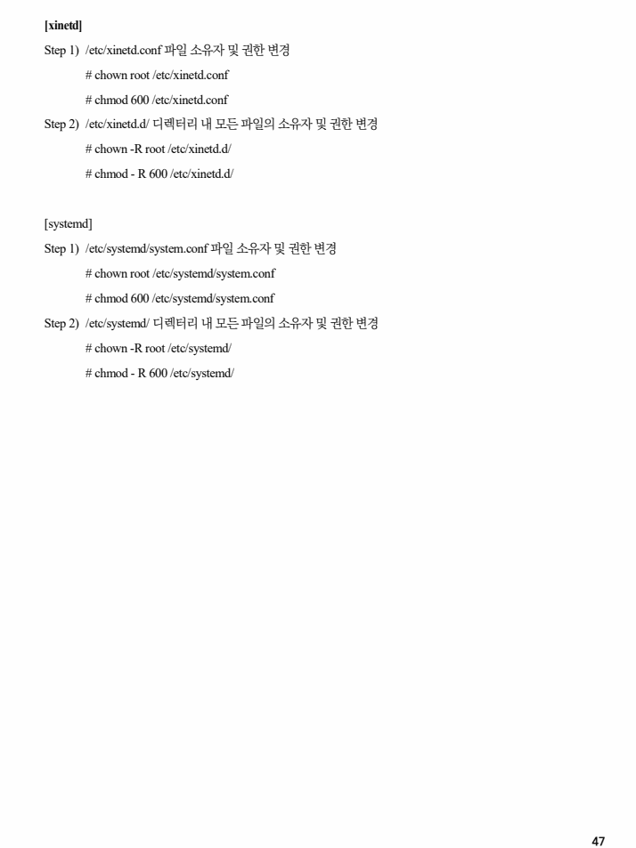

## 원문 전사

### PDF 페이지 46

~~~text transcription
개요
점검 내용 /etc/(x)inetd.conf 파일 권한 적절성 여부 점검
점검 목적 /etc/(x)inetd.conf 파일을 관리자만 제어하여 비인가자들의 임의적인 파일 변조를 방지하기 위함
/etc/(x)inetd.conf 파일에 소유자 외 쓰기 권한이 부여된 경우, 일반 사용자 권한으로 해당 파일에
보안 위협
등록된 서비스를 변조하거나 악의적인 프로그램(서비스)을 등록할 수 있는 위험이 존재함
※ (x)inetd(슈퍼데몬): 자주 사용하지 않는 서비스가 상시 실행되어 메모리를 점유하는 것을 방지하기
참고 위해 (x)inetd(슈퍼데몬)에 자주 사용하지 않는 서비스를 등록하여 요청이 있을 시에만 해당
서비스를 실행하고 요청이 끝나면 서비스를 종료하는 역할 수행
점검 대상 및 판단 기준
대상 SOLARIS, LINUX, AIX, HP-UX 등
양호 : /etc/(x)inetd.conf 파일의 소유자가 root이고, 권한이 600 이하인 경우
판단 기준
취약 : /etc/(x)inetd.conf 파일의 소유자가 root가 아니거나, 권한이 600 이하가 아닌 경우
조치 방법 /etc/(x)inetd.conf 파일 소유자 및 권한 변경 설정
조치 시 영향 일반적인 경우 영향 없음
점검 및 조치 사례
l SOLARIS, AIX, HP-UX
Step 1) /etc/inetd.conf 파일 소유자 및 권한 변경
# chown root /etc/inetd.conf
# chmod 600 /etc/inetd.conf
l LINUX
[inetd]
Step 1) /etc/inetd.conf 파일 소유자 및 권한 변경
# chown root /etc/inetd.conf
# chmod 600 /etc/inetd.conf
~~~

### PDF 페이지 47

~~~text transcription
[xinetd]
Step 1) /etc/xinetd.conf 파일 소유자 및 권한 변경
# chown root /etc/xinetd.conf
# chmod 600 /etc/xinetd.conf
Step 2) /etc/xinetd.d/ 디렉터리 내 모든 파일의 소유자 및 권한 변경
# chown -R root /etc/xinetd.d/
# chmod - R 600 /etc/xinetd.d/
[systemd]
Step 1) /etc/systemd/system.conf 파일 소유자 및 권한 변경
# chown root /etc/systemd/system.conf
# chmod 600 /etc/systemd/system.conf
Step 2) /etc/systemd/ 디렉터리 내 모든 파일의 소유자 및 권한 변경
# chown -R root /etc/systemd/
# chmod - R 600 /etc/systemd/
~~~

