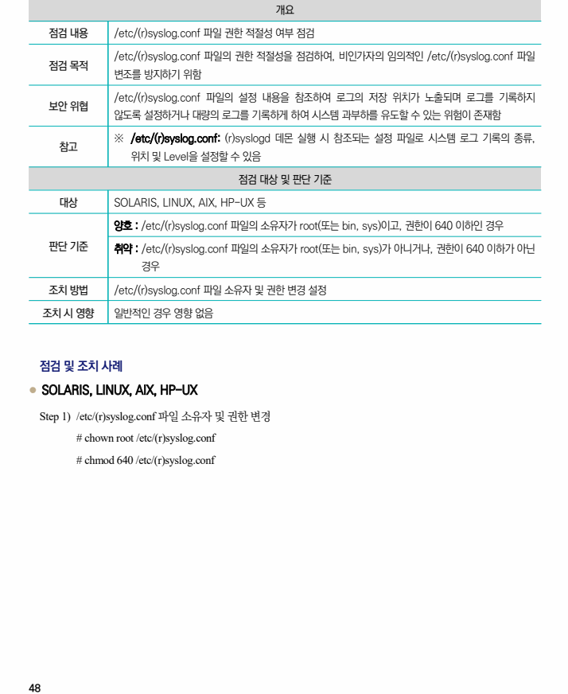

## 원문 전사

### PDF 페이지 48

~~~text transcription
개요
점검 내용 /etc/(r)syslog.conf 파일 권한 적절성 여부 점검
/etc/(r)syslog.conf 파일의 권한 적절성을 점검하여, 비인가자의 임의적인 /etc/(r)syslog.conf 파일
점검 목적
변조를 방지하기 위함
/etc/(r)syslog.conf 파일의 설정 내용을 참조하여 로그의 저장 위치가 노출되며 로그를 기록하지
보안 위협
않도록 설정하거나 대량의 로그를 기록하게 하여 시스템 과부하를 유도할 수 있는 위험이 존재함
※ /etc/(r)syslog.conf: (r)syslogd 데몬 실행 시 참조되는 설정 파일로 시스템 로그 기록의 종류,
참고
위치 및 Level을 설정할 수 있음
점검 대상 및 판단 기준
대상 SOLARIS, LINUX, AIX, HP-UX 등
양호 : /etc/(r)syslog.conf 파일의 소유자가 root(또는 bin, sys)이고, 권한이 640 이하인 경우
판단 기준 취약 : /etc/(r)syslog.conf 파일의 소유자가 root(또는 bin, sys)가 아니거나, 권한이 640 이하가 아닌
경우
조치 방법 /etc/(r)syslog.conf 파일 소유자 및 권한 변경 설정
조치 시 영향 일반적인 경우 영향 없음
점검 및 조치 사례
l SOLARIS, LINUX, AIX, HP-UX
Step 1) /etc/(r)syslog.conf 파일 소유자 및 권한 변경
# chown root /etc/(r)syslog.conf
# chmod 640 /etc/(r)syslog.conf
~~~

