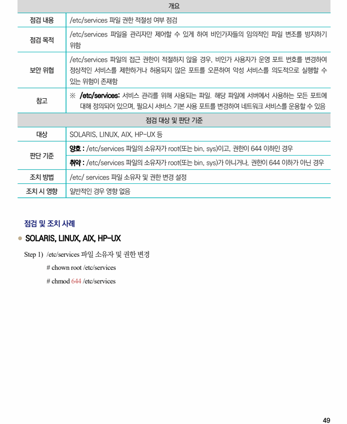

## 원문 전사

### PDF 페이지 49

~~~text transcription
개요
점검 내용 /etc/services 파일 권한 적절성 여부 점검
/etc/services 파일을 관리자만 제어할 수 있게 하여 비인가자들의 임의적인 파일 변조를 방지하기
점검 목적
위함
/etc/services 파일의 접근 권한이 적절하지 않을 경우, 비인가 사용자가 운영 포트 번호를 변경하여
보안 위협 정상적인 서비스를 제한하거나 허용되지 않은 포트를 오픈하여 악성 서비스를 의도적으로 실행할 수
있는 위험이 존재함
※ /etc/services: 서비스 관리를 위해 사용되는 파일. 해당 파일에 서버에서 사용하는 모든 포트에
참고
대해 정의되어 있으며, 필요시 서비스 기본 사용 포트를 변경하여 네트워크 서비스를 운용할 수 있음
점검 대상 및 판단 기준
대상 SOLARIS, LINUX, AIX, HP-UX 등
양호 : /etc/services 파일의 소유자가 root(또는 bin, sys)이고, 권한이 644 이하인 경우
판단 기준
취약 : /etc/services 파일의 소유자가 root(또는 bin, sys)가 아니거나, 권한이 644 이하가 아닌 경우
조치 방법 /etc/ services 파일 소유자 및 권한 변경 설정
조치 시 영향 일반적인 경우 영향 없음
점검 및 조치 사례
l SOLARIS, LINUX, AIX, HP-UX
Step 1) /etc/services 파일 소유자 및 권한 변경
# chown root /etc/services
# chmod 644 /etc/services
~~~

