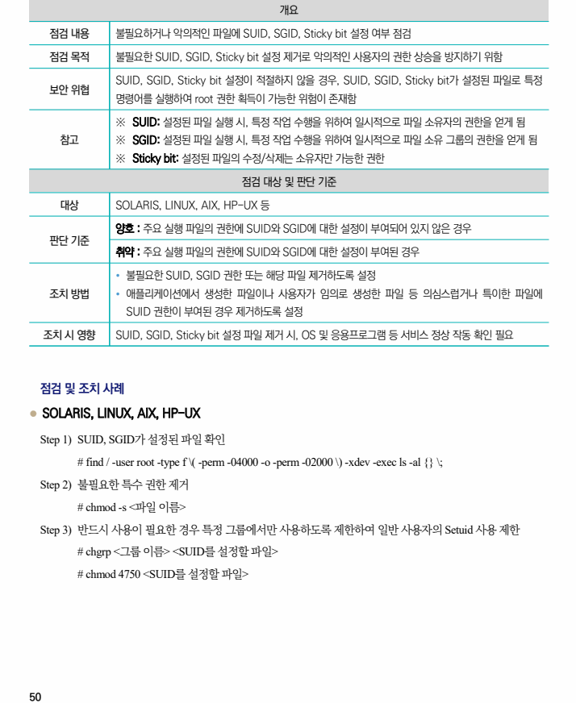

## 원문 전사

### PDF 페이지 50

~~~text transcription
개요
점검 내용 불필요하거나 악의적인 파일에 SUID, SGID, Sticky bit 설정 여부 점검
점검 목적 불필요한 SUID, SGID, Sticky bit 설정 제거로 악의적인 사용자의 권한 상승을 방지하기 위함
SUID, SGID, Sticky bit 설정이 적절하지 않을 경우, SUID, SGID, Sticky bit가 설정된 파일로 특정
보안 위협
명령어를 실행하여 root 권한 획득이 가능한 위험이 존재함
※ SUID: 설정된 파일 실행 시, 특정 작업 수행을 위하여 일시적으로 파일 소유자의 권한을 얻게 됨
참고 ※ SGID: 설정된 파일 실행 시, 특정 작업 수행을 위하여 일시적으로 파일 소유 그룹의 권한을 얻게 됨
※ Sticky bit: 설정된 파일의 수정/삭제는 소유자만 가능한 권한
점검 대상 및 판단 기준
대상 SOLARIS, LINUX, AIX, HP-UX 등
양호 : 주요 실행 파일의 권한에 SUID와 SGID에 대한 설정이 부여되어 있지 않은 경우
판단 기준
취약 : 주요 실행 파일의 권한에 SUID와 SGID에 대한 설정이 부여된 경우
Ÿ 불필요한 SUID, SGID 권한 또는 해당 파일 제거하도록 설정
조치 방법 Ÿ 애플리케이션에서 생성한 파일이나 사용자가 임의로 생성한 파일 등 의심스럽거나 특이한 파일에
SUID 권한이 부여된 경우 제거하도록 설정
조치 시 영향 SUID, SGID, Sticky bit 설정 파일 제거 시, OS 및 응용프로그램 등 서비스 정상 작동 확인 필요
점검 및 조치 사례
l SOLARIS, LINUX, AIX, HP-UX
Step 1) SUID, SGID가 설정된 파일 확인
# find / -user root -type f \( -perm -04000 -o -perm -02000 \) -xdev -exec ls -al {} \;
Step 2) 불필요한 특수 권한 제거
# chmod -s <파일 이름>
Step 3) 반드시 사용이 필요한 경우 특정 그룹에서만 사용하도록 제한하여 일반 사용자의 Setuid 사용 제한
# chgrp <그룹 이름> <SUID를 설정할 파일>
# chmod 4750 <SUID를 설정할 파일>
~~~

