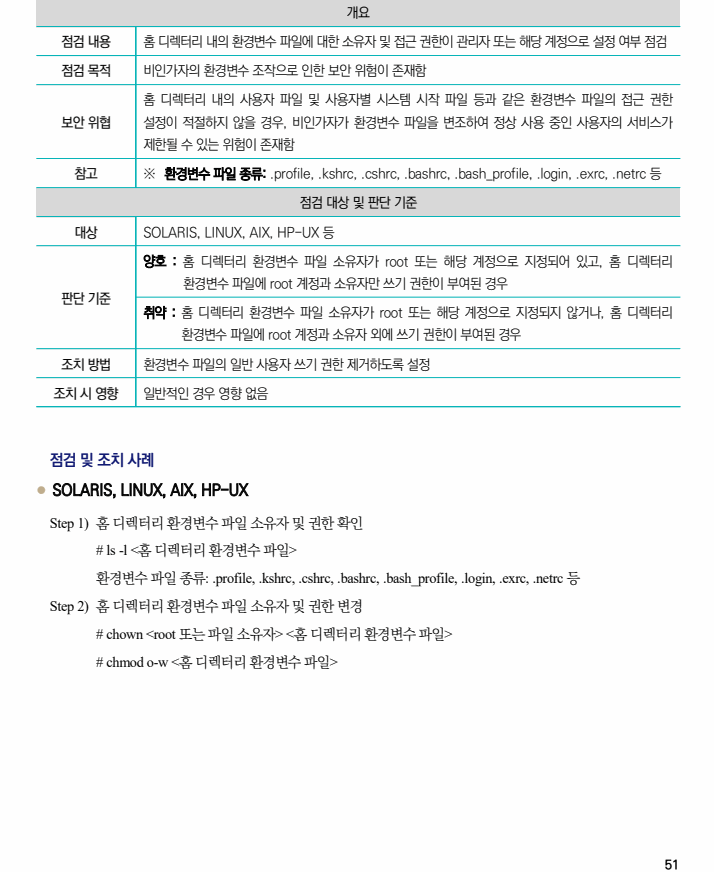

## 원문 전사

### PDF 페이지 51

~~~text transcription
개요
점검 내용 홈 디렉터리 내의 환경변수 파일에 대한 소유자 및 접근 권한이 관리자 또는 해당 계정으로 설정 여부 점검
점검 목적 비인가자의 환경변수 조작으로 인한 보안 위험이 존재함
홈 디렉터리 내의 사용자 파일 및 사용자별 시스템 시작 파일 등과 같은 환경변수 파일의 접근 권한
보안 위협 설정이 적절하지 않을 경우, 비인가자가 환경변수 파일을 변조하여 정상 사용 중인 사용자의 서비스가
제한될 수 있는 위험이 존재함
참고 ※ 환경변수 파일 종류: .profile, .kshrc, .cshrc, .bashrc, .bash_profile, .login, .exrc, .netrc 등
점검 대상 및 판단 기준
대상 SOLARIS, LINUX, AIX, HP-UX 등
양호 : 홈 디렉터리 환경변수 파일 소유자가 root 또는 해당 계정으로 지정되어 있고, 홈 디렉터리
환경변수 파일에 root 계정과 소유자만 쓰기 권한이 부여된 경우
판단 기준
취약 : 홈 디렉터리 환경변수 파일 소유자가 root 또는 해당 계정으로 지정되지 않거나, 홈 디렉터리
환경변수 파일에 root 계정과 소유자 외에 쓰기 권한이 부여된 경우
조치 방법 환경변수 파일의 일반 사용자 쓰기 권한 제거하도록 설정
조치 시 영향 일반적인 경우 영향 없음
점검 및 조치 사례
l SOLARIS, LINUX, AIX, HP-UX
Step 1) 홈 디렉터리 환경변수 파일 소유자 및 권한 확인
# ls -l <홈 디렉터리 환경변수 파일>
환경변수 파일 종류: .profile, .kshrc, .cshrc, .bashrc, .bash_profile, .login, .exrc, .netrc 등
Step 2) 홈 디렉터리 환경변수 파일 소유자 및 권한 변경
# chown <root 또는 파일 소유자> <홈 디렉터리 환경변수 파일>
# chmod o-w <홈 디렉터리 환경변수 파일>
~~~

