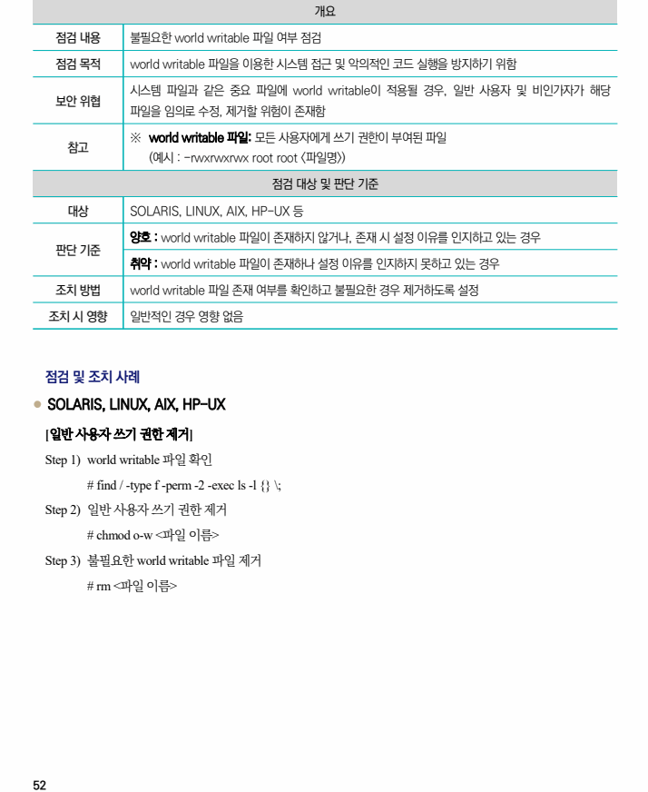

## 원문 전사

### PDF 페이지 52

~~~text transcription
개요
점검 내용 불필요한 world writable 파일 여부 점검
점검 목적 world writable 파일을 이용한 시스템 접근 및 악의적인 코드 실행을 방지하기 위함
시스템 파일과 같은 중요 파일에 world writable이 적용될 경우, 일반 사용자 및 비인가자가 해당
보안 위협
파일을 임의로 수정, 제거할 위험이 존재함
※ world writable 파일: 모든 사용자에게 쓰기 권한이 부여된 파일
참고
(예시 : -rwxrwxrwx root root <파일명>)
점검 대상 및 판단 기준
대상 SOLARIS, LINUX, AIX, HP-UX 등
양호 : world writable 파일이 존재하지 않거나, 존재 시 설정 이유를 인지하고 있는 경우
판단 기준
취약 : world writable 파일이 존재하나 설정 이유를 인지하지 못하고 있는 경우
조치 방법 world writable 파일 존재 여부를 확인하고 불필요한 경우 제거하도록 설정
조치 시 영향 일반적인 경우 영향 없음
점검 및 조치 사례
l SOLARIS, LINUX, AIX, HP-UX
[일반 사용자 쓰기 권한 제거]
Step 1) world writable 파일 확인
# find / -type f -perm -2 -exec ls -l {} \;
Step 2) 일반 사용자 쓰기 권한 제거
# chmod o-w <파일 이름>
Step 3) 불필요한 world writable 파일 제거
# rm <파일 이름>
~~~

