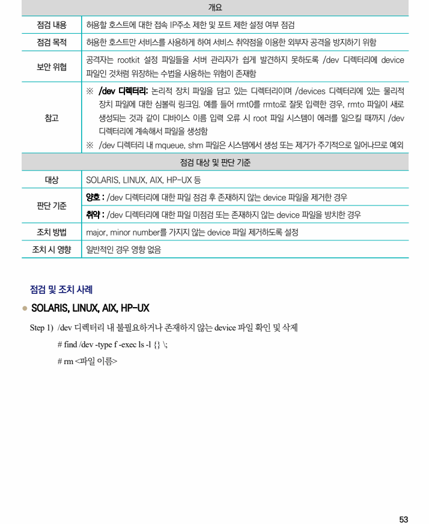

## 원문 전사

### PDF 페이지 53

~~~text transcription
개요
점검 내용 허용할 호스트에 대한 접속 IP주소 제한 및 포트 제한 설정 여부 점검
점검 목적 허용한 호스트만 서비스를 사용하게 하여 서비스 취약점을 이용한 외부자 공격을 방지하기 위함
공격자는 rootkit 설정 파일들을 서버 관리자가 쉽게 발견하지 못하도록 /dev 디렉터리에 device
보안 위협
파일인 것처럼 위장하는 수법을 사용하는 위험이 존재함
※ /dev 디렉터리: 논리적 장치 파일을 담고 있는 디렉터리이며 /devices 디렉터리에 있는 물리적
장치 파일에 대한 심볼릭 링크임. 예를 들어 rmt0를 rmto로 잘못 입력한 경우, rmto 파일이 새로
참고 생성되는 것과 같이 디바이스 이름 입력 오류 시 root 파일 시스템이 에러를 일으킬 때까지 /dev
디렉터리에 계속해서 파일을 생성함
※ /dev 디렉터리 내 mqueue, shm 파일은 시스템에서 생성 또는 제거가 주기적으로 일어나므로 예외
점검 대상 및 판단 기준
대상 SOLARIS, LINUX, AIX, HP-UX 등
양호 : /dev 디렉터리에 대한 파일 점검 후 존재하지 않는 device 파일을 제거한 경우
판단 기준
취약 : /dev 디렉터리에 대한 파일 미점검 또는 존재하지 않는 device 파일을 방치한 경우
조치 방법 major, minor number를 가지지 않는 device 파일 제거하도록 설정
조치 시 영향 일반적인 경우 영향 없음
점검 및 조치 사례
l SOLARIS, LINUX, AIX, HP-UX
Step 1) /dev 디렉터리 내 불필요하거나 존재하지 않는 device 파일 확인 및 삭제
# find /dev -type f -exec ls -l {} \;
# rm <파일 이름>
~~~

