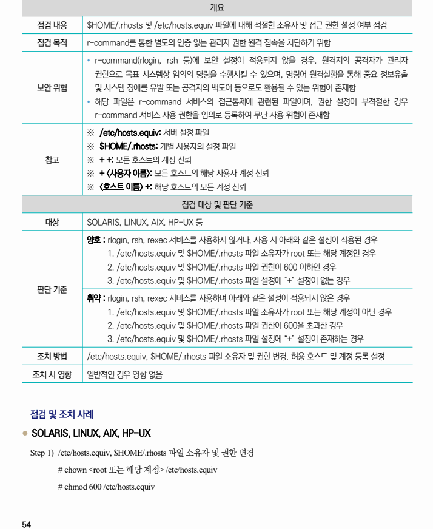
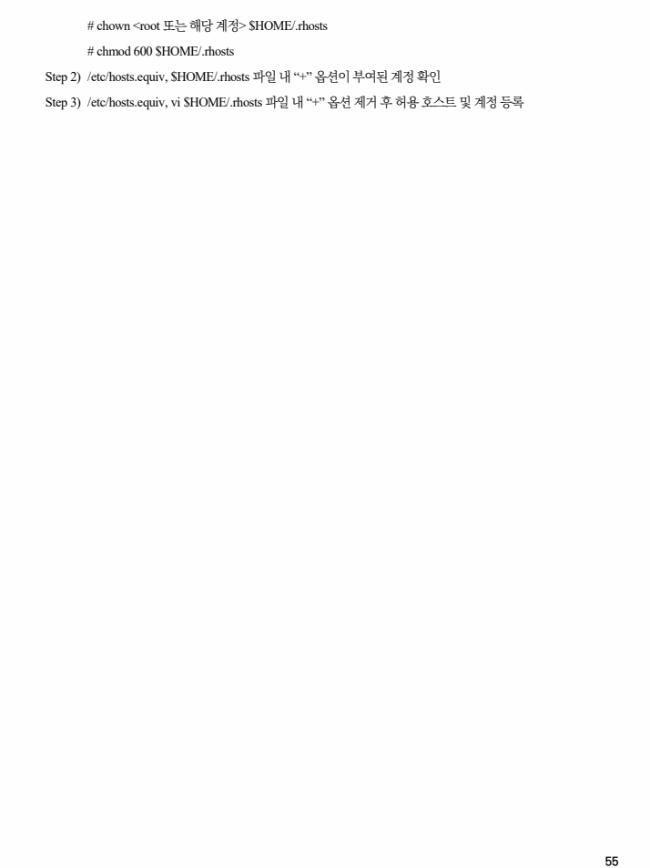

## 원문 전사

### PDF 페이지 54

~~~text transcription
개요
점검 내용 $HOME/.rhosts 및 /etc/hosts.equiv 파일에 대해 적절한 소유자 및 접근 권한 설정 여부 점검
점검 목적 r-command를 통한 별도의 인증 없는 관리자 권한 원격 접속을 차단하기 위함
Ÿ r-command(rlogin, rsh 등)에 보안 설정이 적용되지 않을 경우, 원격지의 공격자가 관리자
권한으로 목표 시스템상 임의의 명령을 수행시킬 수 있으며, 명령어 원격실행을 통해 중요 정보유출
보안 위협 및 시스템 장애를 유발 또는 공격자의 백도어 등으로도 활용될 수 있는 위험이 존재함
Ÿ 해당 파일은 r-command 서비스의 접근통제에 관련된 파일이며, 권한 설정이 부적절한 경우
r-command 서비스 사용 권한을 임의로 등록하여 무단 사용 위험이 존재함
※ /etc/hosts.equiv: 서버 설정 파일
※ $HOME/.rhosts: 개별 사용자의 설정 파일
참고 ※ + +: 모든 호스트의 계정 신뢰
※ + <사용자 이름>: 모든 호스트의 해당 사용자 계정 신뢰
※ <호스트 이름> +: 해당 호스트의 모든 계정 신뢰
점검 대상 및 판단 기준
대상 SOLARIS, LINUX, AIX, HP-UX 등
양호 : rlogin, rsh, rexec 서비스를 사용하지 않거나, 사용 시 아래와 같은 설정이 적용된 경우
1. /etc/hosts.equiv 및 $HOME/.rhosts 파일 소유자가 root 또는 해당 계정인 경우
2. /etc/hosts.equiv 및 $HOME/.rhosts 파일 권한이 600 이하인 경우
3. /etc/hosts.equiv 및 $HOME/.rhosts 파일 설정에 “+” 설정이 없는 경우
판단 기준
취약 : rlogin, rsh, rexec 서비스를 사용하며 아래와 같은 설정이 적용되지 않은 경우
1. /etc/hosts.equiv 및 $HOME/.rhosts 파일 소유자가 root 또는 해당 계정이 아닌 경우
2. /etc/hosts.equiv 및 $HOME/.rhosts 파일 권한이 600을 초과한 경우
3. /etc/hosts.equiv 및 $HOME/.rhosts 파일 설정에 “+” 설정이 존재하는 경우
조치 방법 /etc/hosts.equiv, $HOME/.rhosts 파일 소유자 및 권한 변경, 허용 호스트 및 계정 등록 설정
조치 시 영향 일반적인 경우 영향 없음
점검 및 조치 사례
l SOLARIS, LINUX, AIX, HP-UX
Step 1) /etc/hosts.equiv, $HOME/.rhosts 파일 소유자 및 권한 변경
# chown <root 또는 해당 계정> /etc/hosts.equiv
# chmod 600 /etc/hosts.equiv
~~~

### PDF 페이지 55

~~~text transcription
# chown <root 또는 해당 계정> $HOME/.rhosts
# chmod 600 $HOME/.rhosts
Step 2) /etc/hosts.equiv, $HOME/.rhosts 파일 내 “+” 옵션이 부여된 계정 확인
Step 3) /etc/hosts.equiv, vi $HOME/.rhosts 파일 내 “+” 옵션 제거 후 허용 호스트 및 계정 등록
~~~

