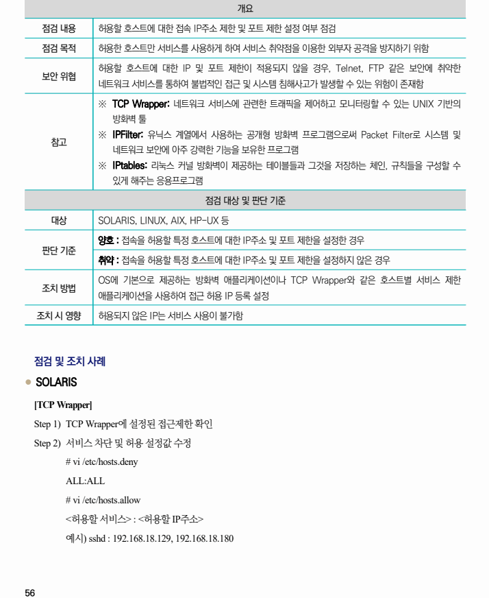
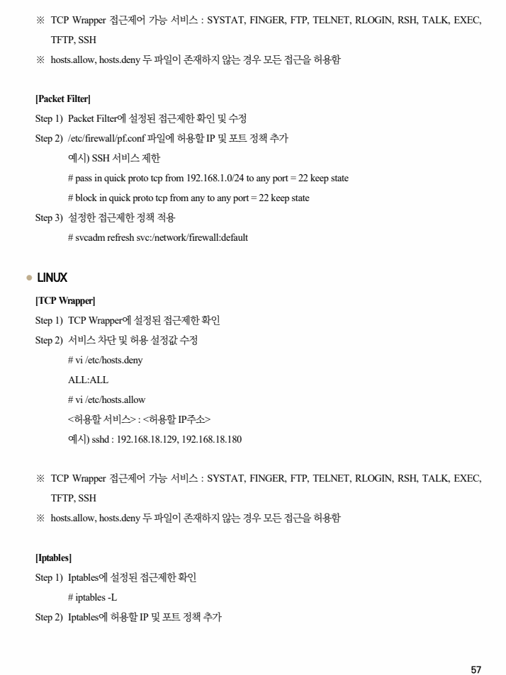
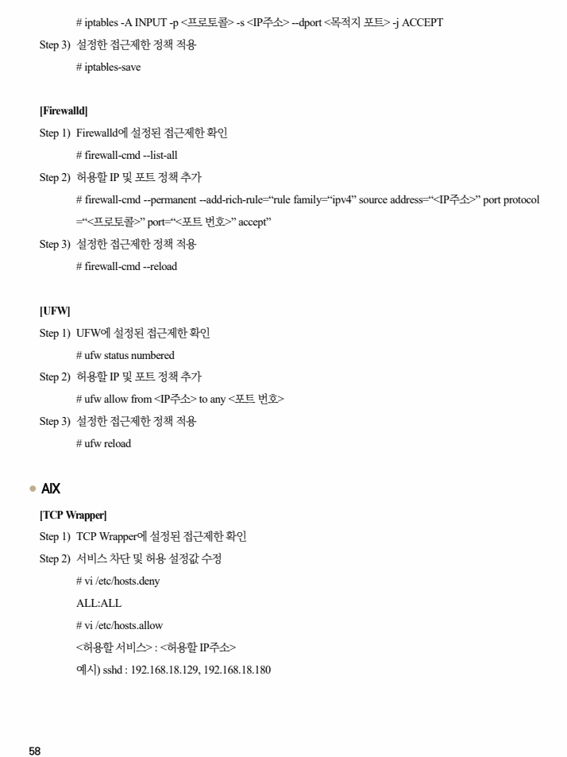
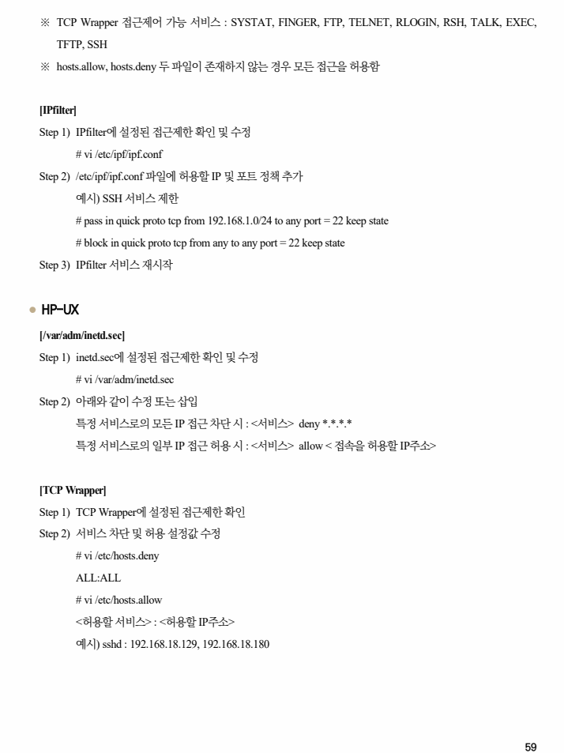
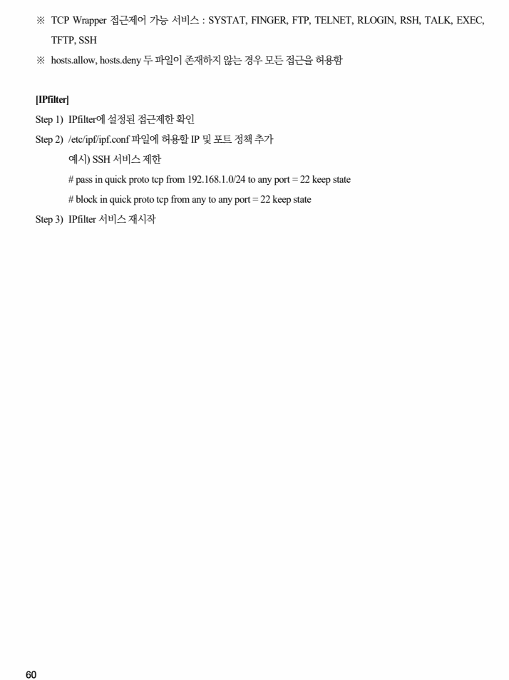

## 원문 전사

### PDF 페이지 56

~~~text transcription
개요
점검 내용 허용할 호스트에 대한 접속 IP주소 제한 및 포트 제한 설정 여부 점검
점검 목적 허용한 호스트만 서비스를 사용하게 하여 서비스 취약점을 이용한 외부자 공격을 방지하기 위함
허용할 호스트에 대한 IP 및 포트 제한이 적용되지 않을 경우, Telnet, FTP 같은 보안에 취약한
보안 위협
네트워크 서비스를 통하여 불법적인 접근 및 시스템 침해사고가 발생할 수 있는 위험이 존재함
※ TCP Wrapper: 네트워크 서비스에 관련한 트래픽을 제어하고 모니터링할 수 있는 UNIX 기반의
방화벽 툴
※ IPFilter: 유닉스 계열에서 사용하는 공개형 방화벽 프로그램으로써 Packet Filter로 시스템 및
참고
네트워크 보안에 아주 강력한 기능을 보유한 프로그램
※ IPtables: 리눅스 커널 방화벽이 제공하는 테이블들과 그것을 저장하는 체인, 규칙들을 구성할 수
있게 해주는 응용프로그램
점검 대상 및 판단 기준
대상 SOLARIS, LINUX, AIX, HP-UX 등
양호 : 접속을 허용할 특정 호스트에 대한 IP주소 및 포트 제한을 설정한 경우
판단 기준
취약 : 접속을 허용할 특정 호스트에 대한 IP주소 및 포트 제한을 설정하지 않은 경우
OS에 기본으로 제공하는 방화벽 애플리케이션이나 TCP Wrapper와 같은 호스트별 서비스 제한
조치 방법
애플리케이션을 사용하여 접근 허용 IP 등록 설정
조치 시 영향 허용되지 않은 IP는 서비스 사용이 불가함
점검 및 조치 사례
l SOLARIS
[TCP Wrapper]
Step 1) TCP Wrapper에 설정된 접근제한 확인
Step 2) 서비스 차단 및 허용 설정값 수정
# vi /etc/hosts.deny
ALL:ALL
# vi /etc/hosts.allow
<허용할 서비스> : <허용할 IP주소>
예시) sshd : 192.168.18.129, 192.168.18.180
~~~

### PDF 페이지 57

~~~text transcription
※ TCP Wrapper 접근제어 가능 서비스 : SYSTAT, FINGER, FTP, TELNET, RLOGIN, RSH, TALK, EXEC,
TFTP, SSH
※ hosts.allow, hosts.deny 두 파일이 존재하지 않는 경우 모든 접근을 허용함
[Packet Filter]
Step 1) Packet Filter에 설정된 접근제한 확인 및 수정
Step 2) /etc/firewall/pf.conf 파일에 허용할 IP 및 포트 정책 추가
예시) SSH 서비스 제한
# pass in quick proto tcp from 192.168.1.0/24 to any port = 22 keep state
# block in quick proto tcp from any to any port = 22 keep state
Step 3) 설정한 접근제한 정책 적용
# svcadm refresh svc:/network/firewall:default
l LINUX
[TCP Wrapper]
Step 1) TCP Wrapper에 설정된 접근제한 확인
Step 2) 서비스 차단 및 허용 설정값 수정
# vi /etc/hosts.deny
ALL:ALL
# vi /etc/hosts.allow
<허용할 서비스> : <허용할 IP주소>
예시) sshd : 192.168.18.129, 192.168.18.180
※ TCP Wrapper 접근제어 가능 서비스 : SYSTAT, FINGER, FTP, TELNET, RLOGIN, RSH, TALK, EXEC,
TFTP, SSH
※ hosts.allow, hosts.deny 두 파일이 존재하지 않는 경우 모든 접근을 허용함
[Iptables]
Step 1) Iptables에 설정된 접근제한 확인
# iptables -L
Step 2) Iptables에 허용할 IP 및 포트 정책 추가
~~~

### PDF 페이지 58

~~~text transcription
# iptables -A INPUT -p <프로토콜> -s <IP주소> --dport <목적지 포트> -j ACCEPT
Step 3) 설정한 접근제한 정책 적용
# iptables-save
[Firewalld]
Step 1) Firewalld에 설정된 접근제한 확인
# firewall-cmd --list-all
Step 2) 허용할 IP 및 포트 정책 추가
# firewall-cmd --permanent --add-rich-rule=“rule family=“ipv4” source address=“<IP주소>” port protocol
=“<프로토콜>” port=“<포트 번호>” accept”
Step 3) 설정한 접근제한 정책 적용
# firewall-cmd --reload
[UFW]
Step 1) UFW에 설정된 접근제한 확인
# ufw status numbered
Step 2) 허용할 IP 및 포트 정책 추가
# ufw allow from <IP주소> to any <포트 번호>
Step 3) 설정한 접근제한 정책 적용
# ufw reload
l AIX
[TCP Wrapper]
Step 1) TCP Wrapper에 설정된 접근제한 확인
Step 2) 서비스 차단 및 허용 설정값 수정
# vi /etc/hosts.deny
ALL:ALL
# vi /etc/hosts.allow
<허용할 서비스> : <허용할 IP주소>
예시) sshd : 192.168.18.129, 192.168.18.180
~~~

### PDF 페이지 59

~~~text transcription
※ TCP Wrapper 접근제어 가능 서비스 : SYSTAT, FINGER, FTP, TELNET, RLOGIN, RSH, TALK, EXEC,
TFTP, SSH
※ hosts.allow, hosts.deny 두 파일이 존재하지 않는 경우 모든 접근을 허용함
[IPfilter]
Step 1) IPfilter에 설정된 접근제한 확인 및 수정
# vi /etc/ipf/ipf.conf
Step 2) /etc/ipf/ipf.conf 파일에 허용할 IP 및 포트 정책 추가
예시) SSH 서비스 제한
# pass in quick proto tcp from 192.168.1.0/24 to any port = 22 keep state
# block in quick proto tcp from any to any port = 22 keep state
Step 3) IPfilter 서비스 재시작
l HP-UX
[/var/adm/inetd.sec]
Step 1) inetd.sec에 설정된 접근제한 확인 및 수정
# vi /var/adm/inetd.sec
Step 2) 아래와 같이 수정 또는 삽입
특정 서비스로의 모든 IP 접근 차단 시 : <서비스> deny *.*.*.*
특정 서비스로의 일부 IP 접근 허용 시 : <서비스> allow < 접속을 허용할 IP주소>
[TCP Wrapper]
Step 1) TCP Wrapper에 설정된 접근제한 확인
Step 2) 서비스 차단 및 허용 설정값 수정
# vi /etc/hosts.deny
ALL:ALL
# vi /etc/hosts.allow
<허용할 서비스> : <허용할 IP주소>
예시) sshd : 192.168.18.129, 192.168.18.180
~~~

### PDF 페이지 60

~~~text transcription
※ TCP Wrapper 접근제어 가능 서비스 : SYSTAT, FINGER, FTP, TELNET, RLOGIN, RSH, TALK, EXEC,
TFTP, SSH
※ hosts.allow, hosts.deny 두 파일이 존재하지 않는 경우 모든 접근을 허용함
[IPfilter]
Step 1) IPfilter에 설정된 접근제한 확인
Step 2) /etc/ipf/ipf.conf 파일에 허용할 IP 및 포트 정책 추가
예시) SSH 서비스 제한
# pass in quick proto tcp from 192.168.1.0/24 to any port = 22 keep state
# block in quick proto tcp from any to any port = 22 keep state
Step 3) IPfilter 서비스 재시작
~~~

