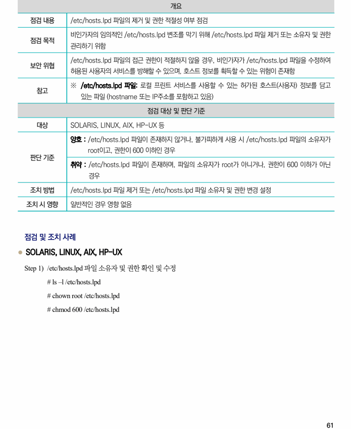

## 원문 전사

### PDF 페이지 61

~~~text transcription
개요
점검 내용 /etc/hosts.lpd 파일의 제거 및 권한 적절성 여부 점검
비인가자의 임의적인 /etc/hosts.lpd 변조를 막기 위해 /etc/hosts.lpd 파일 제거 또는 소유자 및 권한
점검 목적
관리하기 위함
/etc/hosts.lpd 파일의 접근 권한이 적절하지 않을 경우, 비인가자가 /etc/hosts.lpd 파일을 수정하여
보안 위협
허용된 사용자의 서비스를 방해할 수 있으며, 호스트 정보를 획득할 수 있는 위험이 존재함
※ /etc/hosts.lpd 파일: 로컬 프린트 서비스를 사용할 수 있는 허가된 호스트(사용자) 정보를 담고
참고
있는 파일 (hostname 또는 IP주소를 포함하고 있음)
점검 대상 및 판단 기준
대상 SOLARIS, LINUX, AIX, HP-UX 등
양호 : /etc/hosts.lpd 파일이 존재하지 않거나, 불가피하게 사용 시 /etc/hosts.lpd 파일의 소유자가
root이고, 권한이 600 이하인 경우
판단 기준
취약 : /etc/hosts.lpd 파일이 존재하며, 파일의 소유자가 root가 아니거나, 권한이 600 이하가 아닌
경우
조치 방법 /etc/hosts.lpd 파일 제거 또는 /etc/hosts.lpd 파일 소유자 및 권한 변경 설정
조치 시 영향 일반적인 경우 영향 없음
점검 및 조치 사례
l SOLARIS, LINUX, AIX, HP-UX
Step 1) /etc/hosts.lpd 파일 소유자 및 권한 확인 및 수정
# ls –l /etc/hosts.lpd
# chown root /etc/hosts.lpd
# chmod 600 /etc/hosts.lpd
~~~

