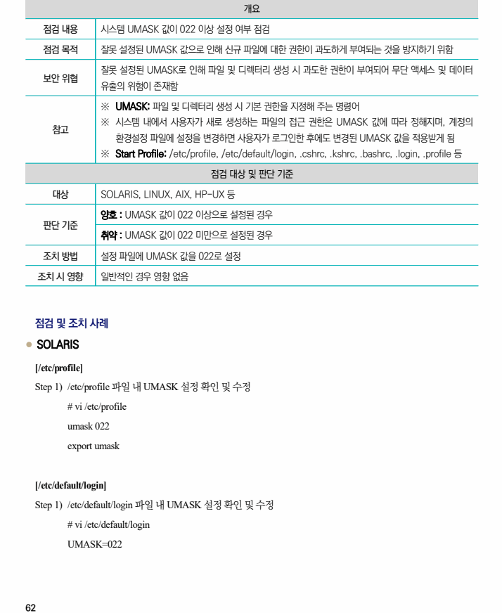
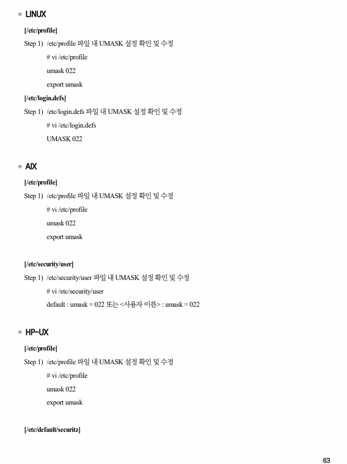
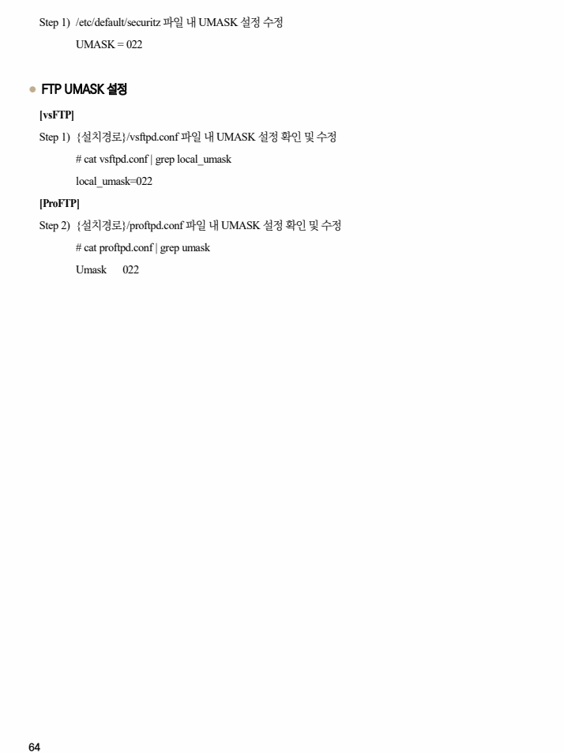

## 원문 전사

### PDF 페이지 62

~~~text transcription
개요
점검 내용 시스템 UMASK 값이 022 이상 설정 여부 점검
점검 목적 잘못 설정된 UMASK 값으로 인해 신규 파일에 대한 권한이 과도하게 부여되는 것을 방지하기 위함
잘못 설정된 UMASK로 인해 파일 및 디렉터리 생성 시 과도한 권한이 부여되어 무단 액세스 및 데이터
보안 위협
유출의 위험이 존재함
※ UMASK: 파일 및 디렉터리 생성 시 기본 권한을 지정해 주는 명령어
※ 시스템 내에서 사용자가 새로 생성하는 파일의 접근 권한은 UMASK 값에 따라 정해지며, 계정의
참고
환경설정 파일에 설정을 변경하면 사용자가 로그인한 후에도 변경된 UMASK 값을 적용받게 됨
※ Start Profile: /etc/profile, /etc/default/login, .cshrc, .kshrc, .bashrc, .login, .profile 등
점검 대상 및 판단 기준
대상 SOLARIS, LINUX, AIX, HP-UX 등
양호 : UMASK 값이 022 이상으로 설정된 경우
판단 기준
취약 : UMASK 값이 022 미만으로 설정된 경우
조치 방법 설정 파일에 UMASK 값을 022로 설정
조치 시 영향 일반적인 경우 영향 없음
점검 및 조치 사례
l SOLARIS
[/etc/profile]
Step 1) /etc/profile 파일 내 UMASK 설정 확인 및 수정
# vi /etc/profile
umask 022
export umask
[/etc/default/login]
Step 1) /etc/default/login 파일 내 UMASK 설정 확인 및 수정
# vi /etc/default/login
UMASK=022
~~~

### PDF 페이지 63

~~~text transcription
l LINUX
[/etc/profile]
Step 1) /etc/profile 파일 내 UMASK 설정 확인 및 수정
# vi /etc/profile
umask 022
export umask
[/etc/login.defs]
Step 1) /etc/login.defs 파일 내 UMASK 설정 확인 및 수정
# vi /etc/login.defs
UMASK 022
l AIX
[/etc/profile]
Step 1) /etc/profile 파일 내 UMASK 설정 확인 및 수정
# vi /etc/profile
umask 022
export umask
[/etc/security/user]
Step 1) /etc/security/user 파일 내 UMASK 설정 확인 및 수정
# vi /etc/security/user
default : umask = 022 또는 <사용자 이름> : umask = 022
l HP-UX
[/etc/profile]
Step 1) /etc/profile 파일 내 UMASK 설정 확인 및 수정
# vi /etc/profile
umask 022
export umask
[/etc/default/securitz]
~~~

### PDF 페이지 64

~~~text transcription
Step 1) /etc/default/securitz 파일 내 UMASK 설정 수정
UMASK = 022
l FTP UMASK 설정
[vsFTP]
Step 1) {설치경로}/vsftpd.conf 파일 내 UMASK 설정 확인 및 수정
# cat vsftpd.conf | grep local_umask
local_umask=022
[ProFTP]
Step 2) {설치경로}/proftpd.conf 파일 내 UMASK 설정 확인 및 수정
# cat proftpd.conf | grep umask
Umask 022
~~~

