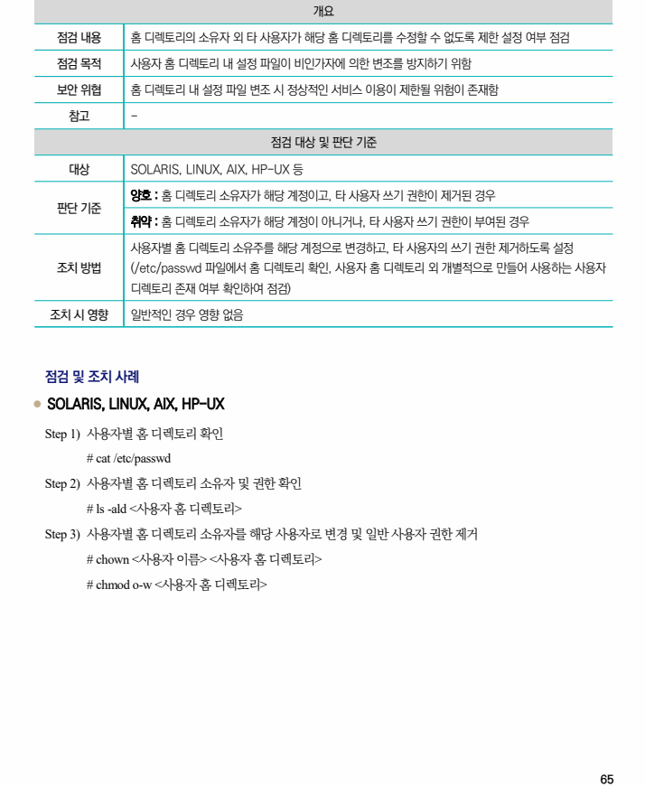

## 원문 전사

### PDF 페이지 65

~~~text transcription
개요
점검 내용 홈 디렉토리의 소유자 외 타 사용자가 해당 홈 디렉토리를 수정할 수 없도록 제한 설정 여부 점검
점검 목적 사용자 홈 디렉토리 내 설정 파일이 비인가자에 의한 변조를 방지하기 위함
보안 위협 홈 디렉토리 내 설정 파일 변조 시 정상적인 서비스 이용이 제한될 위험이 존재함
참고 -
점검 대상 및 판단 기준
대상 SOLARIS, LINUX, AIX, HP-UX 등
양호 : 홈 디렉토리 소유자가 해당 계정이고, 타 사용자 쓰기 권한이 제거된 경우
판단 기준
취약 : 홈 디렉토리 소유자가 해당 계정이 아니거나, 타 사용자 쓰기 권한이 부여된 경우
사용자별 홈 디렉토리 소유주를 해당 계정으로 변경하고, 타 사용자의 쓰기 권한 제거하도록 설정
조치 방법 (/etc/passwd 파일에서 홈 디렉토리 확인, 사용자 홈 디렉토리 외 개별적으로 만들어 사용하는 사용자
디렉토리 존재 여부 확인하여 점검)
조치 시 영향 일반적인 경우 영향 없음
점검 및 조치 사례
l SOLARIS, LINUX, AIX, HP-UX
Step 1) 사용자별 홈 디렉토리 확인
# cat /etc/passwd
Step 2) 사용자별 홈 디렉토리 소유자 및 권한 확인
# ls -ald <사용자 홈 디렉토리>
Step 3) 사용자별 홈 디렉토리 소유자를 해당 사용자로 변경 및 일반 사용자 권한 제거
# chown <사용자 이름> <사용자 홈 디렉토리>
# chmod o-w <사용자 홈 디렉토리>
~~~

