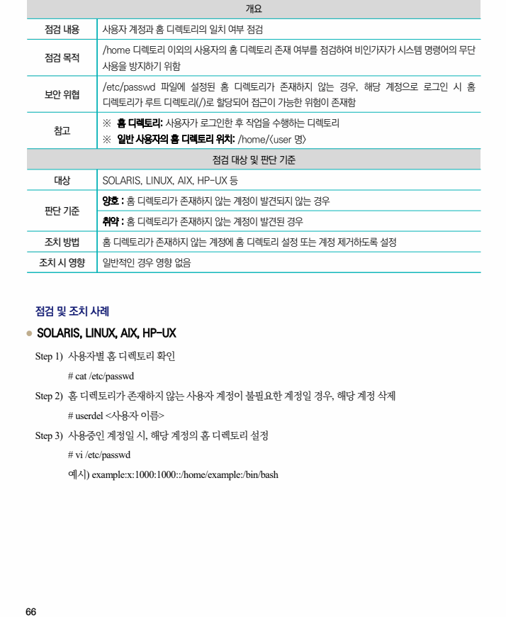

## 원문 전사

### PDF 페이지 66

~~~text transcription
개요
점검 내용 사용자 계정과 홈 디렉토리의 일치 여부 점검
/home 디렉토리 이외의 사용자의 홈 디렉토리 존재 여부를 점검하여 비인가자가 시스템 명령어의 무단
점검 목적
사용을 방지하기 위함
/etc/passwd 파일에 설정된 홈 디렉토리가 존재하지 않는 경우, 해당 계정으로 로그인 시 홈
보안 위협
디렉토리가 루트 디렉토리(/)로 할당되어 접근이 가능한 위험이 존재함
※ 홈 디렉토리: 사용자가 로그인한 후 작업을 수행하는 디렉토리
참고
※ 일반 사용자의 홈 디렉토리 위치: /home/<user 명>
점검 대상 및 판단 기준
대상 SOLARIS, LINUX, AIX, HP-UX 등
양호 : 홈 디렉토리가 존재하지 않는 계정이 발견되지 않는 경우
판단 기준
취약 : 홈 디렉토리가 존재하지 않는 계정이 발견된 경우
조치 방법 홈 디렉토리가 존재하지 않는 계정에 홈 디렉토리 설정 또는 계정 제거하도록 설정
조치 시 영향 일반적인 경우 영향 없음
점검 및 조치 사례
l SOLARIS, LINUX, AIX, HP-UX
Step 1) 사용자별 홈 디렉토리 확인
# cat /etc/passwd
Step 2) 홈 디렉토리가 존재하지 않는 사용자 계정이 불필요한 계정일 경우, 해당 계정 삭제
# userdel <사용자 이름>
Step 3) 사용중인 계정일 시, 해당 계정의 홈 디렉토리 설정
# vi /etc/passwd
예시) example:x:1000:1000::/home/example:/bin/bash
~~~

