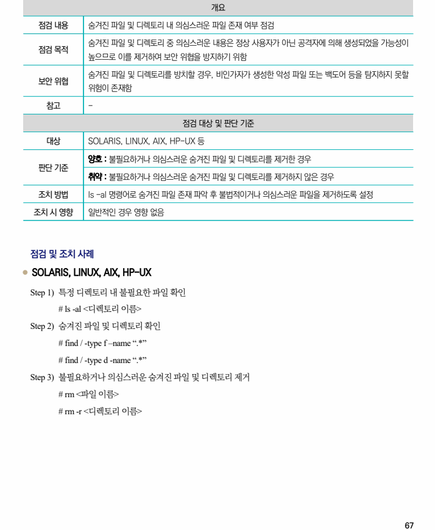

## 원문 전사

### PDF 페이지 67

~~~text transcription
개요
점검 내용 숨겨진 파일 및 디렉토리 내 의심스러운 파일 존재 여부 점검
숨겨진 파일 및 디렉토리 중 의심스러운 내용은 정상 사용자가 아닌 공격자에 의해 생성되었을 가능성이
점검 목적
높으므로 이를 제거하여 보안 위협을 방지하기 위함
숨겨진 파일 및 디렉토리를 방치할 경우, 비인가자가 생성한 악성 파일 또는 백도어 등을 탐지하지 못할
보안 위협
위험이 존재함
참고 -
점검 대상 및 판단 기준
대상 SOLARIS, LINUX, AIX, HP-UX 등
양호 : 불필요하거나 의심스러운 숨겨진 파일 및 디렉토리를 제거한 경우
판단 기준
취약 : 불필요하거나 의심스러운 숨겨진 파일 및 디렉토리를 제거하지 않은 경우
조치 방법 ls -al 명령어로 숨겨진 파일 존재 파악 후 불법적이거나 의심스러운 파일을 제거하도록 설정
조치 시 영향 일반적인 경우 영향 없음
점검 및 조치 사례
l SOLARIS, LINUX, AIX, HP-UX
Step 1) 특정 디렉토리 내 불필요한 파일 확인
# ls -al <디렉토리 이름>
Step 2) 숨겨진 파일 및 디렉토리 확인
# find / -type f –name “.*”
# find / -type d -name “.*”
Step 3) 불필요하거나 의심스러운 숨겨진 파일 및 디렉토리 제거
# rm <파일 이름>
# rm -r <디렉토리 이름>
~~~

