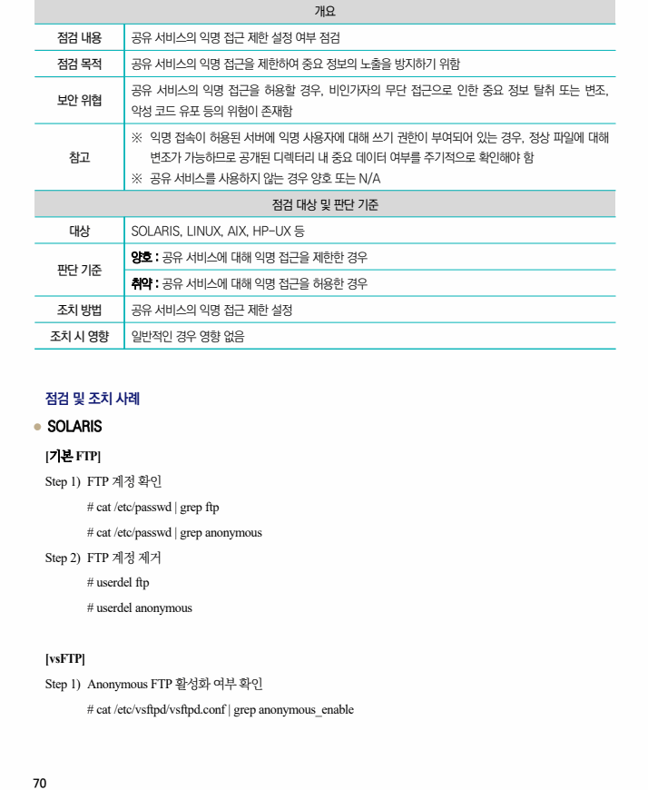
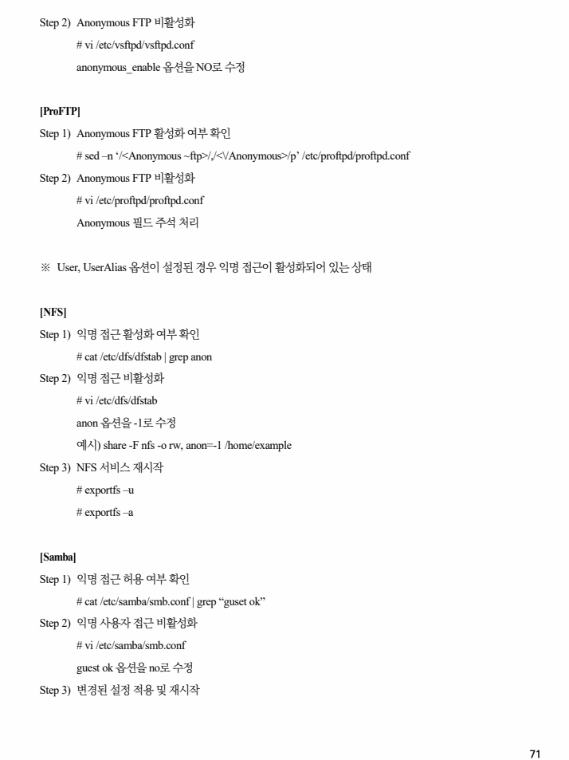
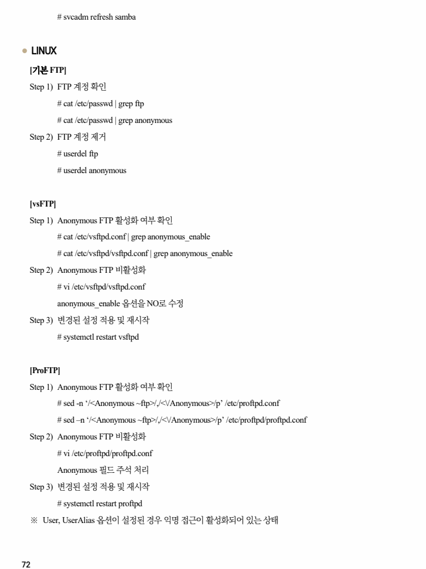
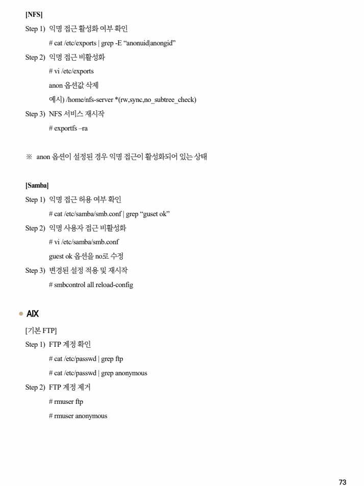
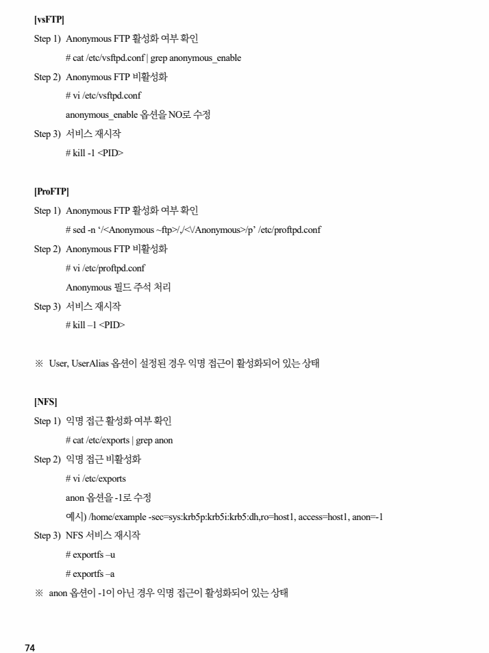
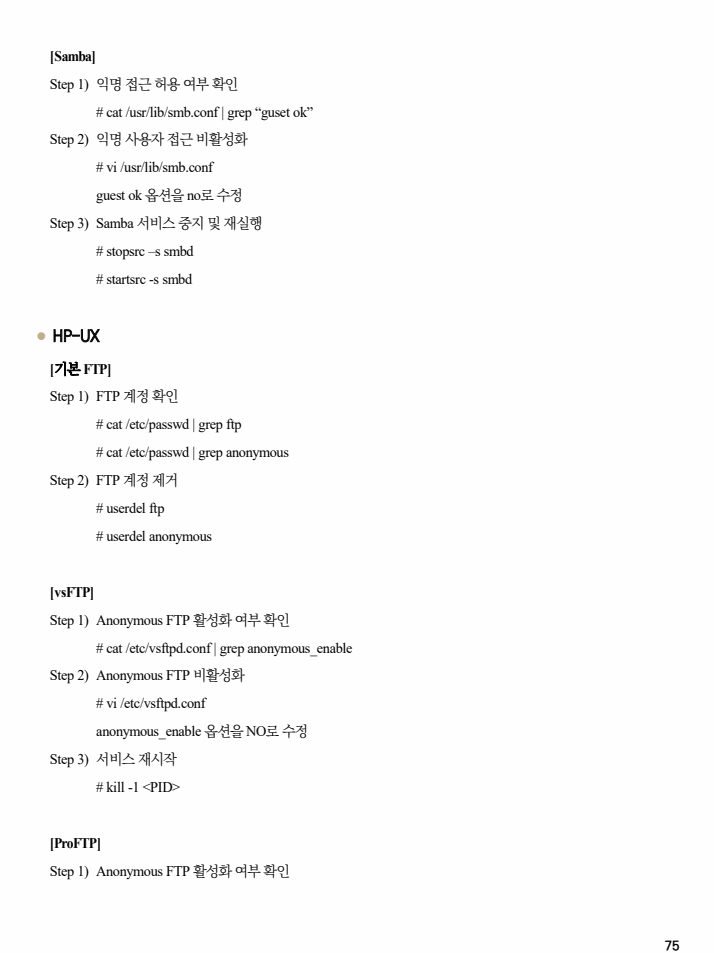
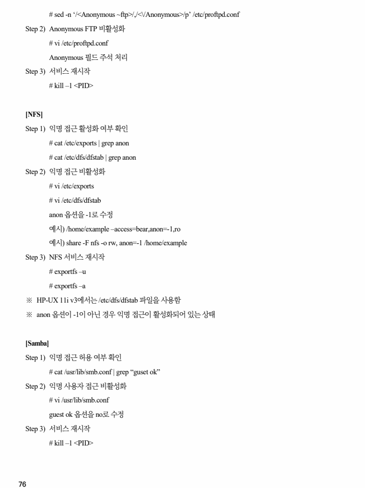

## 원문 전사

### PDF 페이지 70

~~~text transcription
개요
점검 내용 공유 서비스의 익명 접근 제한 설정 여부 점검
점검 목적 공유 서비스의 익명 접근을 제한하여 중요 정보의 노출을 방지하기 위함
공유 서비스의 익명 접근을 허용할 경우, 비인가자의 무단 접근으로 인한 중요 정보 탈취 또는 변조,
보안 위협
악성 코드 유포 등의 위험이 존재함
※ 익명 접속이 허용된 서버에 익명 사용자에 대해 쓰기 권한이 부여되어 있는 경우, 정상 파일에 대해
참고 변조가 가능하므로 공개된 디렉터리 내 중요 데이터 여부를 주기적으로 확인해야 함
※ 공유 서비스를 사용하지 않는 경우 양호 또는 N/A
점검 대상 및 판단 기준
대상 SOLARIS, LINUX, AIX, HP-UX 등
양호 : 공유 서비스에 대해 익명 접근을 제한한 경우
판단 기준
취약 : 공유 서비스에 대해 익명 접근을 허용한 경우
조치 방법 공유 서비스의 익명 접근 제한 설정
조치 시 영향 일반적인 경우 영향 없음
점검 및 조치 사례
l SOLARIS
[기본 FTP]
Step 1) FTP 계정 확인
# cat /etc/passwd | grep ftp
# cat /etc/passwd | grep anonymous
Step 2) FTP 계정 제거
# userdel ftp
# userdel anonymous
[vsFTP]
Step 1) Anonymous FTP 활성화 여부 확인
# cat /etc/vsftpd/vsftpd.conf | grep anonymous_enable
~~~

### PDF 페이지 71

~~~text transcription
Step 2) Anonymous FTP 비활성화
# vi /etc/vsftpd/vsftpd.conf
anonymous_enable 옵션을 NO로 수정
[ProFTP]
Step 1) Anonymous FTP 활성화 여부 확인
# sed –n ‘/<Anonymous ~ftp>/,/<\/Anonymous>/p’ /etc/proftpd/proftpd.conf
Step 2) Anonymous FTP 비활성화
# vi /etc/proftpd/proftpd.conf
Anonymous 필드 주석 처리
※ User, UserAlias 옵션이 설정된 경우 익명 접근이 활성화되어 있는 상태
[NFS]
Step 1) 익명 접근 활성화 여부 확인
# cat /etc/dfs/dfstab | grep anon
Step 2) 익명 접근 비활성화
# vi /etc/dfs/dfstab
anon 옵션을 -1로 수정
예시) share -F nfs -o rw, anon=-1 /home/example
Step 3) NFS 서비스 재시작
# exportfs –u
# exportfs –a
[Samba]
Step 1) 익명 접근 허용 여부 확인
# cat /etc/samba/smb.conf | grep “guset ok”
Step 2) 익명 사용자 접근 비활성화
# vi /etc/samba/smb.conf
guest ok 옵션을 no로 수정
Step 3) 변경된 설정 적용 및 재시작
~~~

### PDF 페이지 72

~~~text transcription
# svcadm refresh samba
l LINUX
[기본 FTP]
Step 1) FTP 계정 확인
# cat /etc/passwd | grep ftp
# cat /etc/passwd | grep anonymous
Step 2) FTP 계정 제거
# userdel ftp
# userdel anonymous
[vsFTP]
Step 1) Anonymous FTP 활성화 여부 확인
# cat /etc/vsftpd.conf | grep anonymous_enable
# cat /etc/vsftpd/vsftpd.conf | grep anonymous_enable
Step 2) Anonymous FTP 비활성화
# vi /etc/vsftpd/vsftpd.conf
anonymous_enable 옵션을 NO로 수정
Step 3) 변경된 설정 적용 및 재시작
# systemctl restart vsftpd
[ProFTP]
Step 1) Anonymous FTP 활성화 여부 확인
# sed -n ‘/<Anonymous ~ftp>/,/<\/Anonymous>/p’ /etc/proftpd.conf
# sed –n ‘/<Anonymous ~ftp>/,/<\/Anonymous>/p’ /etc/proftpd/proftpd.conf
Step 2) Anonymous FTP 비활성화
# vi /etc/proftpd/proftpd.conf
Anonymous 필드 주석 처리
Step 3) 변경된 설정 적용 및 재시작
# systemctl restart proftpd
※ User, UserAlias 옵션이 설정된 경우 익명 접근이 활성화되어 있는 상태
~~~

### PDF 페이지 73

~~~text transcription
[NFS]
Step 1) 익명 접근 활성화 여부 확인
# cat /etc/exports | grep -E “anonuid|anongid”
Step 2) 익명 접근 비활성화
# vi /etc/exports
anon 옵션값 삭제
예시) /home/nfs-server *(rw,sync,no_subtree_check)
Step 3) NFS 서비스 재시작
# exportfs –ra
※ anon 옵션이 설정된 경우 익명 접근이 활성화되어 있는 상태
[Samba]
Step 1) 익명 접근 허용 여부 확인
# cat /etc/samba/smb.conf | grep “guset ok”
Step 2) 익명 사용자 접근 비활성화
# vi /etc/samba/smb.conf
guest ok 옵션을 no로 수정
Step 3) 변경된 설정 적용 및 재시작
# smbcontrol all reload-config
l AIX
[기본 FTP]
Step 1) FTP 계정 확인
# cat /etc/passwd | grep ftp
# cat /etc/passwd | grep anonymous
Step 2) FTP 계정 제거
# rmuser ftp
# rmuser anonymous
~~~

### PDF 페이지 74

~~~text transcription
[vsFTP]
Step 1) Anonymous FTP 활성화 여부 확인
# cat /etc/vsftpd.conf | grep anonymous_enable
Step 2) Anonymous FTP 비활성화
# vi /etc/vsftpd.conf
anonymous_enable 옵션을 NO로 수정
Step 3) 서비스 재시작
# kill -1 <PID>
[ProFTP]
Step 1) Anonymous FTP 활성화 여부 확인
# sed -n ‘/<Anonymous ~ftp>/,/<\/Anonymous>/p’ /etc/proftpd.conf
Step 2) Anonymous FTP 비활성화
# vi /etc/proftpd.conf
Anonymous 필드 주석 처리
Step 3) 서비스 재시작
# kill –1 <PID>
※ User, UserAlias 옵션이 설정된 경우 익명 접근이 활성화되어 있는 상태
[NFS]
Step 1) 익명 접근 활성화 여부 확인
# cat /etc/exports | grep anon
Step 2) 익명 접근 비활성화
# vi /etc/exports
anon 옵션을 -1로 수정
예시) /home/example -sec=sys:krb5p:krb5i:krb5:dh,ro=host1, access=host1, anon=-1
Step 3) NFS 서비스 재시작
# exportfs –u
# exportfs –a
※ anon 옵션이 -1이 아닌 경우 익명 접근이 활성화되어 있는 상태
~~~

### PDF 페이지 75

~~~text transcription
[Samba]
Step 1) 익명 접근 허용 여부 확인
# cat /usr/lib/smb.conf | grep “guset ok”
Step 2) 익명 사용자 접근 비활성화
# vi /usr/lib/smb.conf
guest ok 옵션을 no로 수정
Step 3) Samba 서비스 중지 및 재실행
# stopsrc –s smbd
# startsrc -s smbd
l HP-UX
[기본 FTP]
Step 1) FTP 계정 확인
# cat /etc/passwd | grep ftp
# cat /etc/passwd | grep anonymous
Step 2) FTP 계정 제거
# userdel ftp
# userdel anonymous
[vsFTP]
Step 1) Anonymous FTP 활성화 여부 확인
# cat /etc/vsftpd.conf | grep anonymous_enable
Step 2) Anonymous FTP 비활성화
# vi /etc/vsftpd.conf
anonymous_enable 옵션을 NO로 수정
Step 3) 서비스 재시작
# kill -1 <PID>
[ProFTP]
Step 1) Anonymous FTP 활성화 여부 확인
~~~

### PDF 페이지 76

~~~text transcription
# sed -n ‘/<Anonymous ~ftp>/,/<\/Anonymous>/p’ /etc/proftpd.conf
Step 2) Anonymous FTP 비활성화
# vi /etc/proftpd.conf
Anonymous 필드 주석 처리
Step 3) 서비스 재시작
# kill –1 <PID>
[NFS]
Step 1) 익명 접근 활성화 여부 확인
# cat /etc/exports | grep anon
# cat /etc/dfs/dfstab | grep anon
Step 2) 익명 접근 비활성화
# vi /etc/exports
# vi /etc/dfs/dfstab
anon 옵션을 -1로 수정
예시) /home/example –access=bear,anon=-1,ro
예시) share -F nfs -o rw, anon=-1 /home/example
Step 3) NFS 서비스 재시작
# exportfs –u
# exportfs –a
※ HP-UX 11i v3에서는 /etc/dfs/dfstab 파일을 사용함
※ anon 옵션이 -1이 아닌 경우 익명 접근이 활성화되어 있는 상태
[Samba]
Step 1) 익명 접근 허용 여부 확인
# cat /usr/lib/smb.conf | grep “guset ok”
Step 2) 익명 사용자 접근 비활성화
# vi /usr/lib/smb.conf
guest ok 옵션을 no로 수정
Step 3) 서비스 재시작
# kill –1 <PID>
~~~

