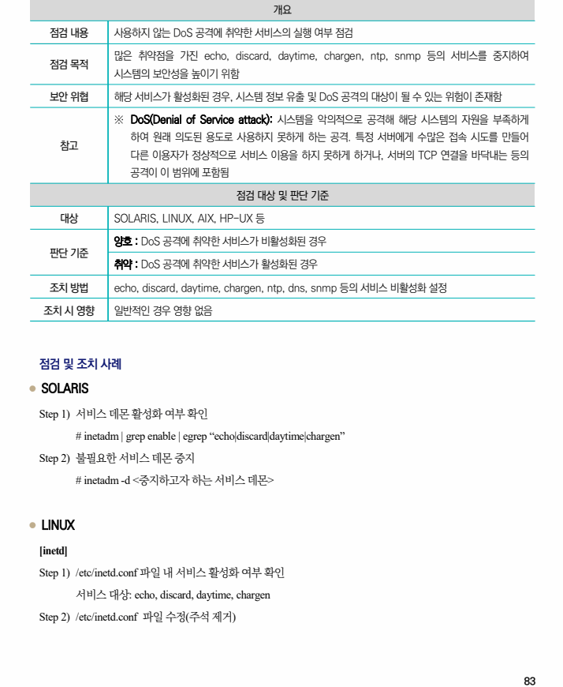
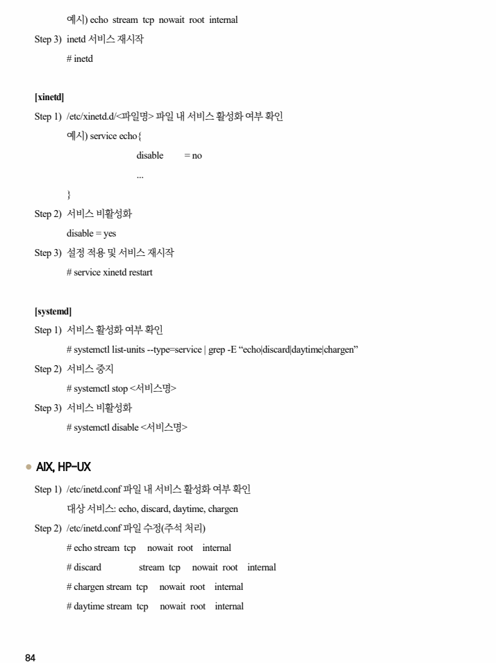
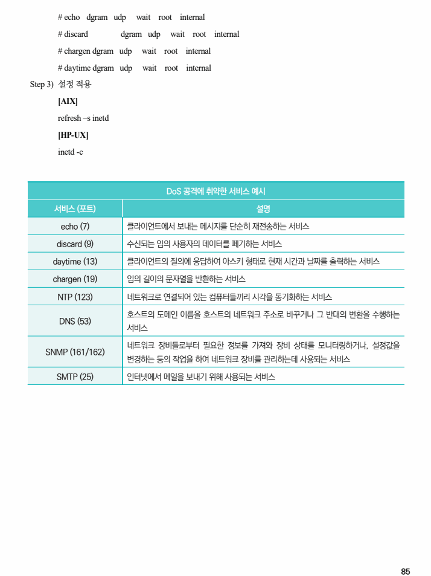

## 원문 전사

### PDF 페이지 83

~~~text transcription
개요
점검 내용 사용하지 않는 DoS 공격에 취약한 서비스의 실행 여부 점검
많은 취약점을 가진 echo, discard, daytime, chargen, ntp, snmp 등의 서비스를 중지하여
점검 목적
시스템의 보안성을 높이기 위함
보안 위협 해당 서비스가 활성화된 경우, 시스템 정보 유출 및 DoS 공격의 대상이 될 수 있는 위험이 존재함
※ DoS(Denial of Service attack): 시스템을 악의적으로 공격해 해당 시스템의 자원을 부족하게
하여 원래 의도된 용도로 사용하지 못하게 하는 공격. 특정 서버에게 수많은 접속 시도를 만들어
참고
다른 이용자가 정상적으로 서비스 이용을 하지 못하게 하거나, 서버의 TCP 연결을 바닥내는 등의
공격이 이 범위에 포함됨
점검 대상 및 판단 기준
대상 SOLARIS, LINUX, AIX, HP-UX 등
양호 : DoS 공격에 취약한 서비스가 비활성화된 경우
판단 기준
취약 : DoS 공격에 취약한 서비스가 활성화된 경우
조치 방법 echo, discard, daytime, chargen, ntp, dns, snmp 등의 서비스 비활성화 설정
조치 시 영향 일반적인 경우 영향 없음
점검 및 조치 사례
l SOLARIS
Step 1) 서비스 데몬 활성화 여부 확인
# inetadm | grep enable | egrep “echo|discard|daytime|chargen”
Step 2) 불필요한 서비스 데몬 중지
# inetadm -d <중지하고자 하는 서비스 데몬>
l LINUX
[inetd]
Step 1) /etc/inetd.conf 파일 내 서비스 활성화 여부 확인
서비스 대상: echo, discard, daytime, chargen
Step 2) /etc/inetd.conf 파일 수정(주석 제거)
~~~

### PDF 페이지 84

~~~text transcription
예시) echo stream tcp nowait root internal
Step 3) inetd 서비스 재시작
# inetd
[xinetd]
Step 1) /etc/xinetd.d/<파일명> 파일 내 서비스 활성화 여부 확인
예시) service echo{
disable = no
...
}
Step 2) 서비스 비활성화
disable = yes
Step 3) 설정 적용 및 서비스 재시작
# service xinetd restart
[systemd]
Step 1) 서비스 활성화 여부 확인
# systemctl list-units --type=service | grep -E “echo|discard|daytime|chargen”
Step 2) 서비스 중지
# systemctl stop <서비스명>
Step 3) 서비스 비활성화
# systemctl disable <서비스명>
l AIX, HP-UX
Step 1) /etc/inetd.conf 파일 내 서비스 활성화 여부 확인
대상 서비스: echo, discard, daytime, chargen
Step 2) /etc/inetd.conf 파일 수정(주석 처리)
# echo stream tcp nowait root internal
# discard stream tcp nowait root internal
# chargen stream tcp nowait root internal
# daytime stream tcp nowait root internal
~~~

### PDF 페이지 85

~~~text transcription
# echo dgram udp wait root internal
# discard dgram udp wait root internal
# chargen dgram udp wait root internal
# daytime dgram udp wait root internal
Step 3) 설정 적용
[AIX]
refresh –s inetd
[HP-UX]
inetd -c
DoS 공격에 취약한 서비스 예시
서비스 (포트) 설명
echo (7) 클라이언트에서 보내는 메시지를 단순히 재전송하는 서비스
discard (9) 수신되는 임의 사용자의 데이터를 폐기하는 서비스
daytime (13) 클라이언트의 질의에 응답하여 아스키 형태로 현재 시간과 날짜를 출력하는 서비스
chargen (19) 임의 길이의 문자열을 반환하는 서비스
NTP (123) 네트워크로 연결되어 있는 컴퓨터들끼리 시각을 동기화하는 서비스
호스트의 도메인 이름을 호스트의 네트워크 주소로 바꾸거나 그 반대의 변환을 수행하는
DNS (53)
서비스
네트워크 장비들로부터 필요한 정보를 가져와 장비 상태를 모니터링하거나, 설정값을
SNMP (161/162)
변경하는 등의 작업을 하여 네트워크 장비를 관리하는데 사용되는 서비스
SMTP (25) 인터넷에서 메일을 보내기 위해 사용되는 서비스
~~~

