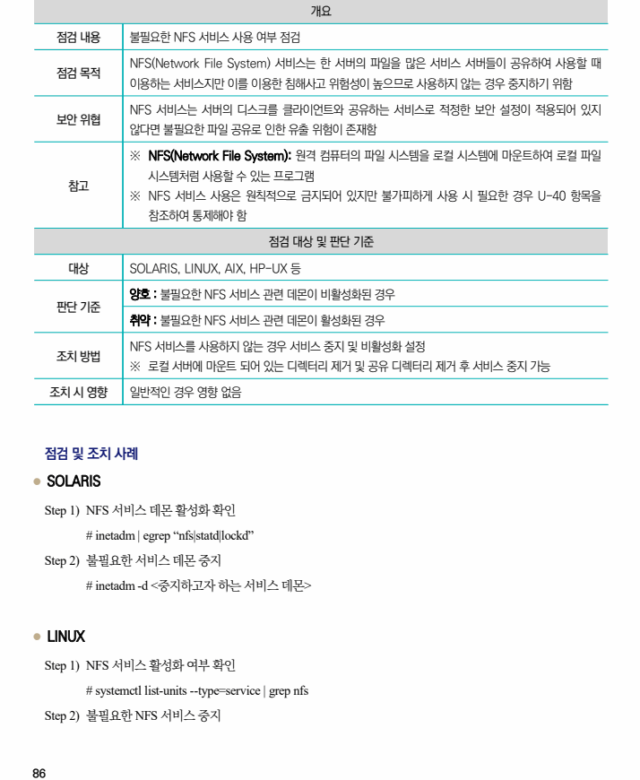
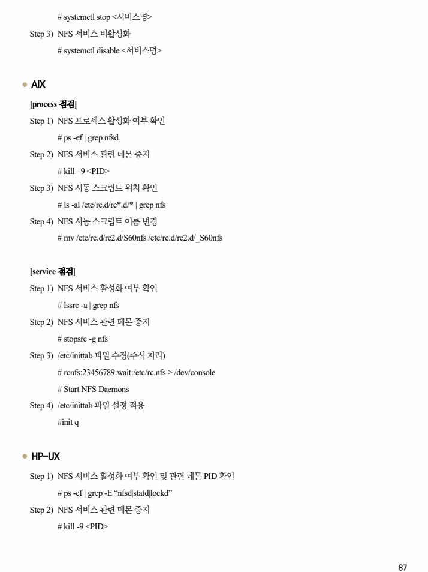

## 원문 전사

### PDF 페이지 86

~~~text transcription
개요
점검 내용 불필요한 NFS 서비스 사용 여부 점검
NFS(Network File System) 서비스는 한 서버의 파일을 많은 서비스 서버들이 공유하여 사용할 때
점검 목적
이용하는 서비스지만 이를 이용한 침해사고 위험성이 높으므로 사용하지 않는 경우 중지하기 위함
NFS 서비스는 서버의 디스크를 클라이언트와 공유하는 서비스로 적정한 보안 설정이 적용되어 있지
보안 위협
않다면 불필요한 파일 공유로 인한 유출 위험이 존재함
※ NFS(Network File System): 원격 컴퓨터의 파일 시스템을 로컬 시스템에 마운트하여 로컬 파일
시스템처럼 사용할 수 있는 프로그램
참고
※ NFS 서비스 사용은 원칙적으로 금지되어 있지만 불가피하게 사용 시 필요한 경우 U-40 항목을
참조하여 통제해야 함
점검 대상 및 판단 기준
대상 SOLARIS, LINUX, AIX, HP-UX 등
양호 : 불필요한 NFS 서비스 관련 데몬이 비활성화된 경우
판단 기준
취약 : 불필요한 NFS 서비스 관련 데몬이 활성화된 경우
NFS 서비스를 사용하지 않는 경우 서비스 중지 및 비활성화 설정
조치 방법
※ 로컬 서버에 마운트 되어 있는 디렉터리 제거 및 공유 디렉터리 제거 후 서비스 중지 가능
조치 시 영향 일반적인 경우 영향 없음
점검 및 조치 사례
l SOLARIS
Step 1) NFS 서비스 데몬 활성화 확인
# inetadm | egrep “nfs|statd|lockd”
Step 2) 불필요한 서비스 데몬 중지
# inetadm -d <중지하고자 하는 서비스 데몬>
l LINUX
Step 1) NFS 서비스 활성화 여부 확인
# systemctl list-units --type=service | grep nfs
Step 2) 불필요한 NFS 서비스 중지
~~~

### PDF 페이지 87

~~~text transcription
# systemctl stop <서비스명>
Step 3) NFS 서비스 비활성화
# systemctl disable <서비스명>
l AIX
[process 점검]
Step 1) NFS 프로세스 활성화 여부 확인
# ps -ef | grep nfsd
Step 2) NFS 서비스 관련 데몬 중지
# kill –9 <PID>
Step 3) NFS 시동 스크립트 위치 확인
# ls -al /etc/rc.d/rc*.d/* | grep nfs
Step 4) NFS 시동 스크립트 이름 변경
# mv /etc/rc.d/rc2.d/S60nfs /etc/rc.d/rc2.d/_S60nfs
[service 점검]
Step 1) NFS 서비스 활성화 여부 확인
# lssrc -a | grep nfs
Step 2) NFS 서비스 관련 데몬 중지
# stopsrc -g nfs
Step 3) /etc/inittab 파일 수정(주석 처리)
# rcnfs:23456789:wait:/etc/rc.nfs > /dev/console
# Start NFS Daemons
Step 4) /etc/inittab 파일 설정 적용
#init q
l HP-UX
Step 1) NFS 서비스 활성화 여부 확인 및 관련 데몬 PID 확인
# ps -ef | grep -E “nfsd|statd|lockd”
Step 2) NFS 서비스 관련 데몬 중지
# kill -9 <PID>
~~~

### PDF 페이지 88

~~~text transcription
Step 3) /etc/rc.config.d/nfsconf 파일 수정
NFS_SERVER=0
Step 4) 설정 적용
# /usr/sbin/nfs.server start
~~~

