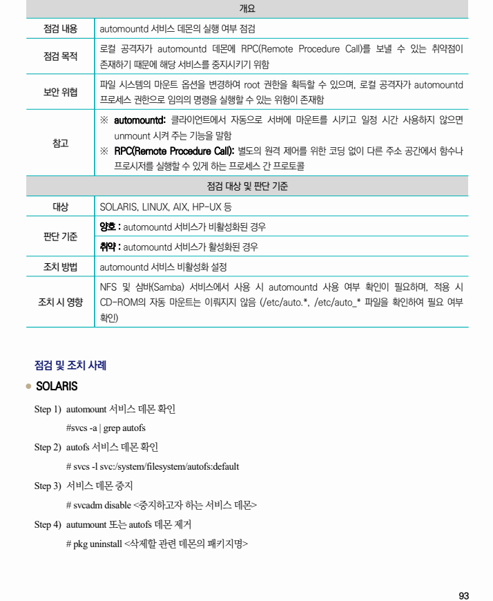
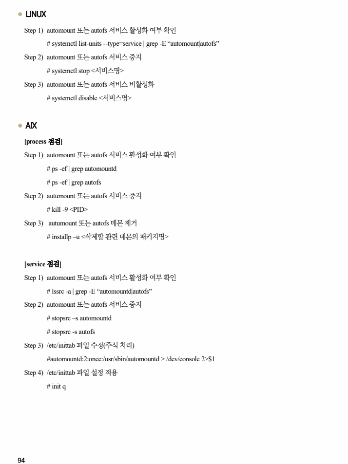

## 원문 전사

### PDF 페이지 93

~~~text transcription
개요
점검 내용 automountd 서비스 데몬의 실행 여부 점검
로컬 공격자가 automountd 데몬에 RPC(Remote Procedure Call)를 보낼 수 있는 취약점이
점검 목적
존재하기 때문에 해당 서비스를 중지시키기 위함
파일 시스템의 마운트 옵션을 변경하여 root 권한을 획득할 수 있으며, 로컬 공격자가 automountd
보안 위협
프로세스 권한으로 임의의 명령을 실행할 수 있는 위험이 존재함
※ automountd: 클라이언트에서 자동으로 서버에 마운트를 시키고 일정 시간 사용하지 않으면
unmount 시켜 주는 기능을 말함
참고
※ RPC(Remote Procedure Call): 별도의 원격 제어를 위한 코딩 없이 다른 주소 공간에서 함수나
프로시저를 실행할 수 있게 하는 프로세스 간 프로토콜
점검 대상 및 판단 기준
대상 SOLARIS, LINUX, AIX, HP-UX 등
양호 : automountd 서비스가 비활성화된 경우
판단 기준
취약 : automountd 서비스가 활성화된 경우
조치 방법 automountd 서비스 비활성화 설정
NFS 및 삼바(Samba) 서비스에서 사용 시 automountd 사용 여부 확인이 필요하며, 적용 시
조치 시 영향 CD-ROM의 자동 마운트는 이뤄지지 않음 (/etc/auto.*, /etc/auto_* 파일을 확인하여 필요 여부
확인)
점검 및 조치 사례
l SOLARIS
Step 1) automount 서비스 데몬 확인
#svcs -a | grep autofs
Step 2) autofs 서비스 데몬 확인
# svcs -l svc:/system/filesystem/autofs:default
Step 3) 서비스 데몬 중지
# svcadm disable <중지하고자 하는 서비스 데몬>
Step 4) autumount 또는 autofs 데몬 제거
# pkg uninstall <삭제할 관련 데몬의 패키지명>
~~~

### PDF 페이지 94

~~~text transcription
l LINUX
Step 1) automount 또는 autofs 서비스 활성화 여부 확인
# systemctl list-units --type=service | grep -E “automount|autofs”
Step 2) automount 또는 autofs 서비스 중지
# systemctl stop <서비스명>
Step 3) automount 또는 autofs 서비스 비활성화
# systemctl disable <서비스명>
l AIX
[process 점검]
Step 1) automount 또는 autofs 서비스 활성화 여부 확인
# ps -ef | grep automountd
# ps -ef | grep autofs
Step 2) autumount 또는 autofs 서비스 중지
# kill -9 <PID>
Step 3) autumount 또는 autofs 데몬 제거
# installp –u <삭제할 관련 데몬의 패키지명>
[service 점검]
Step 1) automount 또는 autofs 서비스 활성화 여부 확인
# lssrc -a | grep -E “automountd|autofs”
Step 2) automount 또는 autofs 서비스 중지
# stopsrc –s automountd
# stopsrc -s autofs
Step 3) /etc/inittab 파일 수정(주석 처리)
#automountd:2:once:/usr/sbin/automountd > /dev/console 2>$1
Step 4) /etc/inittab 파일 설정 적용
# init q
~~~

### PDF 페이지 95

~~~text transcription
l HP-UX
Step 1) automount 또는 autofs 서비스 활성화 여부 확인
# ps -ef | grep automountd
# ps -ef | grep autofs
Step 2) autumount 또는 autofs 서비스 중지
# kill -9 <PID>
Step 3) /etc/rc.config.d/nfsconf 파일 수정
AUTOFS=0
~~~

