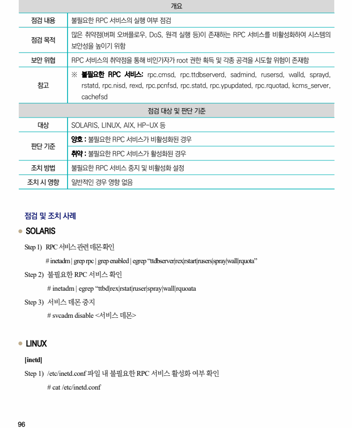
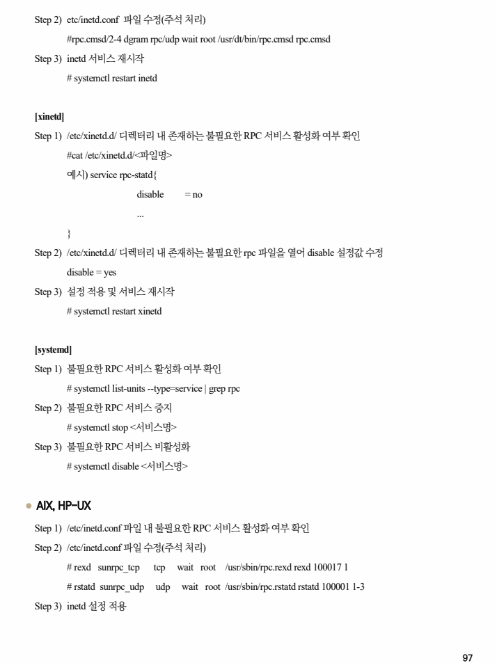

## 원문 전사

### PDF 페이지 96

~~~text transcription
개요
점검 내용 불필요한 RPC 서비스의 실행 여부 점검
많은 취약점(버퍼 오버플로우, DoS, 원격 실행 등)이 존재하는 RPC 서비스를 비활성화하여 시스템의
점검 목적
보안성을 높이기 위함
보안 위협 RPC 서비스의 취약점을 통해 비인가자가 root 권한 획득 및 각종 공격을 시도할 위험이 존재함
※ 불필요한 RPC 서비스: rpc.cmsd, rpc.ttdbserverd, sadmind, rusersd, walld, sprayd,
참고 rstatd, rpc.nisd, rexd, rpc.pcnfsd, rpc.statd, rpc.ypupdated, rpc.rquotad, kcms_server,
cachefsd
점검 대상 및 판단 기준
대상 SOLARIS, LINUX, AIX, HP-UX 등
양호 : 불필요한 RPC 서비스가 비활성화된 경우
판단 기준
취약 : 불필요한 RPC 서비스가 활성화된 경우
조치 방법 불필요한 RPC 서비스 중지 및 비활성화 설정
조치 시 영향 일반적인 경우 영향 없음
점검 및 조치 사례
l SOLARIS
Step 1) RPC 서비스 관련 데몬 확인
# inetadm | grep rpc | grep enabled | egrep “ttdbserver|rex|rstart|rusers|spray|wall|rquota”
Step 2) 불필요한 RPC 서비스 확인
# inetadm | egrep “ttbd|rex|rstat|ruser|spray|wall|rquoata
Step 3) 서비스 데몬 중지
# svcadm disable <서비스 데몬>
l LINUX
[inetd]
Step 1) /etc/inetd.conf 파일 내 불필요한 RPC 서비스 활성화 여부 확인
# cat /etc/inetd.conf
~~~

### PDF 페이지 97

~~~text transcription
Step 2) etc/inetd.conf 파일 수정(주석 처리)
#rpc.cmsd/2-4 dgram rpc/udp wait root /usr/dt/bin/rpc.cmsd rpc.cmsd
Step 3) inetd 서비스 재시작
# systemctl restart inetd
[xinetd]
Step 1) /etc/xinetd.d/ 디렉터리 내 존재하는 불필요한 RPC 서비스 활성화 여부 확인
#cat /etc/xinetd.d/<파일명>
예시) service rpc-statd{
disable = no
...
}
Step 2) /etc/xinetd.d/ 디렉터리 내 존재하는 불필요한 rpc 파일을 열어 disable 설정값 수정
disable = yes
Step 3) 설정 적용 및 서비스 재시작
# systemctl restart xinetd
[systemd]
Step 1) 불필요한 RPC 서비스 활성화 여부 확인
# systemctl list-units --type=service | grep rpc
Step 2) 불필요한 RPC 서비스 중지
# systemctl stop <서비스명>
Step 3) 불필요한 RPC 서비스 비활성화
# systemctl disable <서비스명>
l AIX, HP-UX
Step 1) /etc/inetd.conf 파일 내 불필요한 RPC 서비스 활성화 여부 확인
Step 2) /etc/inetd.conf 파일 수정(주석 처리)
# rexd sunrpc_tcp tcp wait root /usr/sbin/rpc.rexd rexd 100017 1
# rstatd sunrpc_udp udp wait root /usr/sbin/rpc.rstatd rstatd 100001 1-3
Step 3) inetd 설정 적용
~~~

### PDF 페이지 98

~~~text transcription
[AIX]
refresh –s inetd
[HP-UX]
inetd –c
~~~

