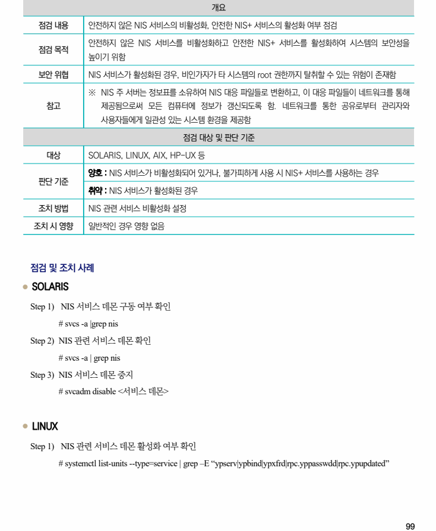
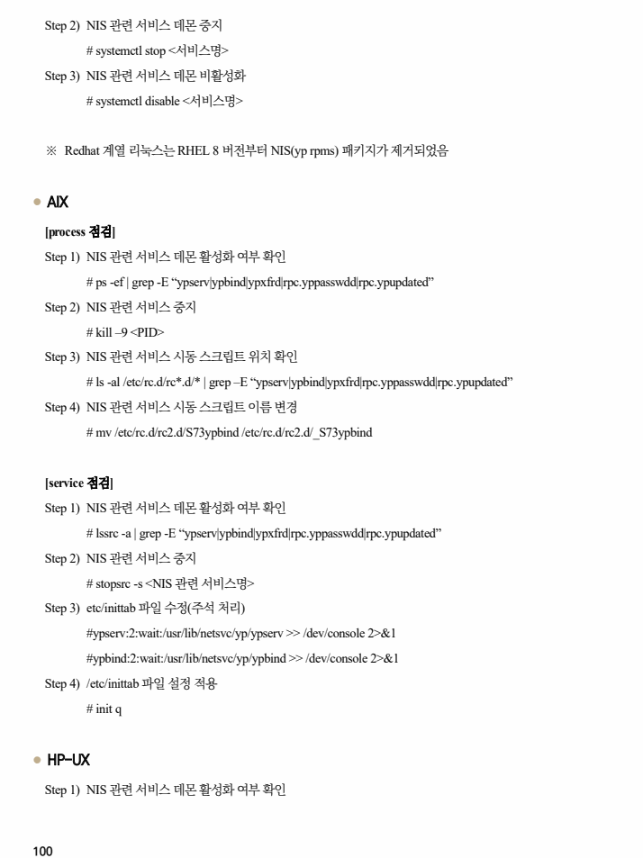
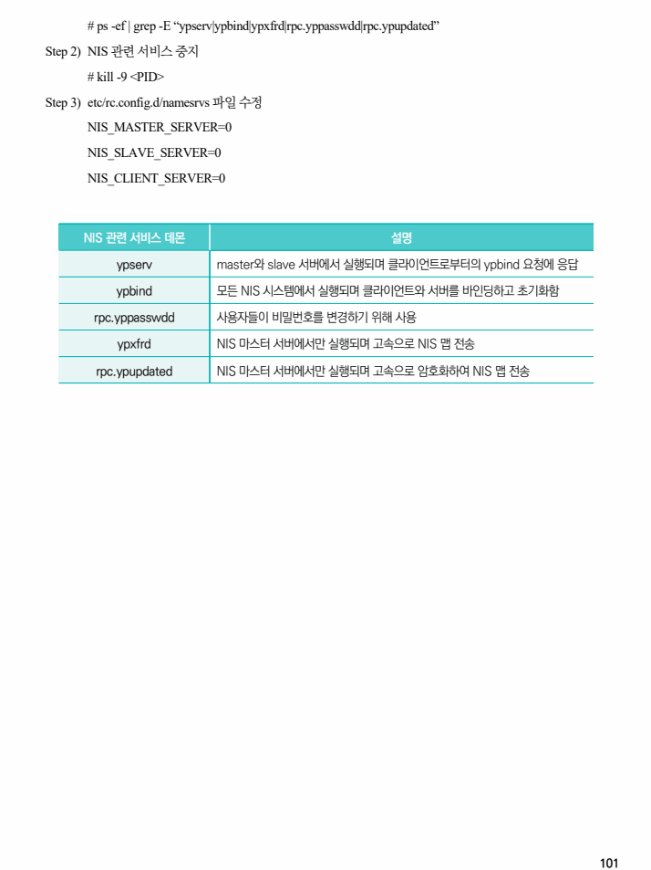

## 원문 전사

### PDF 페이지 99

~~~text transcription
개요
점검 내용 안전하지 않은 NIS 서비스의 비활성화, 안전한 NIS+ 서비스의 활성화 여부 점검
안전하지 않은 NIS 서비스를 비활성화하고 안전한 NIS+ 서비스를 활성화하여 시스템의 보안성을
점검 목적
높이기 위함
보안 위협 NIS 서비스가 활성화된 경우, 비인가자가 타 시스템의 root 권한까지 탈취할 수 있는 위험이 존재함
※ NIS 주 서버는 정보표를 소유하여 NIS 대응 파일들로 변환하고, 이 대응 파일들이 네트워크를 통해
참고 제공됨으로써 모든 컴퓨터에 정보가 갱신되도록 함. 네트워크를 통한 공유로부터 관리자와
사용자들에게 일관성 있는 시스템 환경을 제공함
점검 대상 및 판단 기준
대상 SOLARIS, LINUX, AIX, HP-UX 등
양호 : NIS 서비스가 비활성화되어 있거나, 불가피하게 사용 시 NIS+ 서비스를 사용하는 경우
판단 기준
취약 : NIS 서비스가 활성화된 경우
조치 방법 NIS 관련 서비스 비활성화 설정
조치 시 영향 일반적인 경우 영향 없음
점검 및 조치 사례
l SOLARIS
Step 1) NIS 서비스 데몬 구동 여부 확인
# svcs -a |grep nis
Step 2) NIS 관련 서비스 데몬 확인
# svcs -a | grep nis
Step 3) NIS 서비스 데몬 중지
# svcadm disable <서비스 데몬>
l LINUX
Step 1) NIS 관련 서비스 데몬 활성화 여부 확인
# systemctl list-units --type=service | grep –E “ypserv|ypbind|ypxfrd|rpc.yppasswdd|rpc.ypupdated”
~~~

### PDF 페이지 100

~~~text transcription
Step 2) NIS 관련 서비스 데몬 중지
# systemctl stop <서비스명>
Step 3) NIS 관련 서비스 데몬 비활성화
# systemctl disable <서비스명>
※ Redhat 계열 리눅스는 RHEL 8 버전부터 NIS(yp rpms) 패키지가 제거되었음
l AIX
[process 점검]
Step 1) NIS 관련 서비스 데몬 활성화 여부 확인
# ps -ef | grep -E “ypserv|ypbind|ypxfrd|rpc.yppasswdd|rpc.ypupdated”
Step 2) NIS 관련 서비스 중지
# kill –9 <PID>
Step 3) NIS 관련 서비스 시동 스크립트 위치 확인
# ls -al /etc/rc.d/rc*.d/* | grep –E “ypserv|ypbind|ypxfrd|rpc.yppasswdd|rpc.ypupdated”
Step 4) NIS 관련 서비스 시동 스크립트 이름 변경
# mv /etc/rc.d/rc2.d/S73ypbind /etc/rc.d/rc2.d/_S73ypbind
[service 점검]
Step 1) NIS 관련 서비스 데몬 활성화 여부 확인
# lssrc -a | grep -E “ypserv|ypbind|ypxfrd|rpc.yppasswdd|rpc.ypupdated”
Step 2) NIS 관련 서비스 중지
# stopsrc -s <NIS 관련 서비스명>
Step 3) etc/inittab 파일 수정(주석 처리)
#ypserv:2:wait:/usr/lib/netsvc/yp/ypserv >> /dev/console 2>&1
#ypbind:2:wait:/usr/lib/netsvc/yp/ypbind >> /dev/console 2>&1
Step 4) /etc/inittab 파일 설정 적용
# init q
l HP-UX
Step 1) NIS 관련 서비스 데몬 활성화 여부 확인
~~~

### PDF 페이지 101

~~~text transcription
# ps -ef | grep -E “ypserv|ypbind|ypxfrd|rpc.yppasswdd|rpc.ypupdated”
Step 2) NIS 관련 서비스 중지
# kill -9 <PID>
Step 3) etc/rc.config.d/namesrvs 파일 수정
NIS_MASTER_SERVER=0
NIS_SLAVE_SERVER=0
NIS_CLIENT_SERVER=0
NIS 관련 서비스 데몬 설명
ypserv master와 slave 서버에서 실행되며 클라이언트로부터의 ypbind 요청에 응답
ypbind 모든 NIS 시스템에서 실행되며 클라이언트와 서버를 바인딩하고 초기화함
rpc.yppasswdd 사용자들이 비밀번호를 변경하기 위해 사용
ypxfrd NIS 마스터 서버에서만 실행되며 고속으로 NIS 맵 전송
rpc.ypupdated NIS 마스터 서버에서만 실행되며 고속으로 암호화하여 NIS 맵 전송
~~~

