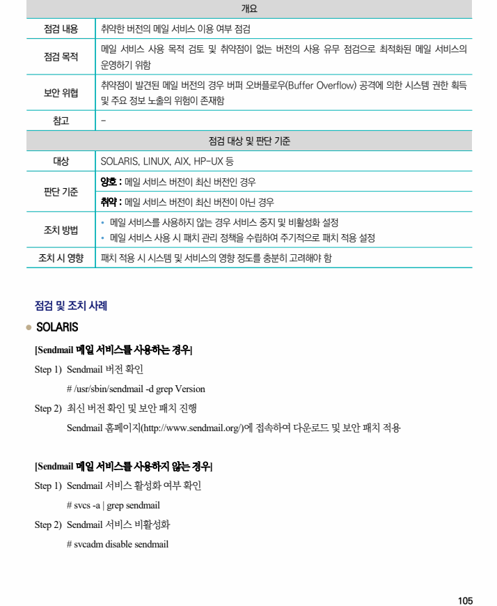
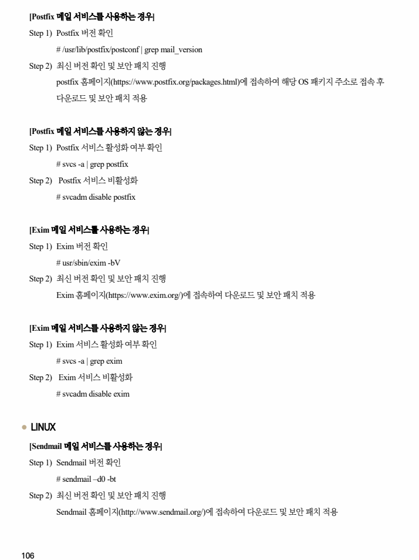
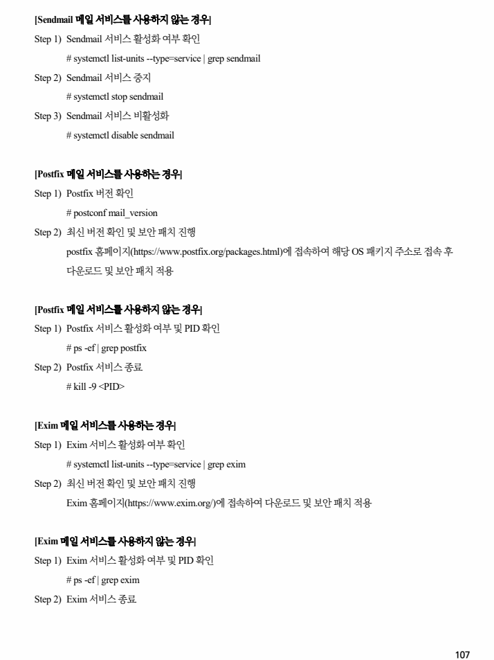
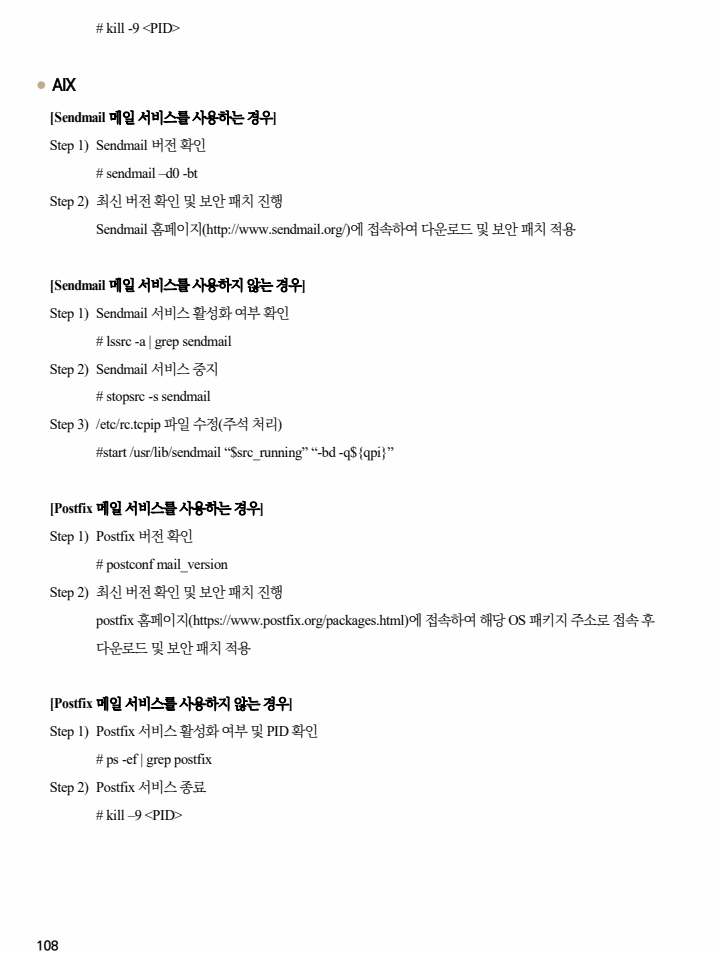
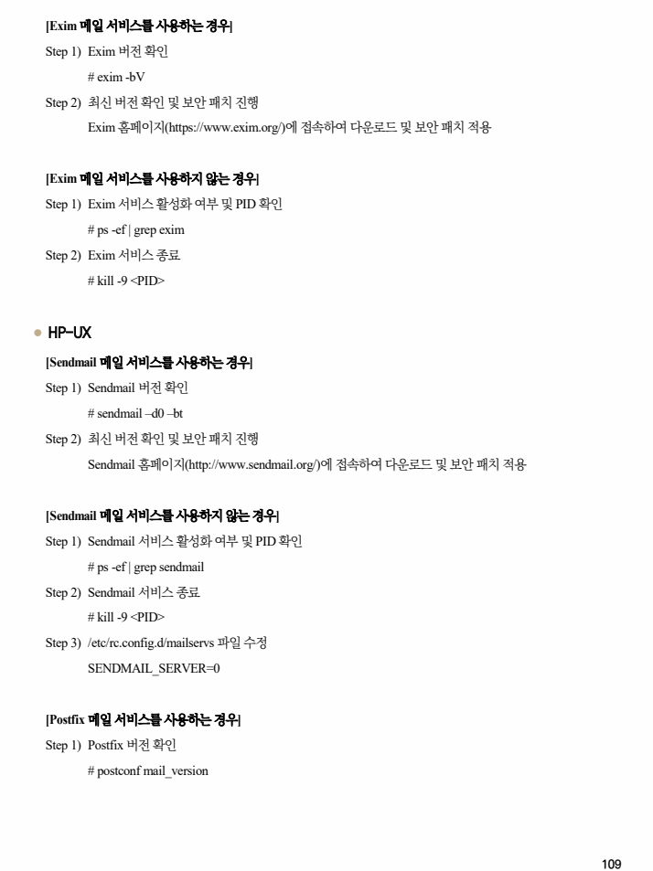
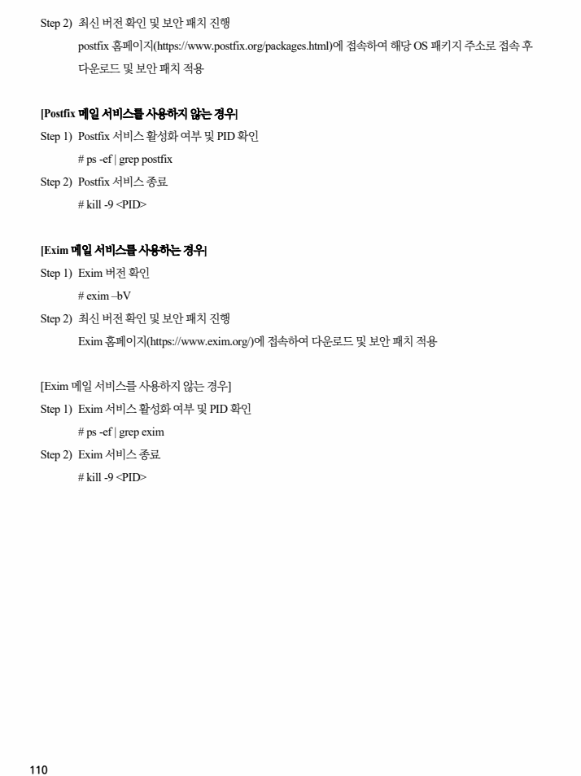

## 원문 전사

### PDF 페이지 105

~~~text transcription
개요
점검 내용 취약한 버전의 메일 서비스 이용 여부 점검
메일 서비스 사용 목적 검토 및 취약점이 없는 버전의 사용 유무 점검으로 최적화된 메일 서비스의
점검 목적
운영하기 위함
취약점이 발견된 메일 버전의 경우 버퍼 오버플로우(Buffer Overflow) 공격에 의한 시스템 권한 획득
보안 위협
및 주요 정보 노출의 위험이 존재함
참고 -
점검 대상 및 판단 기준
대상 SOLARIS, LINUX, AIX, HP-UX 등
양호 : 메일 서비스 버전이 최신 버전인 경우
판단 기준
취약 : 메일 서비스 버전이 최신 버전이 아닌 경우
Ÿ 메일 서비스를 사용하지 않는 경우 서비스 중지 및 비활성화 설정
조치 방법
Ÿ 메일 서비스 사용 시 패치 관리 정책을 수립하여 주기적으로 패치 적용 설정
조치 시 영향 패치 적용 시 시스템 및 서비스의 영향 정도를 충분히 고려해야 함
점검 및 조치 사례
l SOLARIS
[Sendmail 메일 서비스를 사용하는 경우]
Step 1) Sendmail 버전 확인
# /usr/sbin/sendmail -d grep Version
Step 2) 최신 버전 확인 및 보안 패치 진행
Sendmail 홈페이지(http://www.sendmail.org/)에 접속하여 다운로드 및 보안 패치 적용
[Sendmail 메일 서비스를 사용하지 않는 경우]
Step 1) Sendmail 서비스 활성화 여부 확인
# svcs -a | grep sendmail
Step 2) Sendmail 서비스 비활성화
# svcadm disable sendmail
~~~

### PDF 페이지 106

~~~text transcription
[Postfix 메일 서비스를 사용하는 경우]
Step 1) Postfix 버전 확인
# /usr/lib/postfix/postconf | grep mail_version
Step 2) 최신 버전 확인 및 보안 패치 진행
postfix 홈페이지(https://www.postfix.org/packages.html)에 접속하여 해당 OS 패키지 주소로 접속 후
다운로드 및 보안 패치 적용
[Postfix 메일 서비스를 사용하지 않는 경우]
Step 1) Postfix 서비스 활성화 여부 확인
# svcs -a | grep postfix
Step 2) Postfix 서비스 비활성화
# svcadm disable postfix
[Exim 메일 서비스를 사용하는 경우]
Step 1) Exim 버전 확인
# usr/sbin/exim -bV
Step 2) 최신 버전 확인 및 보안 패치 진행
Exim 홈페이지(https://www.exim.org/)에 접속하여 다운로드 및 보안 패치 적용
[Exim 메일 서비스를 사용하지 않는 경우]
Step 1) Exim 서비스 활성화 여부 확인
# svcs -a | grep exim
Step 2) Exim 서비스 비활성화
# svcadm disable exim
l LINUX
[Sendmail 메일 서비스를 사용하는 경우]
Step 1) Sendmail 버전 확인
# sendmail –d0 -bt
Step 2) 최신 버전 확인 및 보안 패치 진행
Sendmail 홈페이지(http://www.sendmail.org/)에 접속하여 다운로드 및 보안 패치 적용
~~~

### PDF 페이지 107

~~~text transcription
[Sendmail 메일 서비스를 사용하지 않는 경우]
Step 1) Sendmail 서비스 활성화 여부 확인
# systemctl list-units --type=service | grep sendmail
Step 2) Sendmail 서비스 중지
# systemctl stop sendmail
Step 3) Sendmail 서비스 비활성화
# systemctl disable sendmail
[Postfix 메일 서비스를 사용하는 경우]
Step 1) Postfix 버전 확인
# postconf mail_version
Step 2) 최신 버전 확인 및 보안 패치 진행
postfix 홈페이지(https://www.postfix.org/packages.html)에 접속하여 해당 OS 패키지 주소로 접속 후
다운로드 및 보안 패치 적용
[Postfix 메일 서비스를 사용하지 않는 경우]
Step 1) Postfix 서비스 활성화 여부 및 PID 확인
# ps -ef | grep postfix
Step 2) Postfix 서비스 종료
# kill -9 <PID>
[Exim 메일 서비스를 사용하는 경우]
Step 1) Exim 서비스 활성화 여부 확인
# systemctl list-units --type=service | grep exim
Step 2) 최신 버전 확인 및 보안 패치 진행
Exim 홈페이지(https://www.exim.org/)에 접속하여 다운로드 및 보안 패치 적용
[Exim 메일 서비스를 사용하지 않는 경우]
Step 1) Exim 서비스 활성화 여부 및 PID 확인
# ps -ef | grep exim
Step 2) Exim 서비스 종료
~~~

### PDF 페이지 108

~~~text transcription
# kill -9 <PID>
l AIX
[Sendmail 메일 서비스를 사용하는 경우]
Step 1) Sendmail 버전 확인
# sendmail –d0 -bt
Step 2) 최신 버전 확인 및 보안 패치 진행
Sendmail 홈페이지(http://www.sendmail.org/)에 접속하여 다운로드 및 보안 패치 적용
[Sendmail 메일 서비스를 사용하지 않는 경우]
Step 1) Sendmail 서비스 활성화 여부 확인
# lssrc -a | grep sendmail
Step 2) Sendmail 서비스 중지
# stopsrc -s sendmail
Step 3) /etc/rc.tcpip 파일 수정(주석 처리)
#start /usr/lib/sendmail “$src_running” “-bd -q${qpi}”
[Postfix 메일 서비스를 사용하는 경우]
Step 1) Postfix 버전 확인
# postconf mail_version
Step 2) 최신 버전 확인 및 보안 패치 진행
postfix 홈페이지(https://www.postfix.org/packages.html)에 접속하여 해당 OS 패키지 주소로 접속 후
다운로드 및 보안 패치 적용
[Postfix 메일 서비스를 사용하지 않는 경우]
Step 1) Postfix 서비스 활성화 여부 및 PID 확인
# ps -ef | grep postfix
Step 2) Postfix 서비스 종료
# kill –9 <PID>
~~~

### PDF 페이지 109

~~~text transcription
[Exim 메일 서비스를 사용하는 경우]
Step 1) Exim 버전 확인
# exim -bV
Step 2) 최신 버전 확인 및 보안 패치 진행
Exim 홈페이지(https://www.exim.org/)에 접속하여 다운로드 및 보안 패치 적용
[Exim 메일 서비스를 사용하지 않는 경우]
Step 1) Exim 서비스 활성화 여부 및 PID 확인
# ps -ef | grep exim
Step 2) Exim 서비스 종료
# kill -9 <PID>
l HP-UX
[Sendmail 메일 서비스를 사용하는 경우]
Step 1) Sendmail 버전 확인
# sendmail –d0 –bt
Step 2) 최신 버전 확인 및 보안 패치 진행
Sendmail 홈페이지(http://www.sendmail.org/)에 접속하여 다운로드 및 보안 패치 적용
[Sendmail 메일 서비스를 사용하지 않는 경우]
Step 1) Sendmail 서비스 활성화 여부 및 PID 확인
# ps -ef | grep sendmail
Step 2) Sendmail 서비스 종료
# kill -9 <PID>
Step 3) /etc/rc.config.d/mailservs 파일 수정
SENDMAIL_SERVER=0
[Postfix 메일 서비스를 사용하는 경우]
Step 1) Postfix 버전 확인
# postconf mail_version
~~~

### PDF 페이지 110

~~~text transcription
Step 2) 최신 버전 확인 및 보안 패치 진행
postfix 홈페이지(https://www.postfix.org/packages.html)에 접속하여 해당 OS 패키지 주소로 접속 후
다운로드 및 보안 패치 적용
[Postfix 메일 서비스를 사용하지 않는 경우]
Step 1) Postfix 서비스 활성화 여부 및 PID 확인
# ps -ef | grep postfix
Step 2) Postfix 서비스 종료
# kill -9 <PID>
[Exim 메일 서비스를 사용하는 경우]
Step 1) Exim 버전 확인
# exim –bV
Step 2) 최신 버전 확인 및 보안 패치 진행
Exim 홈페이지(https://www.exim.org/)에 접속하여 다운로드 및 보안 패치 적용
[Exim 메일 서비스를 사용하지 않는 경우]
Step 1) Exim 서비스 활성화 여부 및 PID 확인
# ps -ef | grep exim
Step 2) Exim 서비스 종료
# kill -9 <PID>
~~~

