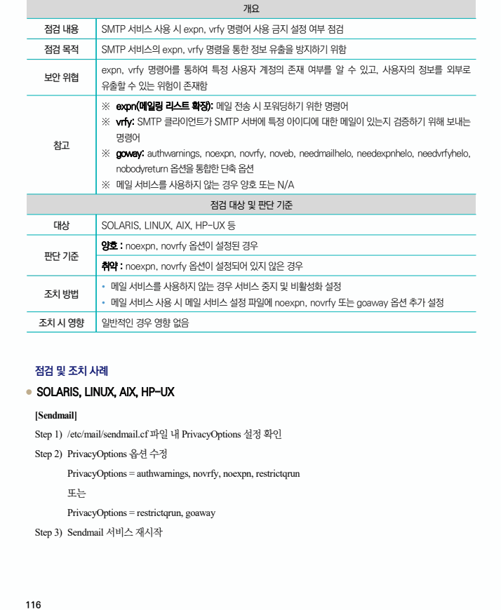
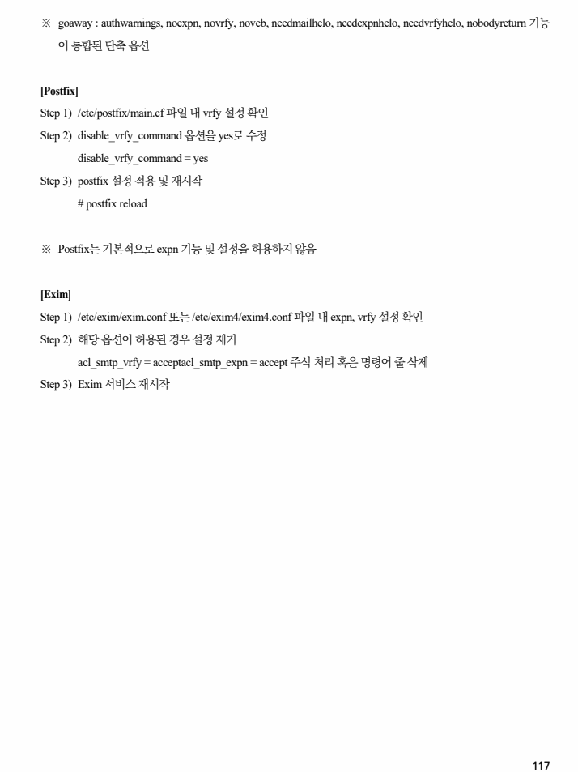

## 원문 전사

### PDF 페이지 116

~~~text transcription
개요
점검 내용 SMTP 서비스 사용 시 expn, vrfy 명령어 사용 금지 설정 여부 점검
점검 목적 SMTP 서비스의 expn, vrfy 명령을 통한 정보 유출을 방지하기 위함
expn, vrfy 명령어를 통하여 특정 사용자 계정의 존재 여부를 알 수 있고, 사용자의 정보를 외부로
보안 위협
유출할 수 있는 위험이 존재함
※ expn(메일링 리스트 확장): 메일 전송 시 포워딩하기 위한 명령어
※ vrfy: SMTP 클라이언트가 SMTP 서버에 특정 아이디에 대한 메일이 있는지 검증하기 위해 보내는
명령어
참고
※ goway: authwarnings, noexpn, novrfy, noveb, needmailhelo, needexpnhelo, needvrfyhelo,
nobodyreturn 옵션을 통합한 단축 옵션
※ 메일 서비스를 사용하지 않는 경우 양호 또는 N/A
점검 대상 및 판단 기준
대상 SOLARIS, LINUX, AIX, HP-UX 등
양호 : noexpn, novrfy 옵션이 설정된 경우
판단 기준
취약 : noexpn, novrfy 옵션이 설정되어 있지 않은 경우
Ÿ 메일 서비스를 사용하지 않는 경우 서비스 중지 및 비활성화 설정
조치 방법
Ÿ 메일 서비스 사용 시 메일 서비스 설정 파일에 noexpn, novrfy 또는 goaway 옵션 추가 설정
조치 시 영향 일반적인 경우 영향 없음
점검 및 조치 사례
l SOLARIS, LINUX, AIX, HP-UX
[Sendmail]
Step 1) /etc/mail/sendmail.cf 파일 내 PrivacyOptions 설정 확인
Step 2) PrivacyOptions 옵션 수정
PrivacyOptions = authwarnings, novrfy, noexpn, restrictqrun
또는
PrivacyOptions = restrictqrun, goaway
Step 3) Sendmail 서비스 재시작
~~~

### PDF 페이지 117

~~~text transcription
※ goaway : authwarnings, noexpn, novrfy, noveb, needmailhelo, needexpnhelo, needvrfyhelo, nobodyreturn 기능
이 통합된 단축 옵션
[Postfix]
Step 1) /etc/postfix/main.cf 파일 내 vrfy 설정 확인
Step 2) disable_vrfy_command 옵션을 yes로 수정
disable_vrfy_command = yes
Step 3) postfix 설정 적용 및 재시작
# postfix reload
※ Postfix는 기본적으로 expn 기능 및 설정을 허용하지 않음
[Exim]
Step 1) /etc/exim/exim.conf 또는 /etc/exim4/exim4.conf 파일 내 expn, vrfy 설정 확인
Step 2) 해당 옵션이 허용된 경우 설정 제거
acl_smtp_vrfy = acceptacl_smtp_expn = accept 주석 처리 혹은 명령어 줄 삭제
Step 3) Exim 서비스 재시작
~~~

